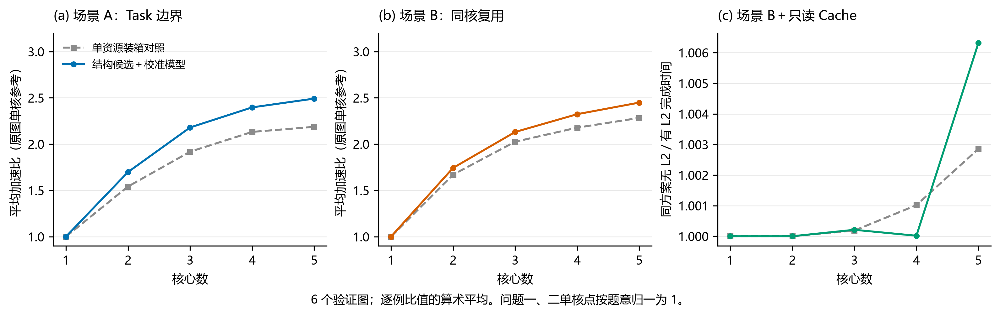
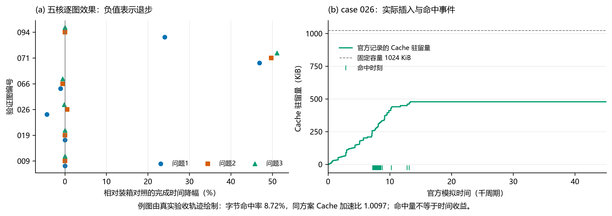

# 三种硬件场景下的切图、核心分配与顺序选择

本方案把切图和调度视为受硬件执行规则约束的离散决策。输入是原始计算图、核心数及固定硬件配置，输出只有操作到子图的映射和各核的子图序列。目标是缩短全图完成时间，同时记录新增搬运量与存储峰值，解释时间收益来自何处。额外搬运不是可以任意调权重替代完成时间的评分目标。

本目录交付的是**三问统一改造后的开发与小样本验证版本**。全部 100 个输入已做结构分析；正式性能验证采用 6 个未参与本轮拟合的图，覆盖 1—5 核。不能把本目录的均值与历史百例均值直接比较，也不能据此称为全量定稿。

## 1. 场景差异决定建模方式

第一问中，一个子图就是一个独立 Task。同一核心上先后执行的两个 Task 也不能直接保留边界数据。弱连通分量没有计算依赖割边，适合作为初始装箱单位；但原始共享输入可能被多个 Task 重复读取，小 Task 还会增加同核等待。因此，算法同时考虑保持分量独立和合并同核子图。合并减少 Task 边界，却可能改变核内排布和存储压力，不应直接断言一定更优。

第二问允许同核子图合并为一个 Task。同核依赖能直接使用片上数据，跨核依赖则必须经过 COPY_OUT、500 周期同步延迟和 COPY_IN。附件实现对每条源核到目标核连接分别构造 COPY 对；同一张量发往两个目标核时，不能擅自只计算一次写出。原图最终输出的写回还需单独计入。共享输入在同一核复用，是分配时的亲和因素；L1 和 UB 的驻留压力则分别计算。

第三问保留第二问的 Task 与同步结构，另加入只读 FIFO Cache。读请求在发射时判断命中，未命中读完成后才可能插入；命中不改变队列顺序，已有条目不重复插入，超大张量不缓存。DDR 与 Cache 读流量属于两个独立的共享带宽池。因此，“先被另一个核读取”并不足以保证命中：首次读取必须已经完成，而且张量尚未被淘汰。算法不能输出题目不支持的预取指令或人为发射时间。

这些规则来自题目附录 B—D、附件 `docs/核内调度算法.md`、`docs/多核并行模拟执行算法.md` 与原版评测代码。工程经验只用于设计候选和预测特征，不修改上述规则。

## 2. 用少量结构候选覆盖主要取舍

每个输入图重新建立计算依赖图并提取弱连通分量。算法构造五类候选：

1. 标量装箱：按分量计算周期总和降序，将其放到累积负载最小的核心。
2. 双 Pipe 装箱：分别维护矩阵与向量计算工作量，避免相同总周期掩盖某条 Pipe 的集中拥塞。
3. 输入亲和装箱：在双 Pipe 负载之外考虑核心需要读取的输入字节，鼓励共享输入的计算放在同一核。
4. 汇合尾部聚合：把汇合节点及其后继聚合，独立前缀分配到各核，减少汇合后的反复跨核传输。
5. 共享前缀聚合：保留通向多个输出的共享前缀，再分配相对独立的后缀。

第一问再为上述候选构造同核合并版本；第二、三问为分量装箱构造相邻输入复用排序版本。排序仅作用于可独立安排的分量，不改动原始节点或依赖。每次至多产生 10 个结构候选，去重后统一计算特征。这里的候选是在当前图上新建的，没有加载历史答案或接续上次搜索。

节点覆盖、子图唯一归属、子图收缩依赖和同核顺序必须通过结构检查。本实现还要求核心依赖图无环，作为一种保守的候选构造限制。题目本身不要求所有可行方案都满足这条额外限制；它可能排除部分具有更强流水并行性的合法方案。这是当前搜索能力的边界。

## 3. 代价模型如何联系物理机理

完整符号、公式与推导见 [模型与算法公式.tex](模型与算法公式.tex)。正文与代码统一使用字节和周期，不把 KiB 与十进制 KB 混用。

对每个候选，首先计算资源下界：每核每条计算 Pipe 的工作量、依赖路径上的计算与必要同步、第一问的 Task 序列下界，以及必需 DDR 字节除以总带宽。下界使用最大值组合。并行等待与搬运不能直接全部相加，更不能把多个并发搬运的完成时间之和误认为全图完成时间。

边界搬运量按“张量—接收 Task”计数，同一 Task 中的多个消费者去重；源端写出次数则按场景分别计算。本轮 140 份开发方案的边界搬运预测，已与官方结果中“原图搬运量＋切图新增量”逐一核对，全部一致。该核对不包含换入换出，因此不会把边界计数正确夸大为整个时间模型精确。

随后构造三个补充量：计算流水的名义结束时间、逻辑张量区间引起的 L1/UB 超容量量，以及第三问的预测 Cache 命中字节。逻辑区间同时计入操作输入和输出，但没有复刻附录 C 的确定性 DFS、换出选择和空间复用依赖，不能证明实际峰值低于容量。85% 容量或局部性比例可以用作经验参数，不能称为无溢出的硬阈值；本版本未采用该比例。

第三问在估计的请求时刻上执行 FIFO 状态转移，并按两个带宽池分别公平分配剩余搬运工作。队列规则是明确的，但请求时刻仍来自简化计算轨迹，不包含官方核内分配器的全部停顿。因此，这是用于候选比较的事件代理，不是官方模拟器的替代，也不是精确的张量存活窗口。

五个特征均换算为周期：资源下界、名义排布超出下界的部分、预测 DDR 占用、逻辑存储超额除以带宽、预测 Cache 读占用。三个场景分别拟合全局非负系数。拟合采用本轮新获得的官方开发标签，并加入 0.01 的岭惩罚；按图留一检查候选选择的稳定性。最终预测值取线性预测与资源下界的较大者，以免拟合产生物理上不可能的低耗时。

这种模型把结构选择和硬件规则联系起来，但不把近似特征解释为精确可加的耗时分解。采用少量可解释特征，也比在很少的开发图上训练复杂代理更容易检查误差来源。

## 4. 冷启动、训练与验收的边界

本轮开发图为 029、040、046、007、048、082，训练核数为 2 和 5。开发方案和官方标签均由本轮生成，没有读取旧项目的拟合参数、成绩表或方案。旧版代码中的结构思想可以复用，但官方评估挑选候选的路径没有带入推理包。

验证图为 094、019、066、071、009、026：先依据 100 个原图的计算规模、分量结构和向量计算占比形成分层，再按输入哈希确定样本；范围限定在 200—6500 个计算操作。它们没有参与当前模型拟合，也未用验证成绩修改本版本参数。此前 Q3 小样本试验中已经用于诊断的图被排除。由于这些仍来自给定数据集，本试验不证明对外部新分布的泛化能力。

参数固定后，将 `solver.py`、`mechanism.py` 和 `model.json` 复制到隔离目录，用改名输入启动新进程。先生成所有 180 份方案并保存哈希，再启动官方验收。三问、五种核数和两种方法各取一次重复推理，共 30 次，输出字节一致。推理包不包含官方评估器；其依赖仅为 Python 标准库和本包的机理模块。

代码保留三个观察点：

- `manifest.json` 与 `small_checks.json`：规则、参数、样本划分、输入和代码版本以及机制反例。
- 各方案的 `generation.json`：候选特征、预测依据、选择结果及生成耗时；最终 JSON 仍只有题目允许的两个字段。
- `generation_freeze.json`、`acceptance.json` 与官方返回文件：证明先冻结方案，再验收；失败信息不会被改写成惩罚分数后隐藏。

每次运行开发、生成或验收入口，都会核对固定硬件配置、114 个官方文件哈希和推理源码哈希。修改求解逻辑后应建立新版本并重新确认题意，不能沿用旧版本的验收结论。

## 5. 验证结果与下一步依据

<!-- RESULTS_START -->
全部 **180/180** 份方案通过官方验收。140 次开发标注与 162 次验收调用分属两个阶段；验收阶段对完全相同的方案复用评分，仅避免重复计算。官方文件 114 份保持原始哈希，模型与推理代码均保持冻结。

下表为 **6 个验证图** 的逐例加速比算术平均，参考值为同图原始单核完成时间。问题三最后一列单独统计同一方案开关 L2 的收益。

| 核心数 | 问题一 | 问题二 | 问题三 | 问题三同方案 L2 收益 |
|---:|---:|---:|---:|---:|
| 1 | 1.000000 | 1.018578 | 1.018578 | 1.000000 |
| 2 | 1.698169 | 1.742807 | 1.742807 | 1.000000 |
| 3 | 2.179960 | 2.131178 | 2.131718 | 1.000211 |
| 4 | 2.397229 | 2.323649 | 2.337249 | 1.000017 |
| 5 | 2.492154 | 2.448958 | 2.461842 | 1.006323 |

表中保留实际单核方案的原图参考比值；图 1 的问题一、二单核点按题意显示为 1。

| 五核比较 | 问题一 | 问题二 | 问题三 |
|---|---:|---:|---:|
| 相对单资源装箱的平均耗时降幅 | 10.93% | 8.29% | 8.40% |
| 改善 / 退步图数 | 2 / 2 | 2 / 1 | 1 / 2 |
| 单图方案生成平均耗时（秒） | 0.274 | 0.176 | 0.179 |

六图平均值受图结构影响明显，不代表百例总体。第一、三问各有两个五核反例，第二问有一个；说明目前的代价模型会选错候选。第三问同方案 L2 平均收益为 **1.006323**，不支持“显著缓存加速”的结论。基于这些证据，本轮未启动百例全量性能实验，也未把旧版全量成绩迁移到新协议。

图 1 展示不同核数下的平均效果与同方案 Cache 收益；图 2 同时保留逐图退步点，并用实际 FIFO 事件解释命中与时间收益的区别。两图均由真实记录生成，未添加统计置信带。

<!-- RESULTS_END -->

冻结后检查中，三个场景在 30 个“图—核数”组合上的完成时间预测平均绝对相对误差分别为 7.57%、4.30%、4.18%，详见 `prediction_diagnostics.json`。平均时间误差较小仍可能导致候选排序错误，不能用这一统计量消除已观察到的退步。

本次改造首先解决了求解与评估混在一起的问题，并校正了跨核写出次数。它尚未证明比旧版评估器在线搜索更强：两者计算预算和信息条件不同，历史百例均值也不能用于代替当前六例均值。

后续改进应优先针对已观察到的选择错误，而不是扩大枚举次数。第一，核内顺序与存储回收的近似尚需用开发图标定，尤其关注逻辑峰值较小但实际等待较大的情况。第二，第三问应检验“预测命中增加是否位于关键完成路径”，避免只追求命中字节。第三，保守的核心依赖无环限制可能损失并行性，放宽时必须重新验证执行依赖和存储可行性。若据此修改算法，本次六个验证图将转为开发诊断集，新版本需要另选确认样本。

## 6. 对参考材料的取舍

参考文稿《通用神经网络处理器下的多核切图与协同调度优化模型与算法》启发了分量装箱、通信内化和 FIFO 生命周期分析。本方案保留这些结构思路，但未沿用其中未经证明的结论：零割边不意味着零新增搬运；经典标量 LPT 界不能直接保证带 Pipe、缓存和共享带宽的完成时间；85% 局部性不保证容量可行；FIFO 淘汰由成功插入事件决定，不能累计所有读请求量代替；Core0 预热不能成为题目未提供的控制接口。

GitHub 对齐版本为 `cf70431b`。其中 Q1、Q2 最新整理版分别位于 `q1_final_v1`、`q2_final_v1`，Q3 位于 `q3_cold`。这些历史文件保持原样，便于追溯。本方案借鉴它们的双 Pipe 负载、共享输入亲和、合法排序与合并检查，重新实现统一推理接口，并重新获取三问开发标签；没有继承旧版本的评估器选优结果。
