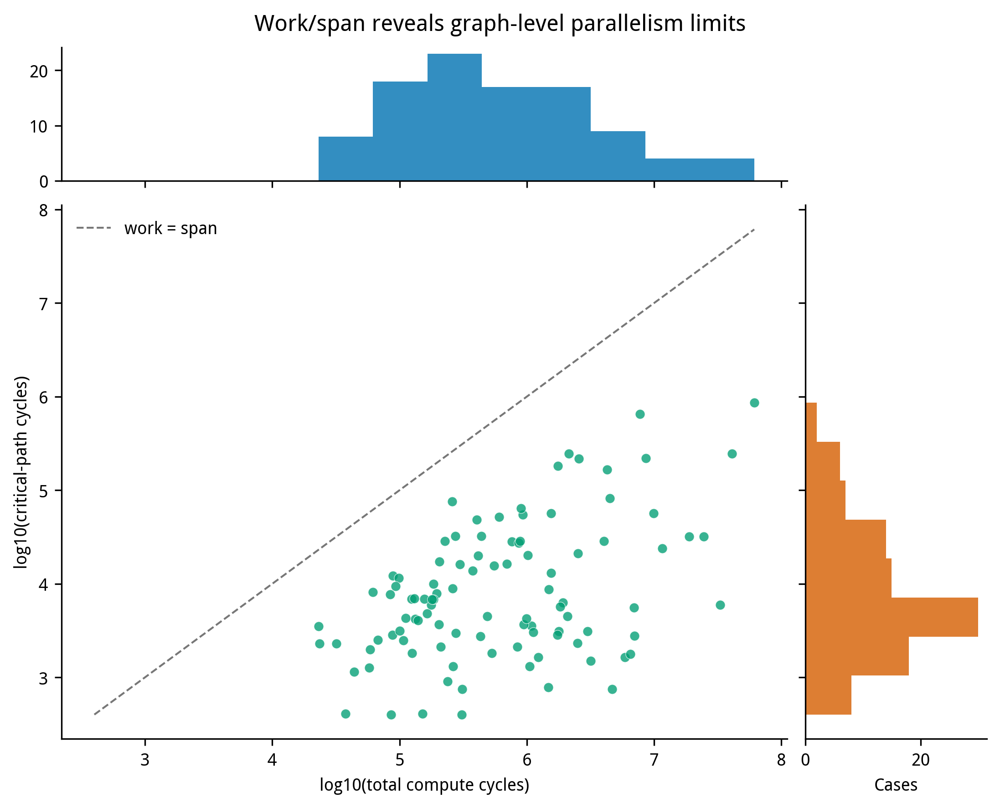
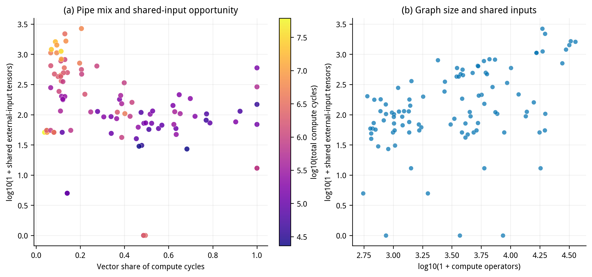
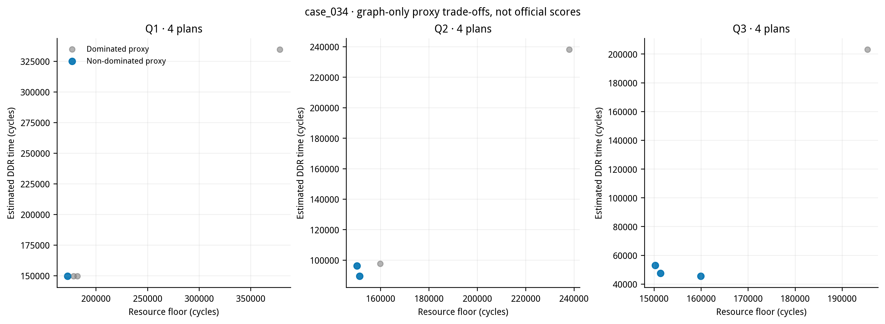
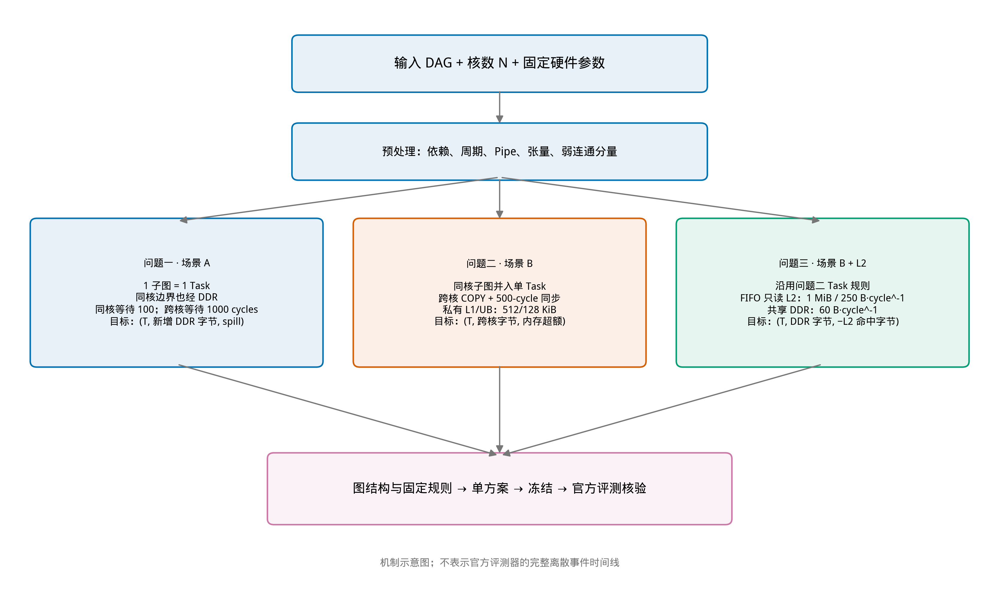

# 三问问题重述、数据分析与多目标模型

> 面向 2026 年 A 题三个执行场景。描述统计由 100 个官方原始输入图计算，不用评估器输出。参考第二篇论文《通用神经网络处理器下的多核切图与协同调度优化模型与算法》（29页）。区分题目规则、论文启发、代理估计与官方验收。

## 1. 问题重述与分析

输入为带操作、张量和依赖边的神经网络 DAG。操作带计算周期和 Pipe 类型；张量带字节大小和存储位置。对给定核心数，输出操作到子图的映射及每核子图序列，满足操作唯一归属、依赖和执行顺序合法，并缩短全图完成时间。

| 问题 | 执行语义 | 主要权衡 |
|---|---|---|
| Q1 | 每个子图是 Task；核内等待100 cycles、跨核等待1000 cycles；同核 Task 边界也处理数据 | 粗切降低Task/等待但损失并行；细切增加边界和调度开销 |
| Q2 | 同核子图合为Task；跨核经COPY_OUT、同步、COPY_IN，跨核同步500 cycles | 通信内化减少搬运，但可能加剧负载与存储压力 |
| Q3 | Q2加共享只读 FIFO L2 | L2为1 MiB、250 B/cycle；共享DDR为60 B/cycle；Cache初始为空 |

L1=524,288 B、UB=131,072 B。容量限制驻留量，带宽限制搬运速率，不能互相替代。Q1可用弱连通分量装箱作初解，但大分量可能需沿拓扑/汇合结构合法切分。Q2须权衡跨核并行和通信。Q3命中由请求、完成插入和FIFO淘汰顺序决定，重复访问数不能替代命中数。Pipe可并行，DDR/L2带宽共享；总字节/带宽只是下界，不是精确makespan。

## 2. 假设和证据边界

1. 原图为DAG，周期、Pipe、张量字节与存储位置取官方输入，不改源值。
2. 每操作唯一归属；原依赖、Task依赖与每核顺序联合后合法无环。不附加题面没有的“核心间依赖方向无环”。
3. DDR/L2按共享带宽建模。各任务可并发，不能把等待或搬运时间简单求和当makespan。
4. L1/UB分别受容量限制。生命周期峰值是初筛代理，不等同官方分配器换入换出与空间复用；0.85C只能作经验裕量，不能证明无spill。
5. 第二篇论文第2、4—6章及附录A—C启发LPT装箱、通信内化、生命周期复用与FIFO分析。经典LPT界不直接覆盖DAG、异构Pipe和共享带宽。
6. 当前v3推理阶段不调用评估器，但参数曾用9个开发图的342个官方标签拟合。因此它是“推理零调用”，不是“全流程完全不受评估器影响”。如规则要求评估器只在方案冻结后评价，当前拟合边界不满足该严格要求。本文输入统计不使用标签。

## 3. 符号

| 符号 | 含义 |
|---|---|
| G=(V∪T,E) | 操作V、张量T和依赖E组成的图 |
| dᵥ、p(v) | 操作周期与Pipe类型 |
| bₜ、pos(t) | 张量字节大小及L1/UB位置 |
| n、k | 核数及核心索引 |
| φ(v)、κ(s)、πₖ | 操作到子图、子图到核心映射、核心k子图顺序 |
| τq(v) | 场景q下Task；Q1按子图，Q2/3按核心合并 |
| Wₖₚ、Qq | 核k的Pipe p工作量、场景q搬运字节 |
| Hₖₘ、Cₘ | 核k存储层级m峰值及容量 |
| BD、BL、CL | DDR/L2带宽和L2容量 |
| Tq、T̂q | 官方makespan与搜索近似代价 |
| Pq | 场景q结构合法方案集合 |

## 4. 预处理与输入统计

读取官方case_001至case_100 JSON，保留原始cycles、B和case标识，校验字段/依赖，并计算操作数、边数、张量字节、Pipe周期、关键路径、分量、共享输入和工作量/关键路径比。逐图核对SHA256与7项基础profile，100/100与input_profiles.csv一致。规模长尾仅在图上用log轴，CSV保留原尺度，不截尾极值。

以下为min / Q1 / median / mean / Q3 / max：

| 特征 | 100图统计 |
|---|---|
| 操作数 | 552 / 1,110.75 / 3,720.5 / 6,345.06 / 7,096 / 35,705 |
| DAG边数 | 400 / 1,266.25 / 4,017 / 7,406.41 / 8,269.75 / 38,493 |
| 弱连通分量数 | 1 / 17.5 / 39.5 / 146.97 / 107.25 / 2,666 |
| 最大分量节点占比 | .0004 / .0156 / .1220 / .3293 / .7288 / 1 |
| 总计算cycles | 23,052 / 162,732.75 / 509,952 / 3,179,741.84 / 1,848,864 / 61,275,840 |
| 关键路径cycles | 400 / 2,500.5 / 6,140 / 39,921.77 / 24,796.5 / 863,040 |
| 矩阵Pipe cycles | 0 / 63,177 / 256,920 / 2,728,477.23 / 1,345,339 / 58,915,232 |
| 向量Pipe cycles | 9,988 / 58,334 / 144,314.5 / 451,264.61 / 347,998.5 / 7,714,975 |
| 张量总字节 | 325,708 / 3,921,341 / 9,366,784 / 29,375,957.16 / 24,141,591 / 360,593,104 |
| 外部输入张量数 | 12 / 130 / 254 / 486.68 / 556.5 / 4,362 |
| 外部输入字节 | 35,622 / 435,535 / 1,063,082 / 2,083,082.98 / 2,428,224 / 13,400,064 |
| 输出张量数 | 1 / 19.5 / 62 / 159.44 / 126.5 / 2,666 |
| 输出字节 | 2 / 271.5 / 16,689 / 324,217.56 / 160,768 / 4,094,976 |
| W/S并行度代理 | 3.42 / 20.20 / 43.13 / 416.22 / 305.17 / 6,258.78 |

总周期、字节等强右偏，均值受大图拉高。16图单一弱连通分量，84图有多个且不少于5个；97图有共享外部输入；28图向量周期占比超过一半。W/S仅为工作量除关键路径的结构指标，不是实际加速比。这些特点支持同时考察分量切分、双Pipe负载及输入局部性。

## 5. 多目标设计

定义xᵥₖ∈{0,1}表示操作v分至核k，zᵤᵥ表示依赖(u,v)是否跨核，rᵥ为拓扑序位。结构约束：
[
sum_{k=0}^{n-1}x_{vk}=1;(orall v),quad
z_{uv}ge x_{uk}-x_{vk}, z_{uv}ge x_{vk}-x_{uk},quad
r_u<r_v;((u,v)in E).
]
此外每个子图唯一分核，子图依赖与核内顺序联合合法。Q1保留Task粒度，Q2/3同核合并；跨核COPY规则依场景计算。

三个场景的目标向量为：
[
minmathbf f_1=(T_1,Q_1,E_{
m mem,1},I_{
m imb,1}),
quad minmathbf f_2=(T_2,Q_{
m cross,2},E_{
m mem,2},I_{
m imb,2}),
]
[
minmathbf f_3=(T_3,Q_{
m DDR,3},-Q_{
m hit,3},E_{
m mem,3},I_{
m imb,3}).
]
T为makespan，Q为通信/DDR字节，Qhit为FIFO命中字节，Emem为容量超额，Iimb为核/Pipe不均衡度。真实T、spill和命中以官方离散事件运行取得；搜索代理需标记为估计值。

理想硬约束：
[
H_{k,
m L1}le524288,quad H_{k,
m UB}le131072quad(orall k).
]
共享资源下界：
[
T_qgemax{max_{k,p}W_{kp},L_{
m dep,q},
Q_{D,q}^{min}/60,mathbf1_{q=3}Q_{L,q}^{min}/250}.
]
这里取max而非把下界逐项相加。辅助负载指标：
[
I_{
m imb}=max_{k,p}rac{W_{kp}}{max(1,sum_jW_{jp}/n)}.
]
方案a支配b，指所有待最小化目标均不差且至少一个更好；先过滤结构/内存不可行解，再保留Pareto非支配集。最终用预先冻结、只读取输入图和硬件参数的确定性规则选一个方案。不可根据待测case的evaluate反馈反复排序；代理Pareto也不等于官方性能前沿。

## 6. 图表及复现

图7只使用图结构代理、不调用评估器。每图导出300dpi PNG及矢量PDF。运行describe_and_plot_inputs.py可重算统计、CSV和图；提供官方原始数据目录，脚本会再核验100个输入哈希/profile。

## 参考资料

1. 《通用神经网络处理器下的多核切图与协同调度优化模型与算法》，2026 A题第二篇论文，29页，第2、4—6章及附录A—C，references/算法论文.pdf。
2. 2026 A题题目说明、官方JSON及硬件配置；Task、COPY、内存和带宽语义以该版本题面和官方执行程序为准。

方法与小样本验收另见《三问模型与实验说明.md》；其6图验证不代表100图正式性能成绩。本节统计仅描述100图输入。
