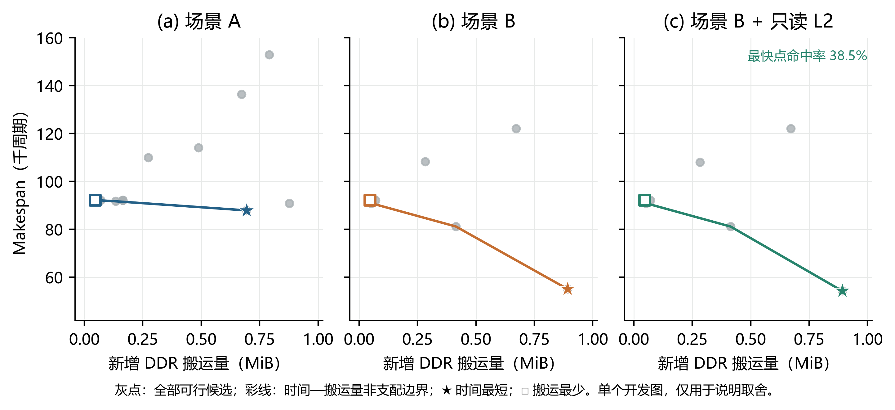
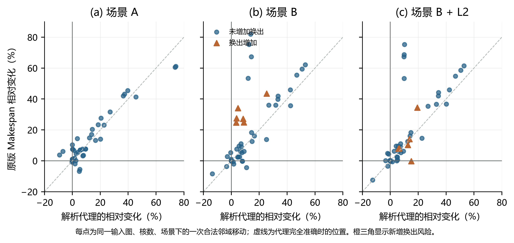

# 三场景的偏好约束多目标切图与调度：设计口径与小样本检验

本文拟采用的论证句是：在原图、固定配置和合法输出格式不变的前提下，联合调整切图、分核与核内子图顺序，以完成时间为首要指标，在可比时间水平下控制额外 DDR 搬运，并在第三问解释只读 L2 的真实收益。下文的搜索方案仍是**待确认方法**；本目录的小样本结果只能决定是否继续实验，不能充当 100 图正式成绩。

## 题目定义与符号

给定操作—张量图 $G$ 和核心数 $n$，输出操作到子图的映射 $\phi$、子图到核心的映射 $\kappa$ 及各核的子图序列 $\pi$，合记 $P=(\phi,\kappa,\pi)$。$T_q(P)$ 是原版评估程序给出的 Makespan（周期），$D_q(P)$ 是相对原图新增的 DDR 字节。第三问另记 $H_3(P)$ 为可缓存 COPY_IN 的字节命中率；对同一冻结方案 $P$，纯 L2 收益定义为 $T_2(P)/T_3(P)$。指标不是互相替代的：$H_3$ 高不保证 $T_3$ 低。

原题把 Makespan 称作“最重要指标”，额外搬运是次要指标；第三问还需报告命中率及相同核数的无 L2／有 L2 对比。因而把 $T_q$ 与 $D_q$ 无条件等权相加，会改变题意。我们拟把容量、图合法性与输出格式放进可行域 $\mathcal F_q$，在其中保留时间—搬运量的非支配候选；第三问把命中率作为**解释和弱偏好**，而不是让它压倒完成时间。

| 层次 | 必须满足或记录的内容 | 对算法的约束 |
|---|---|---|
| 硬性 | 每个非 COPY 操作恰好分到一个子图；子图恰好排在一个核心；子图依赖与同核顺序合法 | 每次迁移、拆分、合并后立即检查，失败候选丢弃并记原因 |
| 硬性 | 场景 A 为每子图一 Task、边界经 DDR；场景 B 同核子图合成 Task、跨核 COPY 与 500 周期同步；L1/UB、共享 DDR 与第三问 FIFO L2 均按附件 | 不创建预取、睡眠、Core0 特权或新硬件操作，不改官方代码、数据和配置 |
| 主要目标 | $T_q(P)$，周期 | 搜索方向与最终选择首先服务于缩短真实完成时间 |
| 次要目标 | $D_q(P)$，字节；第三问 $H_3(P)$ 与同方案 L2 增益 | 控制 DDR 压力，解释缓存机制；不能以命中率替代时间 |
| 工程诊断 | 双 Pipe 负载、关键路径、DDR 并发、L1/UB 换出、FIFO 插入/淘汰、生成用时 | 用于识别瓶颈和产生邻域，不额外宣称为题目硬阈值 |

注意：题目要求“严格满足 L1/UB 容量约束”，附件核内调度器可能为满足容量而自动插入换出／换入。因此可行性以原版执行规则为准；简单逻辑活跃量低于容量、或低于容量的 85%，都不是“零换出”的证明。合并全部同核子图也未必最好，因为驻留时间变长可能增加换出。

## 合法搜索空间与偏好选择

分量装箱应保留为**零跨分量依赖边的种子**，不能禁止切开大分量。另从当前输入生成低字节割边的拓扑带、并行分支—汇合区段及共享输入亲和聚类。结合向上关键路径等级与双 Pipe 负载，为每个区段估计最早完成核；随后只做有界邻域：瓶颈核子图迁移、低通信割边拆分、同核相邻子图合并、合法子图顺序调整。每个邻域都重建任务依赖图并检查无环，不能因为两个核心间存在相反方向的边就判定不合法。

三问共用合法性与图结构，但场景机制参与候选评分：第一问显式计 Task 边界与 100／1000 周期等待；第二问检查同核复用能否抵消驻留压力和跨核 COPY；第三问只对预计在首次未命中读**完成后**、被 FIFO 淘汰前发射的读计入命中代理。等待可重叠，DDR 搬运共享 60 B/cycle；不能把每条边等待或每次传输时间直接相加为 Makespan。

在第三问的解析踪迹内，令池 $p\in\{\mathrm{DDR},\mathrm{L2}\}$ 的带宽为 $B_p$、时刻 $t$ 的活跃请求数为 $N_p(t)$。共享带宽意味着每个请求的累积服务量增量为 $\mathrm dV_p=B_p\,\mathrm dt/N_p(t)$；字节量为 $s_i$ 的请求在 $V_p(t)=V_p(t_i)+s_i$ 时完成。实现用完成阈值最小堆维护每个池，FIFO 仅在未命中 DDR 读取**完成**后插入，命中不刷新次序。固定外生请求踪迹下，这种事件堆与逐请求扫描给出相同状态；100 个固定种子的微型踪迹对照已通过。必须区分：事件推进对给定踪迹是精确的，踪迹的发射时刻仍是自建估计，不能称为附录调度器的精确复现。该改写是为了让大图推理不因并发传输的逐事件扫描而失控。

算法空间不因时延优先而退化成“只许零割边”。完整方法应把已有的分量装箱、拓扑层切分、共享输入亲和、核内重排保留为不同种子；在合法修复后，根据当前图的关键路径、双 Pipe 负载、每池驻留与 DDR 并发诊断选择迁移、拆分、合并、相邻合法换序的预算。若候选数和目标维度足够大，可用 NSGA-III 的参考方向**维持** Pareto 解集覆盖，但参考方向不负责决定哪个完成时间可以牺牲。对问题一、二的 $(\widehat T,\widehat D)$，及问题三的 $(\widehat T,\widehat D,-\widehat H)$，先在本图内部剔除被支配方案，再由明确的完成时间优先偏好决定唯一输出。这里的 $\widehat H$ 只在题面允许的只读 FIFO 机制下估计；高命中本身不是缩短 Makespan 的充分条件。小样本检验未证明种群搜索优于有界贪心时，应先用较便宜的合法邻域完成验收，不把“使用 NSGA-III”当作贡献或成绩保证。

开发阶段可用原版评估结果拟合 $\widehat T_q(P)$ 和 $\widehat D_q(P)$。最终生成阶段只读当前图、固定配置和本轮冻结的全局参数，不加载历史方案、历史评分或官方评估器。对同一图、核数、场景的候选集合 $\mathcal C$，先保留预测非支配点，并定义组内归一化量

$$
z_f(P)=\frac{\widehat f(P)-\min_{Q\in\mathcal C}\widehat f(Q)}
{\max_{Q\in\mathcal C}\widehat f(Q)-\min_{Q\in\mathcal C}\widehat f(Q)+\eta},\qquad \eta>0,
$$

其中 $f\in\{T,D\}$；$z_H$ 同样由预测命中率归一化，取值越大越好。候选时间必须先满足 $\widehat T_q(P)\le1.02\min_{Q\in\mathcal C}\widehat T_q(Q)$。在该**待验证的 2% 预测时间带**内，试验偏好分数

$$
J_q(P)=\begin{cases}
0.90z_T(P)+0.10z_D(P),&q=1,2,\\
0.90z_T(P)+0.08z_D(P)+0.02[1-z_H(P)],&q=3.
\end{cases}
$$

这里 0.90 是开发实验的预设偏好，不是题面给出的权重；2% 是防止次要目标牺牲过多预测时间的保护带，也不是硬件常数。若新的留出图或全量结果显示时间退步，应回到开发阶段重新比较，不得用已验收结果直接为同一版本改权重。若要采用 NSGA-III，其参考方向只负责维持非支配解多样性，**不会自动优先 Makespan**；最终偏好仍需如上明示。此前同预算的三图 NSGA-III 工程变异只有 4 胜、1 平、4 负，尚不足以无条件代替确定性有界搜索。

## 已完成的低成本检验

在上一冻结版本的 9 个开发图、2／5 核、三场景共 54 个“图—核数—场景”组上，利用**已存在**的 342 份官方标签作留一图交叉检验，没有新增评估调用。每次只用其余 8 图重拟合时间代理，比较几种偏好选择；下面的实际后悔值定义为所选完成时间／本组已评估候选最短完成时间减一。每一问有 18 组。

| 策略 | 问题一平均后悔值 | 问题二平均后悔值 | 问题三平均后悔值 | 解释 |
|---|---:|---:|---:|---|
| 仅按预测时间 | 0.80% | 0.90% | 1.79% | 当前比较参照 |
| 90% 时间权重＋2% 时间带 | 0.80% | 0.90% | 0.90% | 第一、二问不变；第三问 1 组时间改善、0 组退步 |
| 80% 时间权重 | 1.08% | 0.90% | 0.90% | 第一问有 2 组时间退步，不宜直接放宽 |

逐组选择和计算见 `tradeoff_cv.json`，计算入口为 `tradeoff_cv.py`。由于候选集合很小，且这是旧开发图上的政策筛查，不能据此证明 90% 为全局最优，更不能把 18 组相关试验当成 18 个独立外部分布。这个结果只支持：偏好权重值得保留在新版本候选选择实验中，并需重新留出测试。

**图注。** 同一个开发图、五核、三场景下，全部候选均由原版程序验收。横轴为原版报告的新增 DDR 字节，纵轴为 Makespan；彩线为这批候选的时间—搬运量非支配边界。问题二、三中最快候选比最少搬运候选增加 DDR 约 0.84 MiB，却把完成时间由约 92 千周期降至约 55 千周期。此图说明两个目标存在真实取舍，不说明所有图都应选择大搬运方案。问题三“最快点命中率”仅为同时观察到的结果，不能据此认定缓存命中是全部时间收益的原因。数据见 `tradeoff_source.csv`，用 `plot_tradeoff.py` 重新生成 PNG/PDF。

这张图的论点是“首要时间目标与次要搬运目标不可被单一零割边规则替代”；三个场景为相同输入的机制对照，非装饰性小图。三面板共用单位与刻度，灰色为全部可行候选，彩色只标非支配边界；不添加没有抽样依据的置信区间。论文中需作为单图全宽排版，并在实际页面尺寸检查文字。

## 有界邻域与容量风险：本轮新增的工程检验

为检验“保留数学多目标设计，同时让工程约束决定搜索是否值得展开”，我们从每张当前输入图独立构造拓扑带种子，再围绕最忙核心尝试三类有界操作：把整子图迁至较空核心、在低字节割口拆分子图、交换两个核心的子图。每个候选重建子图依赖，投影得到核内合法顺序，并检查节点覆盖与无环；不借用该图以往的优胜方案。若一项操作不能通过检查，就记录失败原因并丢弃。这样分量零割边解仍可作为候选，但不充当禁止切分的大前提。

这轮先冻结了 6 个开发图、2 个诊断图上的 192 个“图—核数—场景—候选”方案，然后逐一用原版程序标注。**192／192 份方案执行成功**；在 48 个图—核数—场景组中，有 14 组的至少一个邻域解比本组种子快。但原始解析分数直接择优只得到 3 组改善、8 组退步。这证明“合法邻域中存在机会”和“代理模型能可靠选中”是两件事，不能把候选集的事后最优值当成提交算法成绩。

**图注。** 每点是一项相对于本组种子的合法迁移、拆分或交换。横轴为解析分数变化，纵轴为原版 Makespan 变化；下方为改善。橙色三角表示该操作比种子新增换出字节。144 次邻域移动中有 12 次新增换出。问题二的一个五核交换使解析特征误判，原版多出 1,291,200 B 换出，Makespan 增加 24.71%。数据文件 `neighbor_diagnostics_source.csv`，复现脚本 `plot_neighbor_diagnostics.py`。散点展示模型缺口，不把代理误差称作硬件异常。

因此，在开发样本上试验一个**搜索准入规则**，而非宣称新的硬件约束。设种子为 $P_0$，候选为 $P$；$R(P)$ 为按 L1、UB 分别计算的逻辑超量总和除以 60 B/周期，只用于预警，$\widehat D(P)$ 暂用不含换出的 COPY 字节代理。用本轮新标签拟合相对时延变化 $\widehat\delta_T(P\mid P_0)=\boldsymbol\beta_q^\mathsf T\mathbf x(P,P_0)$，其中 $\mathbf x$ 包括解析时延、无命中 COPY 字节、FIFO 命中代理的差值，以及移动类型和核心数。仅当

$$
R(P)\le R(P_0),\qquad
\widehat\delta_T(P\mid P_0)+0.02\left[\frac{\widehat D(P)-\widehat D(P_0)}{\max\{1,\widehat D(P_0)\}}\right]_+<-0.03
$$

时尝试替换种子，否则保留 $P_0$。这里的 2% 搬运惩罚和 3% 预测改善边际来自本轮开发筛查，**不是题面权重或容量保证**。它把时延作为主判断，让额外搬运与内存风险抑制不稳健的微小预测收益；候选仍须满足题目原有硬性约束。

六个开发图的留一图检验中，该保守规则没有选出任何替换，因而没有退步也没有改善。最初两个诊断图曾在修订前被查看，不能作为盲测证据。之后冻结规则、系数、候选和方案哈希，另在事先指定的 `case_011`、`case_057` 两图作新验收：48／48 个候选被原版接受，12 组中选择了 1 次替换，五核问题一的 Makespan 从 22,441 降至 21,541 周期（4.01%）；其余 11 组沿用种子，0 组退步。这是**两个图的局部成功**，既不足以保证外部图不退步，也没有形成三问全量成绩。若在后续更大独立样本仍几乎不选邻域，说明准入过严，应回到开发阶段改进驻留与时序模型，再冻结新版本，而不是为了本轮成绩用已看过的图调阈值。

原版评估程序只出现在 `calibrate_neighbors.py` 和 `blind_holdout.py` 的开发／冻结后验收路径；`selection_policy.py` 只读取当前图候选的解析特征与本轮冻结系数。保留 `neighbor_candidates_frozen.json`、`neighbor_policy_frozen.json`、`blind_holdout_frozen.json` 三个独立快照，便于核对候选先于评估而存在。纯求解模块已单独打成 `standalone_pilot.zip`，在仅含包文件、改名输入图和配置的隔离目录中，12 份方案与验收前冻结的哈希全部一致；见 `standalone_verification.json`。真正提交前，第一、二问应使用题目定义的整图单核基准得到单核加速比 1，**无需对单核做切图搜索**；仅 2—5 核需要独立生成与官方验收，即 100 图 × 4 核 × 三问。第三问的 1 核无／有 L2 对比仍要按题目报告，但也不需要为此另起优化搜索。现在不得把结构合法率等同于原版通过率。

鉴于上述盲测只有 1／12 组真正被规则选中并提速，提前停止对这版试验算法铺开全部输入。停机前的 2—5 核结构筛查有 186／186 组通过，覆盖 15 张完整图及第 16 张的部分核数；这没有调用原版评估程序，原始记录见 `structural_100_progress.jsonl`，汇总见 `structural_preliminary_summary.json`。早期误把单核纳入搜索所留下的 84 条记录已从该汇总排除，不作成绩。大图解析层的虚拟服务时间浮点不前进问题已修正，并以微型踪迹、隔离复现及大型 `case_014` 的单候选试算检查；但这个修正也不能替代全量验收。

## 不能沿用的推导与成功率门槛

提供的工程参考稿启发了分量装箱、通信内化和 FIFO 时间窗，但其中若干断言不能直接写进论文：经典标量 LPT 的近似界不适用于双 Pipe、缓存、依赖和共享带宽下的真实 Makespan；零跨分量割边不推出零新增 DDR（共享输入的多 Task 读取和换出仍可能增加流量）；多条等待可以重叠，不能求和；85% 逻辑容量不能保证附录 C 的零换出；FIFO 淘汰由**成功插入**事件与顺序决定，不能把所有读字节直接积分为精确淘汰时刻；题目也不提供强制 Core0 预热或操作级发射时间接口。这些可作为候选设计或代理特征，但必须由原版结果校验，不能冒充硬约束或定理。

本版尚未建立“成功率”结论。后续冻结版本须先在微图验证 Task、同步、搬运去重、双 Pipe 与 FIFO 边界；再在结构差异明确的开发图上比较候选和消融；冻结所有 100 图 × 2—5 核 × 三问的方案与源码哈希后，才调用未修改的官方程序验收。报告**可行方案比例**、失败类型、逐例时间／额外字节、平均和低分位加速比、最差退步图、方案生成耗时；第三问另报告同方案无／有 L2 配对结果。只有这 1200 份多核方案的正式评估均通过，才能称“多核全量合法”；高分或目标均值不能事先保证。

可借鉴但不可直接替代本题模型的原始资料：[HEFT 原论文](https://disco.ethz.ch/courses/fs14/seminar/paper/Jochen/4.pdf)解释关键路径优先队列；[MAGIS 原仓库](https://github.com/pku-liang/MAGIS)展示图变换与调度联动，但其允许的图重写不能直接套用；[Timeloop Mapper 官方文档](https://timeloop.csail.mit.edu/v4/input-formats/mapper)提供优先级指标的设计参照，而本题缺少其完整算子维度映射输入；[pymoo NSGA-III 文档](https://pymoo.org/algorithms/moo/nsga3.html)明确参考方向用于解集多样性，不能代替题目的目标偏好。
