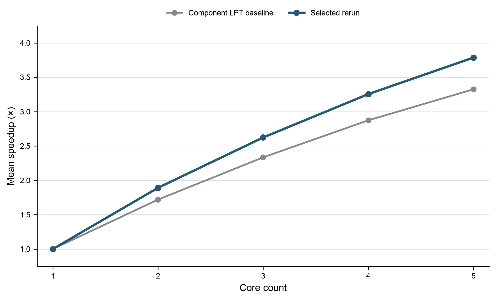
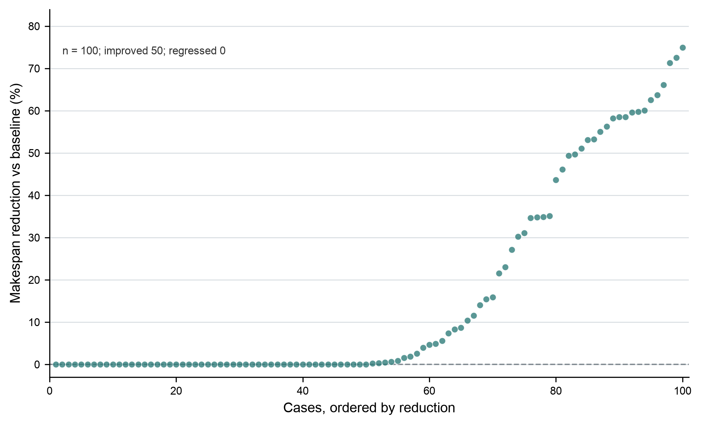
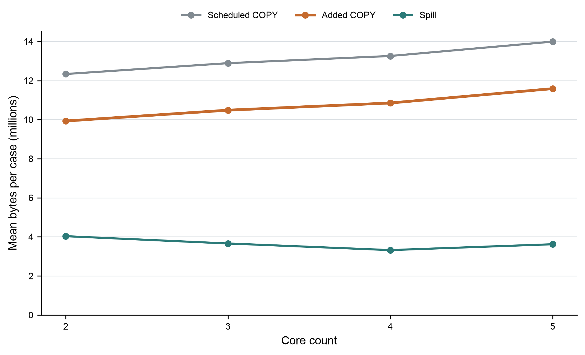

# 2026 华为杯 A 题问题一：模型方法、全量重跑与结果复核

本稿记录 2026-09-25 在 dashan 上按 `问题一模型方案.md` 完成的问题一全量重跑。统计只来自本轮冷启动求解、重新计算的单核参照及官方评测器核验；历史多轮离线选优成绩不混入本轮结果。工作流程遵循 [Mathodology 建模技能](https://github.com/sweetcornna/mathodology)：从题目和数据确定模型，保留原始数据与规则，用可复现计算检验候选，并如实报告结果与适用边界。

## 1. 任务定义与评分指标

输入为官方 100 个 `case_*.json` 计算图和唯一固定的 `official/data/config.txt`。算法决定非 COPY 算子的子图归属、各子图所在核心及每核 Task 顺序，只输出 `node_to_subgraph` 和 `core_schedules`。原图、操作及周期、张量及字节数、依赖边、Pipe 类型、硬件配置和官方评测程序均保持不变。

场景 A 的关键配置为：

| 项目 | 固定值 |
|---|---:|
| L1 容量 | 524,288 bytes |
| UB 容量 | 131,072 bytes |
| 共享 DDR 带宽 | 60 bytes/cycle |
| 同核相邻 Task 等待 | 100 cycles |
| 跨核前驱 Task 等待 | 1,000 cycles |

场景 A 中每个子图独立成为一个 Task。同核跨 Task 也要经过 DDR 边界；跨核前驱还引入题设等待。缓存换入换出、COPY 插入、共享带宽竞争、核内 Pipe 并发与 Makespan 均由原版 `evaluate_scene_a` 处理，算法中的通信和负载估计只用于筛选候选。

对用例 $i$、核数 $n$，以官方评测器的完成周期为 $T_{i,n}$。单核基准为 $T_{i,1}$，逐例加速比和 100 例算术平均定义为

$$
S_{i,n}=\frac{T_{i,1}}{T_{i,n}}, \qquad
\bar S_n=\frac{1}{100}\sum_{i=1}^{100} S_{i,n}.
$$

每例先求比值再平均；表中 `makespan_cycles` 仍以 cycles 为单位。主要目标是按字典序最小化官方 Makespan，其次最小化官方 `added_copy_bytes`。

## 2. 模型与候选算法

### 2.1 可行解约束

每个非 COPY 算子必须且只能分配一次；每个子图只归属一个核心，并在该核心的 Task 序列中执行一次。收缩后的 Task 依赖图必须无环，加入核心顺序约束后仍须满足依赖。所有原图边继续生效。方案不手工改变 COPY、核内调度或缓存行为；容量限制由官方模拟器执行。

### 2.2 分量 LPT 基线

移除 COPY 节点后，按算子依赖和共享张量构造弱连通计算分量。每个分量保持为不可切分的原子块，并统计 PIPE_M 与 PIPE_V 两类周期负载。按分量最大 Pipe 负载降序放入当前预估最大 Pipe 负载最轻的核心，形成安全的少切分基线。

### 2.3 结构候选

在基线之外，按需生成有限数量的结构候选：

1. `valley`：依据拓扑层宽的窄宽变化识别共享主干、分支和汇合阶段；
2. `data_band`：按拓扑深度分带，使用跨带张量字节量帮助选择切点；
3. `fork_join`：围绕分叉与汇合阶段切分，并合并过短阶段；
4. `terminal`：依据终端分支可达关系识别共享部分与独立末端分支；
5. `reuse_pack`：尝试少于可用核数的分量装箱，以控制并行度与额外搬运之间的权衡。

对每个 Task，算法累加两类 Pipe 的周期及边界输入输出字节，以 $\max(\text{最大 Pipe 周期},\text{边界字节}/B)$ 作为代理排序。代理不代替官方周期。结构候选先按代理排序，最多保留 3 个，再与基线、关键路径优先级贪心重排及少量相邻 Task 合并一起交给原评测器裁决。

关键路径贪心只重排已经构造出的 Task：按反向优先级选择就绪 Task，并按包含核心空闲时间、同核 100 cycles 与跨核 1,000 cycles 的预计最早完成时间分配核心。合并只尝试拓扑和同核顺序中相邻的少量 Task。最终选择只比较官方 `(makespan, added_copy_bytes)`。

### 2.4 搜索预算与下界

本轮使用固定的 `q1-independent-v5` 参数：

| 参数 | 固定值 |
|---|---:|
| 每组最多官方候选评测 | 6 |
| 结构候选评测预算 | 3 |
| 最多生成 Task 目标数 | 256 |
| 贪心合并步数上限 | 4 |
| 每步考察的相邻合并对 | 3 |
| 证书相对间隙阈值 | 3% |
| 随机种子 | null（确定性搜索）|

候选下界结合纯计算关键路径、各核 Pipe 负载和边界搬运估计；若下界已不优于当前最优 Makespan，则跳过该候选的官方仿真。若全局可证明下界满足 $T_{best}\le1.03L$，则提前停止。只有 56 组满足证书停止条件；其他组不声称距全局最优 3% 以内。

## 3. 运行与复核流程

1. 在隔离目录使用独立进程逐一求解 100 个输入图、2/3/4/5 核，共 400 组；每组成功后立即保存方案、官方评测结果、`search.jsonl`、运行参数、耗时、输入图哈希和配置哈希。
2. 另用原版单核评测器重新计算 100 个单核参照。100/100 个结果均与之前记录一致，单核 Makespan 平均为 3,124,793.73 cycles。
3. 对 400 个选中方案调用官方评测器独立复核。397 组在全量搜索期间完成了带文件哈希绑定的官方预复核，最终审计再次校验方案、评测 JSON、运行记录哈希；其余 3 组由最终审计直接调用原评测器。最终 `rechecked_jobs=400`、缺失 0。
4. 复核原版返回的 Makespan、`data_movement_bytes`、内存峰值及搜索记录；确认 `scheduled_copy_bytes`、`spill_added_copy_bytes`、`added_copy_bytes` 可追溯。官方目录 114 个受跟踪文件的 SHA-256 均保持不变。

dashan 默认 Python 为 3.8，不支持 `int.bit_count()`。本轮在独立代码副本中将 3 处位计数写法换为等价的 `bin(x).count("1")`，冻结的正式代码、原题输入和官方评测源码未改。兼容副本的具体哈希列于 `project/q1_final_v1/results/frozen_manifest.json`。

## 4. 全量结果

### 4.1 平均加速比与相对基线变化

| 核数 | 分量基线平均加速比 | 本轮平均加速比 | 平均每例 Makespan 降幅 | 改善例数 | 退化例数 |
|---:|---:|---:|---:|---:|---:|
| 1 | 1.000000 | 1.000000 | — | — | — |
| 2 | 1.719204 | **1.890839** | 9.39% | 37 | 0 |
| 3 | 2.334311 | **2.623566** | 12.68% | 37 | 0 |
| 4 | 2.873390 | **3.254935** | 14.44% | 43 | 0 |
| 5 | 3.324936 | **3.786386** | 16.15% | 50 | 0 |

方案预设的 5 核目标区间为 3.5～3.7，本轮得到 3.786386，高于该区间。按实际的 100 例和逐例比值如实报告，不调整样本或分母。各核平均加速比相对分量基线的增量分别为 0.171636、0.289255、0.381545、0.461450。

### 4.2 Makespan 分布

| 核数 | 平均 cycles | 中位数 cycles | 最小 cycles | 最大 cycles |
|---:|---:|---:|---:|---:|
| 2 | 1,564,544.45 | 247,500.5 | 11,671 | 30,388,702 |
| 3 | 1,096,793.70 | 173,101.5 | 10,106 | 20,383,899 |
| 4 | 861,571.83 | 144,712.5 | 8,078 | 15,452,799 |
| 5 | 744,134.93 | 129,533 | 7,854 | 13,395,817 |

### 4.3 官方数据搬运指标

以下均为 100 个用例上的逐例统计。`scheduled_copy_bytes` 为计划执行的搬运字节；`spill_bytes` 为容量处理额外加入的换出/换入字节；`added_copy_bytes` 为评测器输出的新增搬运指标。列出平均值和中位数，单位均为 bytes。

| 核数 | Added COPY 平均 / 中位数 | Scheduled COPY 平均 / 中位数 | Spill 平均 / 中位数 |
|---:|---:|---:|---:|
| 2 | 9,931,855 / 1,182,640 | 12,339,156 / 2,803,212 | 4,035,499 / 0 |
| 3 | 10,487,516 / 1,592,257 | 12,894,816 / 3,552,401 | 3,661,662 / 0 |
| 4 | 10,854,798 / 1,417,694 | 13,262,099 / 3,499,272 | 3,322,503 / 0 |
| 5 | 11,589,786 / 2,271,300 | 13,997,086 / 4,525,638 | 3,621,893 / 0 |

核数增加时平均 Makespan 下降，平均 COPY 字节数上升，说明收益来自更多并行机会，同时支付了更高的数据搬运代价。COPY 周期、争用和等待已经体现在官方 Makespan 中，不能把字节数直接当作周期相加。

### 4.4 L1/UB 峰值

峰值来自官方 `memory_peak_by_core`，单位 bytes；表内平均值对 100 例取平均，最大值为所有例中的最大单例峰值。

| 核数 | L1 平均 / 最大 | L1 上限 | UB 平均 / 最大 | UB 上限 |
|---:|---:|---:|---:|---:|
| 2 | 219,378 / 524,288 | 524,288 | 34,933 / 129,066 | 131,072 |
| 3 | 214,674 / 524,288 | 524,288 | 33,335 / 122,904 | 131,072 |
| 4 | 205,207 / 524,288 | 524,288 | 31,939 / 122,898 | 131,072 |
| 5 | 195,970 / 524,288 | 524,288 | 29,517 / 122,896 | 131,072 |

400 组均通过官方容量检查，没有超过 L1 或 UB 限制。

### 4.5 搜索成本、候选来源与质量检查

| 核数 | 每组评测次数平均 / 中位数 | 墙钟中位数 / 最大值（秒） | 分量基线胜出 | 贪心重排胜出 | 贪心合并胜出 |
|---:|---:|---:|---:|---:|---:|
| 2 | 2.53 / 2.5 | 8.93 / 3,837.34 | 63 | 12 | 2 |
| 3 | 2.60 / 3 | 9.64 / 3,698.45 | 63 | 14 | 4 |
| 4 | 2.56 / 3 | 8.66 / 3,412.36 | 57 | 15 | 3 |
| 5 | 2.67 / 3 | 9.02 / 5,326.52 | 50 | 26 | 3 |

其余胜出来源为结构候选或少核装箱。官方搜索评测总调用 1,036 次，平均每组 2.59 次；下界剪枝 396 次，证书停止 56 组，不可行候选 0。全体 400 组进程耗时相加为 58,559.40 秒；该数是并行进程耗时之和，不是整轮墙钟时间。最长单例进程为 5,326.52 秒，主要集中在大图。

每核方案来源计数如下：

| 核数 | 分量基线 | 贪心重排 | 贪心合并 | 结构候选与少核装箱 |
|---:|---:|---:|---:|---:|
| 2 | 63 | 12 | 2 | 23 |
| 3 | 63 | 14 | 4 | 19 |
| 4 | 57 | 15 | 3 | 25 |
| 5 | 50 | 26 | 3 | 21 |

### 4.6 结果图

所有图均由本轮逐例审计表汇总生成。均值图的每个点是固定 100 个用例的算术平均；逐例图以分量 LPT 基线作配对比较，按改善幅度排序。100 例是本次固定基准集合，因此不添加抽样置信区间或显著性检验。

**图 1｜平均加速比。** 本轮选择方案和分量 LPT 基线在 1～5 核上的逐例加速比均值。1 核作为共同参照，均为 1。



**图 2｜5 核逐例 Makespan 改善。** 每个点代表一个用例，纵轴为相对基线的周期降幅，零线表示与基线持平。100 例中 50 例改善、50 例持平、0 例退化；中位降幅 0.105%，最大降幅 74.91%。



**图 3｜官方搬运字节指标。** 分别展示计划 COPY、评测器 `added_copy_bytes` 和容量导致的 Spill；这些是不同口径但同为 bytes，未换算或相加为周期。



每张图另附可编辑 PDF、SVG 和碰撞检查 JSON；制图脚本和精简作图输入 JSON 同放在 `project/q1_final_v1/figures/`，用于复现。

## 5. 结果解释与局限

分量基线在 200/400 组中胜出，表示“保留不可分依赖块、减少切割”仍是稳定选择；5 核另有 26 组由 Task 级贪心重排胜出，显示把已生成的任务按关键路径和释放时间安排可以改善部分图。所有方案由官方评测器按真实 Makespan 与数据搬运决胜。平均 COPY 字节随着核数增加，说明并行收益并非免费。

本轮是在指定 100 个公开用例上的确定性、预算受限启发式搜索，不证明对任意计算图泛化，也不证明全局最优。每组最多 6 次官方候选评测；代理排序可能排除未进入预算的好候选。没有证书停止的组不具备 3% 最优性保证。主表是对这 100 例的经验结果，不代表竞赛最终排名或其他机器上的运行时间。

## 6. 文件与复现

本目录提供冻结的 Q1 求解代码、搜索配置、全量逐例审计指标、聚合统计、图表源数据及三种格式的结果图。原题图、固定配置和原版评测器从仓库 `project/official/` 读取，Q1 求解器仅读取当前 Q1 图和配置，不依赖 Q2 文件。

从仓库根目录重新运行全部 100×4 组：

```bash
python3 project/q1_final_v1/solution/run_q1_final.py --workers 2
```

可用 `--cases 1 2 3`、`--cores 2 5` 做小规模复现；正式运行默认冷启动，不加载这里保存的成绩或旧方案。正式结果归档见 `results/`。

```text
q1_final_v1/
├── 技术思路稿-问题一全量重跑.md
├── results/                 # 聚合结果、100×4 指标表与作图数据
├── figures/                 # 3 张图：PNG、PDF、SVG 与绘图脚本
└── solution/                # 冻结 Q1 求解器、候选生成器、运行器和参数
```

完整 400 组重跑开销较大；本文指标来自已完成并由原评测器复核的结果包。

## 7. 方法来源与披露

Mathodology 仓库作为建模工作流参考，强调从题目及可用数据出发、用数学和官方评测器检验假设、保持计算可复现并说明局限。本次只采用其工作方法，不导入第三方求解代码或比赛数据。正式规则、硬件常数和结果以本项目的原题附件、`official/` 文件和固定配置为准。

本稿与本轮计算由 OpenAI Codex 辅助整理。参赛团队应自行复核模型、数据与结果，并按赛事规则披露 AI 辅助情况。
