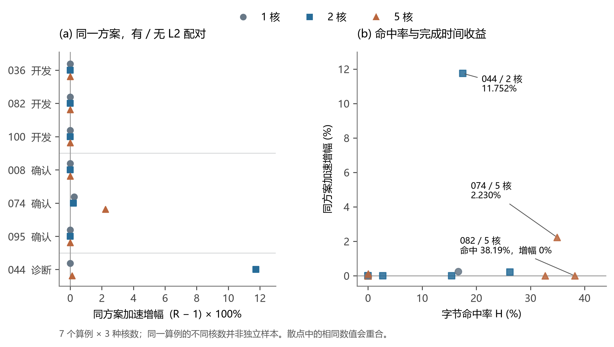
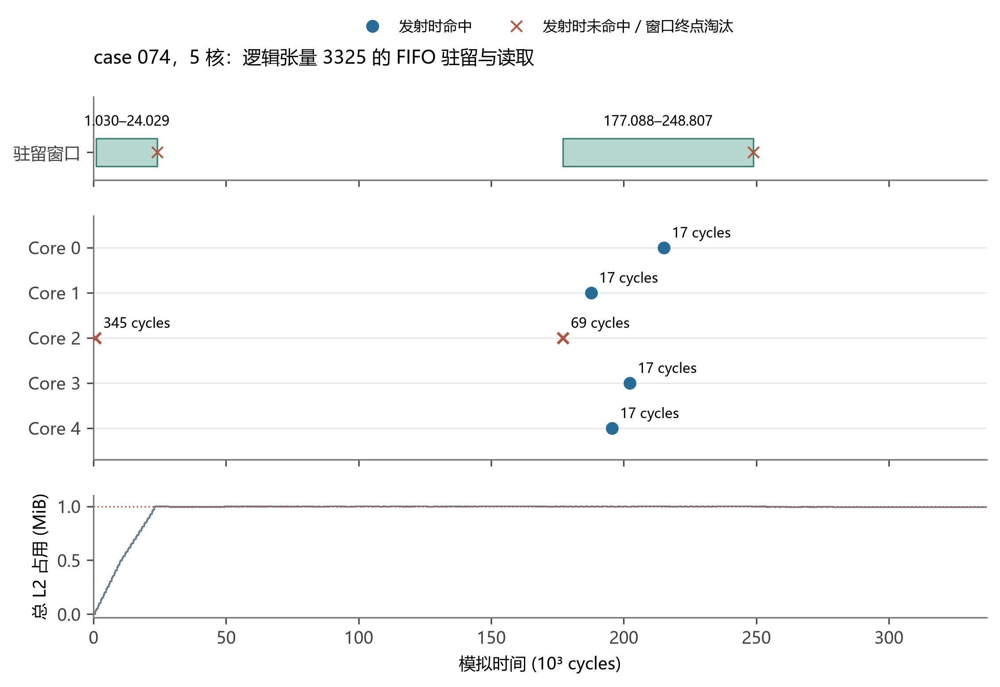

# 共享只读缓存下的事件驱动切图与调度

本稿给出第三问的数学模型、确定性构造算法和小样本机制验证。规则来自题面、附录及原评估程序。当前实验为 7 个算例、1/2/5 核共 21 组，尚不构成全部算例、1～5 核的完整实验。方法段可用于论文，实验段须保留样本范围。

## 1　问题分析与建模边界

第三问在场景 B 上加入共享只读 L2。同一核心的子图合并为一个 Task，同核依赖可以复用私有 L1/UB；跨核数据仍须经过源核 COPY_OUT、500 cycles 同步延迟及目标核 COPY_IN。L2 命中改变读取带宽来源，不取消依赖或同步。

缓存收益由“何时读取”决定。同一张量的多个请求同时发射，可能都在首次填充前查询，从而全部访问 DDR；入缓存的张量也可能在后续使用前被 FIFO 淘汰。因此，仅减少割边或者提高静态共享输入比例，不能确定最终完成时间。另一方面，强制等待填充可能损失计算并行度。我们将图结构构造与实际访问事件反馈结合，以原评估程序检验这种取舍。

核心同构，Core0 没有特殊预热权限。算法只能重排已有合法工作，不能添加预取、等待节点，不能直接指定发射时刻、预填或锁定 L2。完整分量装箱保留为候选，但不把“零割集最优”或“85% 局部性”设为题给约束；不将经典独立作业 LPT 界套用于含共享带宽与依赖的问题。

## 2　输入、变量与约束

设原图为 $G=(V\cup\mathcal T,E)$。$V$ 为非 COPY 操作，$\mathcal T$ 为张量集合；操作给定 Pipe 类型 $p(v)$ 和周期 $c_v$，张量给定大小 $b_x$ 和位置。时间、大小、带宽分别以 cycles、bytes、bytes/cycle 为单位。

方案 $P=(\phi,\kappa,\pi)$ 中，$\phi(v)$ 为操作子图归属，$\kappa(s)$ 为子图核心，$\pi_k$ 为核内子图顺序。输出仅包含 `node_to_subgraph` 与 `core_schedules`，后两项由后一个字段表示。操作开始、完成时刻 $s_q,f_q$ 和换入换出操作由附录算法推导，不能任意赋值。

| 固定项 | 采用值或规则 |
|---|---|
| 核数 | $n\in\{1,\ldots,5\}$；本轮取 1、2、5 |
| 私有容量 | $C_{\mathrm{L1}}=524288$，$C_{\mathrm{UB}}=131072$ bytes |
| 共享容量 | $C_2=1048576$ bytes，即配置中的 1 MiB |
| DDR / L2 带宽 | $B_D=60$，$B_2=250$ bytes/cycle，分别共享 |
| 跨核释放 | 目标读取不早于相应源写出完成后 500 cycles |
| 缓存规则 | 按逻辑张量 id 查询；FIFO，命中不刷新队列 |
| 初始状态 | 每次评估 L2 为空，核心状态重新初始化 |

可行性条件如下：

1. 非 COPY 操作恰好归属一个非负整数编号的子图；每个实际子图恰好在一个核心顺序中出现一次。
2. 子图依赖图无环，核内顺序不违反依赖；按附录展开后的执行图能够完成。
3. 展开依赖边 $(u,v)$ 满足 $s_v\ge f_u$，跨核 COPY 还满足
   $$
   s_{\mathrm{in}}\ge f_{\mathrm{out}}+500. \tag{1}
   $$
4. 同核同 Pipe 串行，不同 Pipe 可重叠。私有存储申请、释放和溢出处理遵循附录 C，
   $$
   \max_t M_k^r(t)\le C_r,\quad r\in\{\mathrm{L1},\mathrm{UB}\}. \tag{2}
   $$
   静态生命周期估计不能替代该检查。
5. L2 占用不超过 $C_2$，单张量大于 $C_2$ 时不缓存。

场景 B 的子图顺序不是“前一子图全部完成，后一子图才开始”的串行屏障。它通过原核内调度影响操作和 Pipe 顺序，数值评估必须保留这一过程。

## 3　FIFO 驻留窗口与共享带宽

### 3.1　离散 FIFO 状态

按实际处理顺序将事件编号为 $e=1,2,\ldots$，物理时间为 $t_e$。同一时刻仍保留先后编号。有序队列 $Q_e$ 表示事件处理后的驻留张量，队首最早插入，$Q_0=\varnothing$。COPY_IN 在发射时查询此前状态：
$$
h_q=\mathbf1\{x(q)\in Q_{e(q)-1}\}. \tag{3}
$$
查询不改变队列。发射时未命中的在途请求，即使另一核心随后填充相同张量，也仍走 DDR，不能合并或中途改走 L2。

COPY_IN 完成时，若 $x$ 尚未驻留且 $b_x\le C_2$，从队首删除能容纳它的最短前缀，再追加到队尾。对原队列 $Q=(x_1,\ldots,x_m)$，
$$
j^*=\min\left\{j\in\{0,\ldots,m\}:\sum_{i=j+1}^{m}b_{x_i}+b_x\le C_2\right\},
\quad Q'=(x_{j^*+1},\ldots,x_m,x). \tag{4}
$$
若已驻留，队列不变。COPY_OUT 不查询、不填充 L2。

原代码在每个 COPY_IN 完成时尝试插入。因此，请求即使发射时命中，若期间条目被淘汰，也可能在完成时重新插入。不能只给首次未命中建立一个永久驻留区间。

记第 $j$ 次插入、淘汰事件编号为 $a_{xj},d_{xj}$，则
$$
\mathcal W_x=\bigcup_j[a_{xj},d_{xj}),\qquad
h_q=\mathbf1\{e(q)\in\mathcal W_{x(q)}\}. \tag{5}
$$
插入与查询属于不同事件，端点按实际次序解释。物理时间用于绘图，事件编号处理同一 cycle 内的边界。结束时仍驻留的区间右端截断，不能推断未来淘汰。该递推精确表达给定执行轨迹的 FIFO 状态，而不是预先指定固定存活时间。

### 3.2　双带宽池与整数事件

参与共享池的搬运 $q$，其操作汇总字节 $b_q^{\mathrm{op}}$ 按原 `_op_duration` 取值。命中读取进入 L2 池，未命中读取及需要访问 DDR 的写出进入 DDR 池；私有存储间 COPY 不进入共享池。初始归一化工作量为
$$
\ell_q=\max\left(1,\left\lceil b_q^{\mathrm{op}}/B_{r(q)}\right\rceil\right).
\tag{6}
$$
令 $N_r(t)$ 为池中剩余工作为正的搬运数，共享服务机理可写为
$$
w_q(t)=\left[\ell_q-\int_{s_q}^{t}
\frac{\mathbf1\{q\text{仍有未完成工作}\}}{N_{r(q)}(u)}\,du\right]_+ . \tag{7}
$$
无活跃请求时不结算。请求进入、完成时重新分配服务；原程序还将预计完成时刻向上取整并按事件次序推进。因此式 (7) 不能脱离该取整过程，直接作为另一个数值评估器。

例如 4096 bytes 的读取，不受同池其他请求竞争时，DDR 与 L2 的参考工作量为 69 和 17 cycles。但读取节省可能被计算重叠掩盖，不能将各次节省直接相加当作全局收益。

### 3.3　目标与统计量

主要目标为
$$
\min_{P\in\mathcal F_n}T_2(P),\qquad T_2(P)=\max_q f_q(P). \tag{8}
$$
搜索按 $(T_2(P),M_{\mathrm{add}}(P))$ 字典序择优：时间优先，同时间下选择官方额外搬运量较小者。命中率只用于解释，不取代完成时间，也不使用任意加权多目标函数。

官方字节命中率为
$$
H(P)=\frac{\sum_{q\in\mathrm{COPY\_IN}}b_{x(q)}h_q}
{\sum_{q\in\mathrm{COPY\_IN}}b_{x(q)}}. \tag{9}
$$
无查询字节时为 0。查询键大小与式 (6) 操作汇总字节是不同字段，按原函数取值。

`data_movement_bytes` 在模拟 L2 前统计展开图 COPY 字节，不因命中直接减少。同一方案开关 L2 时该字段可能完全相同。本文保留官方数值；如分析实际 DDR 承载量，应另增诊断字段，不能改写“总额外搬运量”。

## 4　结构构造与有界事件反馈

### 4.1　三种初始构造

第一种以非 COPY 计算依赖的弱连通分量为物品。记分量 $C_j$ 的矩阵 Pipe 工作量为 $W_{jM}$，其他非 COPY 操作合计为 $W_{jO}$（本题主要为向量计算）。按 $\max(W_{jM},W_{jO})$ 降序处理，并选择
$$
k^*=\arg\min_k\left(
\max(L_{kM}+W_{jM},L_{kO}+W_{jO}),\
L_{kM}+L_{kO},\ k\right). \tag{10}
$$
每核合成一个子图。这是负载代理，不是准确执行时间，也没有本问题的 LPT 近似比保证。

第二种保持分量分核，在各核内按分量工作量排序，将相邻完整分量打包成多个子图，为核内优先级调整保留空间。块数目标 128 是复杂度预算，不是题给硬上限。

第三种允许大分量按拓扑深度分带。候选边界 $\ell$ 的通信代理为
$$
B_{\mathrm{cut}}(\ell)=
\sum_{(u,x,v):\,d(u)\le\ell<d(v)}b_x. \tag{11}
$$
在目标带宽度附近选择较小的代理，带内弱分量再按式 (10) 分核，各带按深度组织。式 (11) 可能重复计入多消费关系，只用于边界排序，不是精确 COPY 量或剪枝下界。带内负载重新统计，跨带失衡与同步成本由原模拟检验。

初始宽度为 $\max(2,\lceil\sqrt D\rceil,\lceil Dn/128\rceil)$，$D$ 为最大深度；块数过大时最多尝试 4 次倍增。参数用于固定小样本预算，未声称经过统计标定。

### 4.2　有限访问时序修正

从合法初始方案读取真实缓存事件和操作时间线，按未命中字节排序，最多检查 3 个被重复访问且发生过插入的张量。

首次填充前，尝试将其他核心已有、不消费目标张量且带外部输入的后续子图前移，形成自然错峰。候选排序量为
$$
\delta(S)=\left|\widehat b_{\mathrm{in}}(S)/60-
(t_{\mathrm{fill}}-s_{\mathrm{miss}})\right|. \tag{12}
$$
输入字节代理按子图内输入集合去重，没有精确计入驻留、重叠和并发，不能直接决定接受。首次填充后仍未命中的请求，则尝试前移消费子图；这只是线索，不能仅凭时间关系断定具体淘汰原因。

先检查依赖和核序，再调用未改动的第三问评估器。每个初始方案最多提出 2 个候选，汇总后按来源方案完成时间及确定性规则排序，最终至多评估 2 个反馈方案。初始与反馈合计最多 5 次评估，重复方案去重。只有字典序目标改善才替换当前解。

~~~text
输入：当前原始图、核数、固定硬件配置、算法参数
构造：完整分量装箱；分量块顺序；数据感知深度带
评估：对不同初始方案调用原评估器，保留合法方案
诊断：从实际事件提取少量错峰／提前消费候选
验证：检查依赖，最多再评估两个候选
输出：按 (Makespan, 官方额外搬运量) 选取方案的两个规定字段
~~~

本轮没有求解通信 MIP，也不采用 85% 安全余量。尤其不能将第二问“全部 COPY 字节 / DDR 带宽”作为第三问剪枝下界，因为它忽略独立 L2 读池，可能错误剪去优解。

### 4.3　两种“冷”的区分

**求解冷启动**：只读取当前图、核数、固定参数，不读取其他 case 或历史优化答案，不按文件名选择策略。同一次独立运行内，比较有限个新构造、利用本次评估反馈，属于算法内部搜索，不是跨运行继承旧解。

**硬件冷缓存**：每次候选评估 L2 为空，首个真实读取完成后其他读取才可能复用；可由任意核心自然填充，不能预置数据或省略首次 DDR 成本。

实现完全确定性，`seed=null` 表示未使用随机数。每个 case/core 用独立子进程；参数和代码在确认样本之前冻结。`search.jsonl` 在每次评估后记录候选、目标、命中率、接受状态、异常和耗时。它是观察断点，重新求解不读取它作为初值。

## 5　实验设计与有效性

先分析全部 100 例的节点数、深度、弱分量数和共享输入特征，再在非 COPY 操作不超过 5000 的 62 例中选择覆盖结构差异的 6 例：开发 100/036/082，确认 095/008/074。选样使用结构，不读取新方法成绩。逐操作共享次数是筛选代理，不等于跨核复用次数。

开发样本未体现同方案 L2 完成时间收益后，补充 044 诊断：它在上述小规模且有共享输入的范围内，原始 COPY/计算工作量比例最高。这是事后机制诊断，不能当作随机样本或确认结果。确认集也仅是本轮冻结后的检查，不是从未接触过的外部数据。

主对照固定选中方案 $P_{i,n}$，用原问题二、三评估器分别得到 $T_B,T_2$，报告
$$
R_{i,n}=\frac{T_B(P_{i,n})}{T_2(P_{i,n})},\qquad
\overline R_{\mathcal I,n}=\frac1{|\mathcal I|}\sum_{i\in\mathcal I}R_{i,n}. \tag{13}
$$
这隔离了同方案配置差异，不是分别优化两种配置所得最优时间之比。1 核也实际评估，不预设比值为 1。另记 $A=T_2(P^{(0)})/T_2(P^{\mathrm{sel}})$，表示构造改进；它与硬件收益 $R$ 不混用。无 L2 直接用原问题二，绝不把第三问容量改为 0。

验收包括：21 组第三问完整结果重新执行并逐字段比较；同方案问题二配对；全部 FIFO 查询、插入、淘汰、占用和最终队列重放；隔离代码目录内改名输入复现。中间结果记录版本与来源 SHA256。

<!-- RESULTS_START -->
### 5.2　小样本真实结果

同一方案分别在无 L2 和 L2 下评估。比值为无 L2 时间除以 L2 时间，不是多核相对单核的加速比。

| 阶段 | 算例数 | 1 核平均 R | 2 核平均 R | 5 核平均 R |
|---|---:|---:|---:|---:|
| 开发：036/082/100 | 3 | 1.000000 | 1.000000 | 1.000000 |
| 确认：008/074/095 | 3 | 1.000818 | 1.000699 | 1.007435 |
| 诊断：044 | 1 | 1.000000 | 1.117523 | 1.001141 |

五核逐例结果如下。全部 21 组两配置时间、额外搬运量、命中率、容量峰值和搜索预算见 `pilot_metrics_all.csv`。无 L2 命中率不适用。

| 阶段／算例 | 无 L2 (cycles) | L2 (cycles) | R | 字节命中率 | 额外 COPY (bytes) |
|---|---:|---:|---:|---:|---:|
| 开发 / case_036 | 187,182 | 187,182 | 1.000000 | 0.000% | 4,608 |
| 开发 / case_082 | 513,840 | 513,840 | 1.000000 | 38.188% | 1,020,174 |
| 开发 / case_100 | 58,085 | 58,085 | 1.000000 | 32.712% | 211,968 |
| 确认 / case_008 | 97,488 | 97,488 | 1.000000 | 0.000% | 2,875,392 |
| 确认 / case_074 | 344,440 | 336,925 | 1.022305 | 34.936% | 9,084,928 |
| 确认 / case_095 | 420,852 | 420,852 | 1.000000 | 0.000% | 0 |
| 诊断 / case_044 | 84,213 | 84,117 | 1.001141 | 0.042% | 3,721,600 |

**机制解释。** 诊断例 044 二核为 51,301 → 45,906 cycles，R=1.117523；五核为 84,213 → 84,117 cycles，R=1.001141。增加核数没有保证本次方案更快：五核额外 COPY 从二核的 930,400 增至 3,721,600 bytes，命中率从 17.487% 降至 0.042%。这些观测支持检查通信与复用的取舍，但不能仅据相关变化精确归因每一周期。

开发例 082 五核命中率为 38.188%，两配置完成时间均为 513,840 cycles，说明命中率不能替代目标。确认例 074 五核命中率为 34.936%，R=1.022305。确认集五核均值 1.007435 只对应三个确认算例。

**验证。** 主实验 61 次候选原评估、21 次完整问题三复核、21 次同方案问题二评估。FIFO 重放全部通过，核对 12,132 次淘汰；114 份官方文件和冻结算法文件哈希未改变。改名 case 044 在仅含代码与配置的隔离目录、新进程中复现相同方案及完整结果（二核 45,906 cycles），该复现单独执行。

极小合成图仅用于规则验证：原图已有独立工作前移可使共享读取错开，完成时间由 127 降为 120 cycles，未并入附件统计。实际附件中的 4 个反馈候选均未胜出，应保留负结果。

**图 1　缓存命中与完成时间收益。** 左侧为同方案配对增幅 (R−1)×100%，右侧为同一批数据的命中率与增幅。共 21 组，同一 case 不同核数不视为独立样本，相同散点可重合，不拟合趋势或虚构置信区间。

**图 2　FIFO 驻留与读取。** 取自确认例 074 五核原日志。选择至少两次驻留、两次未命中且有后续命中的张量，在其中按命中次数降序、id 升序选一例，见 `figures/fifo_example.json`。上层为驻留窗口，中层为各核发射事件及实际读取时长，下层为全部张量 L2 占用。该例用于机制说明，不代表张量总体分布；没有对时间线插值。

<!-- RESULTS_END -->

## 6　结论边界与后续重点

本轮通过格式、约束、冷启动和机制一致性检验。结构构造在部分样本中改善完成时间，但 4 个实际评估的反馈方案均未成为最终方案，尚无证据表明当前错峰／提前消费策略能稳定改善附件算例。合成小图改善只证明机制可行，不能替代真实样本的有效性证据。

后续应优先研究“重排是否缩短决定终点的依赖链”，而不是扩大无差别枚举。可从事件日志识别终点附近的等待、带宽竞争及被计算掩盖的读取，对有机制依据的少量候选开展新一轮冻结确认。该进一步的关键路径筛选是后续方向，本轮没有将其写成已经实现的功能。

题面要求仍需全部 100 例、1～5 核两配置曲线与逐例表。当前未填造 3/4 核点，未用样本均值替代全量平均，未启动全量优化。

## 附：规则—实现—证据

| 规则 | 权威来源与实现 | 本轮证据 |
|---|---|---|
| 合并 Task、跨核 500 cycles | 附录 D.2；`_build_scene_b_tasks`、`external_release` | 21 组完整原评估复核 |
| 空 FIFO、完成插入、不刷新 | 附录 D.5～D.6；`insert_cache`、`retire`、`issue` | `audit_results.json`、`cache_windows.csv` |
| 双共享池及取整 | `advance_pool_work`、`reschedule_pool`、`_op_duration` | 原评估时间线 |
| 私有容量和换入换出 | 附录 C；`schedule_step2.py`、`schedule_step3.py` | 各组 `memory_peak_by_core` |
| 搬运量、字节命中率 | `data_movement_bytes`、`cache_stats` | 各阶段 `metrics.csv` |
| 来源与独立复现 | 官方文件与冻结源代码 SHA256 | `audit_results.json`、`pilot_frozen_manifest.json` |

上述函数除核内脚本外均位于原 `multicore_cut_evaluate_problem_3.py`。公式是对给定执行规则与本文算法的表达，不声称存在题目未提供的 NPU 能力。完成插入的边界行为按实际附件代码说明，没有修改题目或评估器。
