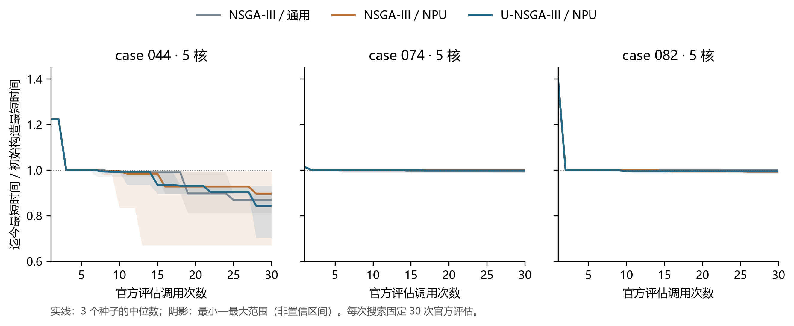

# 第三问：NSGA-III 的 NPU 离散适配与简化对照

本轮重新检查候选设计，进行同预算、同初始种群的三组对照。属于已接触算例上的探索测试，不是全量成绩或泛化证明。原题、配置和评估器均不修改。

## 原设计的问题

上一版是三个初始构造加至多两个重排，没有多代种群更新。固定分核下调整顺序，不能纠正分核失衡、过度切分和通信开销；按输入字节估计前缀时长，也不能准确表达双共享池及计算重叠。这些是搜索空间与近似模型的限制，目前没有发现原评估漏算私有容量、500 cycles 同步或 FIFO 的证据。

本轮改变优化器的决策与迭代，继续由原评估处理全部硬件约束。不能把“未找到好解”直接解释为“评估规则错误”。

## 表示、目标与选择

染色体直接表示方案 $P=(\phi,\kappa,\pi)$：操作子图归属、子图分核、核内顺序。交叉保留一方分区，以子图为整体从另一方继承核心归属；对子图中操作在另一方的分核按多数确定候选核。不重复、删除或新增操作。

三个搜索目标均取自完整原评估：

$$
\mathbf F(P)=\big(T_{\mathrm{L2}}(P),M_{\mathrm{add}}(P),B_{\mathrm{miss}}(P)\big).
$$

$B_{\mathrm{miss}}$ 是未命中 COPY_IN 的查询字节，不是全部 DDR 读写量，也不是命中率。容量、依赖均为硬约束，不可与目标交换。不可行候选排除并记录原异常；不能量化违反幅度时只记录约束类型，不捏造数值。

环境选择调用固定版本 pymoo 的 `ReferenceDirectionSurvival`，保留其非支配排序、超平面归一化、参考方向关联及稀疏方向选择。三目标 Das–Dennis 分割数为 2，产生 6 个方向，种群规模为 6。常量目标退化归一化已单测。归一化目标与参考方向按垂直距离关联：

$$
d_\perp(\tilde{\mathbf F},\mathbf w)=
\left\|\tilde{\mathbf F}-
\frac{\tilde{\mathbf F}^{\mathsf T}\mathbf w}{\|\mathbf w\|^2}\mathbf w\right\|_2 .
$$

U-NSGA-III 组额外调用原竞争函数：同方向内优先较好非支配等级，再比较方向距离，其余情况随机选择。没有把“时间轴参考方向”误解为自动偏好最小时间，没有使用缺乏依据的愿望点。

全部方法保留本次运行的最佳时间档案，最终交付

$$
P^*=\operatorname*{arg\,min}_{P\in\mathcal A_{\mathrm{feasible}}}
\big(T_{\mathrm{L2}}(P),M_{\mathrm{add}}(P)\big)_{\mathrm{lex}}.
$$

多目标用来保留不同工程特征的候选，不改变题目比较口径。档案不会跨运行读取，L2 也不在候选间保留。

## 离散变异与拓扑修复

| 算子 | 通用组 | NPU 工程组 |
|---|---|---|
| 迁移 | 随机子图和目标核 | 优先从实际最后完成的核选块，按双计算负载及通信代理选核 |
| 拆分 | 随机块的拓扑中点 | 偏向高工作量／末完成核，在约 1/3～2/3 区间的 5 个切点中优先低割边字节 |
| 合并 | 随机相邻同核块 | 优先共享张量字节多的相邻同核块 |
| 排序 | 交换两个块的优先级 | 尝试提前实际未命中字节较大的消费块 |

迁移代理为

$$
\widehat J(k)=\max_{c,p}L_{cp}^{(k)}
+\widehat B_{\mathrm{comm}}^{(k)}/60.
$$

内部张量按不同源核—目标核连接计双向 COPY，图输入按消费核数计读取，直接 op–op 边按 data_size 计通信。该代理没有模拟 FIFO、溢出与重叠，也未全面计入图输出写回，只用于候选排序。代理仍建议原核时随机探索另一核，不将代理改善视为真实改善。

拆分沿原操作拓扑序分成前后两块；合并仅允许在某个全局子图拓扑序中相邻且同核的两块。每次交叉、变异后重建子图 DAG，按候选优先级做 Kahn 排序，再投影：

$$
\pi_k=\operatorname{filter}\!\left(\sigma,\kappa(s)=k\right).
$$

这是保守的搜索空间限制，可能排除更复杂的合法核序，并不是给原模拟新增“整个子图串行”的屏障。真实 Pipe 次序、换入换出、跨核释放和 DDR/L2 双池仍由附件决定。

完整分量装箱只是初始构造，允许合法拆分；块数 256 是计算预算，不是硬件容量。没有 85% 假约束、Core0 特权、预取或 sleep。每代从父子合并种群选出新种群，下一代确实使用更新后的父代，最终最佳时间档案单调不劣。

## 冻结实验

| 标识 | 环境选择 | 父代选择 | 变异 |
|---|---|---|---|
| nsga3_generic | NSGA-III | 随机 | 通用离散变异 |
| nsga3_npu | NSGA-III | 随机 | NPU 工程变异 |
| unsga3_npu | NSGA-III | U-NSGA-III 竞争 | 相同 NPU 工程变异 |

第一、二组比较工程算子；第二、三组比较父代选择。这是复用原库选择算子的离散适配，不等于原版连续变量 NSGA-III 开箱运行。

- 044：搬运占比较高；074：溢出与 FIFO 压力；082：单弱分量、依赖较强。
- 固定五核，种子 17、29、43，每次至多 30 次原评估，共 27 次独立搜索。
- 三种初始构造从当前图重建，再以相同通用变异补齐种群；逐种子核对初始方案哈希相同。
- 每批最多 6 次新候选评估。方案去重不重复扣调用；失败的原评估仍扣预算，结构预筛失败另记。
- `evaluations.jsonl` 和 `generations.jsonl` 为候选、代际观察断点；有效中间方案及目标保存在 `candidates.jsonl.gz`。
- 最终方案重新执行问题三、逐字段核对，再由原问题二对同方案配对。算法搜索收益与配置收益分开报告。

三次重复报告均值、最小值、最大值；不把最好种子当作均值，不虚构显著性。不是按机器速度或“达到满意分数”停止搜索。

<!-- RESULTS_START -->
## 简化测试结果

所有数值均为官方模拟 cycles，越小越好。每格使用三个固定种子；初始构造最短时间依次为 044: 84,117、074: 336,925、082: 513,840。

| 算例 | 方法 | 平均 Makespan | 最小—最大 | 相同方案缓存加速比均值 |
|---|---|---:|---:|---:|
| 044 | NSGA-III / 通用 | 72,299.33 | 68,239—75,524 | 1.080941 |
| 044 | NSGA-III / NPU | 71,837.67 | 56,358—83,709 | 1.388395 |
| 044 | U-NSGA-III / NPU | 69,429.00 | 59,036—78,326 | 1.150545 |
| 074 | NSGA-III / 通用 | 335,197.33 | 333,519—336,925 | 1.013254 |
| 074 | NSGA-III / NPU | 335,591.00 | 332,923—336,925 | 1.025674 |
| 074 | U-NSGA-III / NPU | 335,682.33 | 333,664—336,925 | 1.012750 |
| 082 | NSGA-III / 通用 | 511,852.33 | 508,066—513,771 | 1.000041 |
| 082 | NSGA-III / NPU | 510,720.33 | 508,038—513,840 | 1.000068 |
| 082 | U-NSGA-III / NPU | 510,622.33 | 506,716—513,840 | 1.000189 |

与同种子、同初始种群的通用 NSGA-III 比较，配对比值定义为通用组时间 / 对应工程组时间：

| 方法 | 9 组配对比值均值 | 胜／平／负 |
|---|---:|---:|
| NSGA-III / NPU | 1.013489 | 4／1／4 |
| U-NSGA-III / NPU | 1.017486 | 4／1／4 |

上述 9 组来自 3 个算例的重复种子，不能当成 9 个独立算例推断全量；配置比值与算法比值不同，不互相代替。

共 810 次搜索评估，27 次完整问题三复核、27 次同方案问题二评估；全部最终结果逐字段复核通过。初始种群哈希、原评估预算一致，114 份官方文件和冻结源文件未改变。

**图：同预算三组搜索的收敛过程。** 展示各次调用后最佳时间，阴影仅表示三个种子的最小—最大范围。虚线为本次从输入重建的三个初始构造中最好者，不是从磁盘读取历史答案。数据见 convergence_data.csv。

**机制实例。** 044、种子 17 的 U-NSGA-III 工程组，从本次重建的最优初始构造 84,117 降为 59,036 cycles。官方额外 COPY 从 3,721,600 降为 2,763,680 bytes，DDR 未命中读取从 4,672,544 降为 2,600,768 bytes；与此同时跨核传输连接从 0 增至 79。这说明不能只盯住零跨核割集：重复图输入、访问时序与中间通信需要一并考虑。上述量是同一运行前后的共同变化，不是各算子独立因果贡献。源数据见 mechanism_case044.json。

**结论边界。** 改善主要集中在 044；074 中 U-NSGA-III 工程组均值反而略差于通用组。两种工程组相对通用组均为 4 胜、1 平、4 负，当前不足以认定工程变异或 U 竞争机制稳定优越。它们值得保留为候选，并不支持无条件替换。

与旧的至多五次评估方法相比，本轮也增加了预算，因此不能将全部改善归功于 NSGA-III。上表三组均为三十次评估，才是本轮对工程算子和竞争机制的预算受控比较。未进行 100 例全量搜索。

<!-- RESULTS_END -->

## 复现

安装 `q3_nsga/requirements.txt` 后在 A 题项目根目录运行：

~~~powershell
python q3_nsga/test_mechanics.py
python q3_nsga/solve.py official/data/case_044.json -n 5 --method unsga3_npu --seed 17 --output q3_nsga/new_run
~~~

`plan.json` 仅含两个规定字段。官方评估显式传入方案路径；若用默认查找，复制为输入同目录的 `<case>_multicore_res.json`，不改内容或配置。

`run_experiment.py` 可复现实验，会覆盖其输出目录。`experiment/manifest.json` 保存冻结时间、版本、代码哈希；`smoke/` 为运行检查，不纳入统计。所有候选冷缓存，所有 case/seed/method 独立进程，不读取历史解。

## 依据与边界

- [NSGA-III 官方说明](https://pymoo.org/algorithms/moo/nsga3.html)：参考方向环境选择。
- [U-NSGA-III 官方说明](https://pymoo.org/algorithms/moo/unsga3.html)：父代竞争选择。实验固定 `pymoo==0.6.1.6`，在线文档可能显示其他版本。
- [R-NSGA-III 官方说明](https://pymoo.org/algorithms/moo/rnsga3.html)：偏好区域需要额外参考点；当前缺少可解释的愿望点，未盲目叠加。
- [Jain、Deb 约束处理与自适应扩展论文](https://www.egr.msu.edu/~kdeb/papers/k2012010.pdf)：方法背景，本轮没有实现其全部自适应扩展。
- [pymoo 源仓库](https://github.com/anyoptimization/pymoo)。查阅日期 2026-09-25，采用网页检索和官方来源，未使用不可用的文献 MCP。

工程算子及通信代理属于本题设计，不能用上述论文代替本题实验；算法名与仓库存在均不构成有效性证据。
