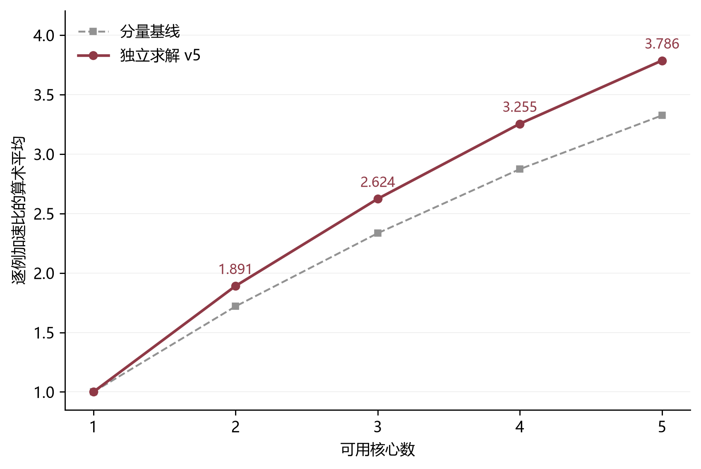
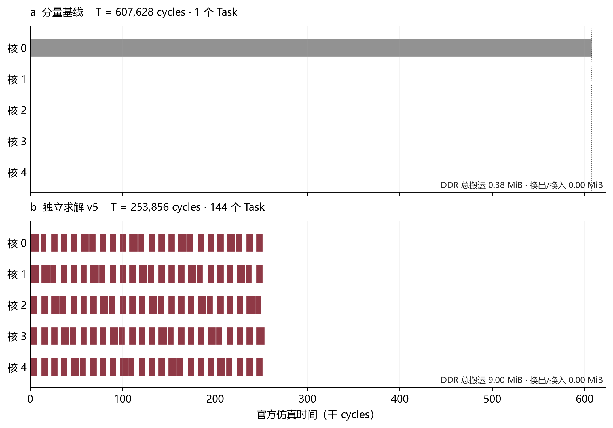

# 问题一：有限候选、关键路径贪心与下界停止

本稿与 `q1-independent-v5` 一致。数学公式可直接引用 [LaTeX 片段](q1_cold/模型与算法公式.tex)。本版从当前输入独立求解，正式入口为 `solution/q1_submit.py`；历史 `q1_optimization/` 属于不同预算的离线选优实验，不能当作本版独立运行成绩。

## 1. 题意、决策与不变部分

输入为原始计算图 JSON、可用核数 $n\in\{2,3,4,5\}$ 以及附件固定配置。时间单位为 **cycles**，张量大小和缓存容量单位为 **bytes**。DDR 总带宽为 60 bytes/cycle，L1 为 524288 bytes，UB 为 131072 bytes。这些数值从配置读取，不在算法中替换。所有成绩来自题给 CPU 模拟器返回的周期数，不是本机 GPU 实测；墙钟秒数仅用于记录求解成本。

输出只包含两项：`node_to_subgraph` 将每个非 COPY 操作唯一分配到一个子图；`core_schedules` 给出各核心的子图顺序。算法不改原图、操作周期、张量大小或附录 C 的核内调度。场景 A 中每个子图分别成为一个 Task；前一 Task 结束后清空其私有缓存，同核跨 Task 仍需要边界 COPY。

| 层次 | 定义与代码对应 |
|---|---|
| 输入 | 原图 $G$、操作周期 $a_o$、管道 $q(o)$、张量字节数 $b_x$、固定配置 |
| 决策 | 子图归属 $p(o)$、核心归属 $c(s)$、各核心执行序列 $\pi_k$；对应两个输出字段 |
| 约束 | 操作无遗漏且不重复；Task 恰执行一次；依赖边与核心顺序边的并图无环；官方内存检查通过 |
| 目标 | 先最小化官方 Makespan，相同周期时再最小化额外 DDR 字节数 |
| 可计算输出 | 合法方案 JSON、官方仿真、候选日志、每例指标、汇总平均加速比 |

设 $F_s$ 为 Task 完成时刻，其启动必须同时满足前一同核 Task 完成后等待 100 cycles、跨核前驱完成后等待 1000 cycles。多个释放条件取最大值，不相加。共享带宽竞争及合法换出换入全部交给原评估器；以粗略缓存峰值超限直接否决方案是不准确的。

一份中间张量若由一个 Task 生产、被另 $m$ 个 Task 使用，边界搬运通常为 $(1+m)b_x$：生产者写一次，每个消费者 Task 各读一次。不能按依赖边重复写成 $2mb_x$。固定切分后改变分核不会免除这些搬运，但会改变等待与并发竞争。

## 2. 为什么采用有限候选与贪心

单纯平均分配计算周期，可能切断长依赖链；单纯减少切分，又可能使大量计算挤在少数核心，并加重缓存压力。因此先用原图的结构构造少量有不同取舍的候选，再调用同一个官方评价函数。

**结构候选。** 根据深度区间、图宽的低谷、分叉汇合及末端独立分支生成切分。分量基线将弱连通计算分量按负载递减分配，同核分量合成一个 Task。另尝试较少活动核心的分量并包，以减少重复读取；该候选也可能产生更多换入换出，所以必须实测后才接受。参数公式见 LaTeX 的式 `q1-width`。所有核数的候选均从当前图重新计算，不读取以前的核数结果。

**代理排序。** 对 Task $s$，令 $W_{sq}$ 为其在 Pipe $q$ 上的计算周期之和，$D_s^{in},D_s^{out}$ 为边界读写字节数，使用

$$
\widehat\tau_s=\max\{\max_q W_{sq},(D_s^{in}+D_s^{out})/B\}
$$

作为廉价排序依据。该值忽略部分内部依赖与缓存换入换出，不能代替真实 Task 时长。仅取代理最优的三个结构候选，再加入分量基线；重复方案跳过。候选进入前三不代表其必然优于未入选方案，这是控制搜索成本的启发式取舍。

**关键路径贪心。** 从后向前计算 $r_s=\widehat\tau_s+\max_{u\in succ(s)}(100+r_u)$，每次选取就绪集合中优先级最高的 Task。逐核估计最早完成时间，选择最小者；估计启动时间同时考虑核心空闲时刻、100 周期切换和 1000 周期跨核前驱等待。并列时固定按 Task id、核心编号处理，不使用随机种子。

**局部合并。** 只检查在全局拓扑序和同核序列中都相邻的 Task，按共享张量量筛选少数相邻对。合并可能减少切换和搬运，也可能延后后继释放，故代理改善后仍需原评估器接受。没有对任意节点组合做无界枚举。

**严格剪枝。** 对固定候选，有

$$
L=\max\{L_{cp},\max_{k,q}W_{kq},D_0/B\}\le T.
$$

其中 $L_{cp}$ 是纯计算关键路径，$D_0$ 是按张量边界精确统计的换入换出前字节数。当下界已超过当前真实最好周期，就不再仿真该候选。字节统计与官方 `scheduled_copy_bytes - spill_added_copy_bytes` 逐项核对。

对所有划分还成立 $L_g=\max\{L_{cp},\max_q W_q/n\}\le T^*$。仅当已验证方案满足 $T_{best}\le1.03L_g$ 时，才能提前停止并得到 $T_{best}\le1.03T^*$ 的证书。**没有触发该条件的用例，不具备“距最优 3%”的保证。**

## 3. 参数、版本与小样本决策

| 算法参数 | 固定值 | 用途与边界 |
|---|---:|---|
| `max_evaluations` | 6 | 最多六次官方评估，不是六秒时限 |
| `structure_evaluations` | 3 | 保留代理排序前三的结构候选 |
| `max_generated_tasks` | 256 | 调整切分尺度的计算预算目标，不是题目规定的物理约束 |
| `merge_limit` / `merge_pair_trials` | 4 / 3 | 最多四步代理合并，每步查看三个相邻对 |
| `cert_relative_gap` | 0.03 | 有全局下界证书时提前停止 |
| `random_seed` | null | 本版为确定性构造，无随机搜索 |

参数由成本与规则选择，在确认测试前冻结；没有声称经过大规模交叉验证找到最优超参数。`frozen_manifest.json` 保存求解入口、依赖与配置的 SHA256；原附件另有 114 文件的独立清单。所有输入、种子状态、参数单位和实际字段见配置与 `input_profiles.csv`。

全部 100 例只作无损解析。计算操作数为 552～35705、深度为 3～2440、弱连通分量为 1～2666，说明单用操作数区分难度不充分。根据七个结构特征进行 `log1p`、极差归一化和最远点覆盖，交替选出 10 个开发例、10 个本轮确认例；过程不读取成绩。完整编号见 `sampling.json`。这些图在此前工作中已可见，所以本轮确认不是未知分布泛化验证。

开发阶段先检查简化图：单例 6 cycles、同核/跨核等待、扇出边界搬运、合法换入换出、等待环拒绝、输入不变、用例顺序独立、隔离目录与改名输入。随后进行定向与代表性实验：

- `development_v1/v2` 保留被停止的试验记录；未完成的批次不报告为完整样本均值。大图中原仿真器的单次执行可能很慢，不能据此修改评估器。
- v3 加入分量并包、核心纯改名跳过与下界停止，避免无益重复。
- v4 的缓存并包在 case044/051、2/5 核四项定向检查中没有改善最终结果。case044 五核该候选的搬运下界已大于现有最好周期，被直接剪枝；v5 移除该构造，保留记录而不包装为有效创新。
- 确认阶段使用冻结 v5；确认后不再按成绩修改算法，再按同一规则开展全量实验。

## 4. 冷启动、算例独立与观察断点

每个 case、每种核数使用一个新进程。求解器只读取当前图、官方代码、固定硬件配置及统一算法配置；不读取旧方案、`final_metrics` 或其他用例。**单次运行内部保存当前最好解是正常优化迭代，与跨运行继承答案不同。**

核数之间也互不读取结果。因此有限启发式搜索可能出现五核慢于四核；不能通过跨核数复制历史答案隐藏此现象。单核时间和分量基线只在求解结束后的实验汇总中用于对照，不影响方案。

每次正式评估完成，`search.jsonl` 追加候选来源、Task 数、边界字节、下界、代理值、真实周期、换入换出字节、接受标记和耗时；最佳方案同步落盘。`process.json` 记录退出状态；批处理的 `progress.csv` 在每个 case/core 完成后更新。代理落选、下界剪枝、核心改名跳过与具体不可行异常均有区别。文件落盘点用于观察和诊断，本版提交入口仍从头独立计算。

求解期间可查看这两个文件，而不需要中断运行：

```text
q1_cold/full/progress.csv
q1_cold/full/case_051/n5/search.jsonl
```

最终 `budget_checkpoints.csv` 汇总第 1～6 次已完成评估的最好结果、达到次数和实际用时。已提前停止的轨迹只延续其最终最好值，并标明已停止，不伪造新的评估。报告墙钟耗时与核心并发数；固定评估次数不会随机器负载改变，实际耗时仍会变化。

## 5. 官方复核结果

<!-- Q1_RESULTS_START -->
| 核数 | 分量基线均值 | 独立求解均值 | 改善 / 退化例数 | 耗时中位数（秒） |
|---:|---:|---:|---:|---:|
| 1 | 1.000000 | 1.000000 | 单核定义 | — |
| 2 | 1.719204 | 1.890839 | 37 / 0 | 4.10 |
| 3 | 2.334311 | 2.623566 | 37 / 0 | 4.17 |
| 4 | 2.873390 | 3.254935 | 43 / 0 | 3.47 |
| 5 | 3.324936 | 3.786386 | 50 / 0 | 3.76 |

全量 100×4 组独立运行，400 份最终方案重新调用原评估器核验一致，114 份原附件哈希未变。五核均值比同核分量基线提高 13.88%。尚未达到先前的 4.2 目标，不能通过删例、修改分母或混入旧方案达到目标。

全量搜索调用原评估器 1036 次，下界剪枝 396 次，有条件 3% 证书停止 56 组；记录不可行候选 0 个。最长单进程耗时 2457.96 秒，实验并发数为 4。

确认样本为预先固定的 10 例：五核均值 3.939145，同批基线 3.534928；该样本与全量指标分开报告。

开发例 case051 五核：607,628 → 253,856 cycles。该例总 DDR 搬运从 0.38 增至 9.00 MiB，却因释放计算并行性而缩短完成时间，说明最小搬运量与最短 Makespan 并不等价。图中时间线仅解释该例；没有据此声称所有图受益于相同机制，也没有把顺序候选比较视为严格模块消融。

个别例超过核数的加速比须结合缓存与搬运减少解释，不能仅按纯计算并行上限判断；本文按原模拟器原样报告。未触发下界证书的用例仍可能有较大改进空间。




<!-- Q1_RESULTS_END -->

平均加速比严格按每例 $S_i(n)=T_i(1)/T_i(n)$ 再对 100 例算术平均，单核定义为 1。不是总时间之比。不同预算的历史离线最佳值单独保留，不混入这条曲线。

## 6. 图表、复现与提交边界

仅输出两张有明确用途的图：① 题目要求的核数—平均加速比曲线；② 开发例 case051 的官方 Task 时间线，用统一时间轴解释切分、分核和等待的变化。Task 条带覆盖自身执行及等待区间，不代表每一时刻都在计算。其他指标放入 CSV，不制作装饰性流程图或重复仪表盘。PNG 便于检查，PDF 为矢量论文母版；图注给出数据路径及单位。

```bash
python solution/q1_submit.py input.json -n 5 --config official/data/config.txt -o input_multicore_res.json
python official/code/multicore_cut_evaluate_problem_1.py input.json input_multicore_res.json --config official/data/config.txt
python solution/q1_experiment.py --project . --output q1_cold/reproduce --sample full --cores 2 3 4 5 --workers 4
python solution/q1_audit.py --project . --runs q1_cold/reproduce --output q1_cold/reproduce_audit --workers 4
```

独立代码包 `q1_cold/submission_q1.zip` 只含代码、配置和原评估器，不含预求解答案或成绩表；真实输入改名后在隔离目录运行，并与冻结全量结果比较。完整实验的最终方案按 `q1_cold/full/case_*/n*/` 存放，`q1_cold/final/per_case_metrics.csv` 含逐例 Makespan、额外搬运、缓存峰值及成本。

提交前仍须由队伍根据当年要求整理正式论文与附件目录、核对论文中的真实实验版本，并处理相应引用和 AI 辅助说明。本稿提供可复现技术内容，不以启发式结果声称全局最优，也不承诺事先指定的 4.2 均值。

## 7. 题给依据与实现定位

规则以原题 DOCX、`official/README.md`、`official/docs/核内调度算法.md`、`official/docs/多核并行模拟执行算法.md` 和原评估器为准。主要实现：`multicore_cut_evaluate_problem_1.py` 构造场景 A、启动 Task、分配 DDR 并返回指标；`evaluation_validation.py` 检查依赖与顺序；`schedule_step3.py` 按原附录进行核内调度。

本版借鉴列表调度的一般构造方式，并按本题场景修订代理成本，没有把 MAGIS 原图变换或 Timeloop 的映射评价直接当作本题算法，也没有沿用其最优性结论。两套原仓库此前的小例复现仍在 `original_runs/`，与本版官方成绩分开标注。
