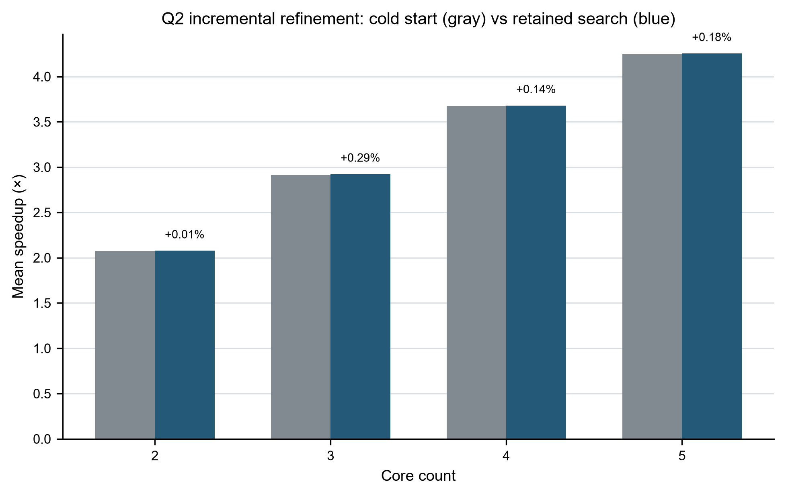
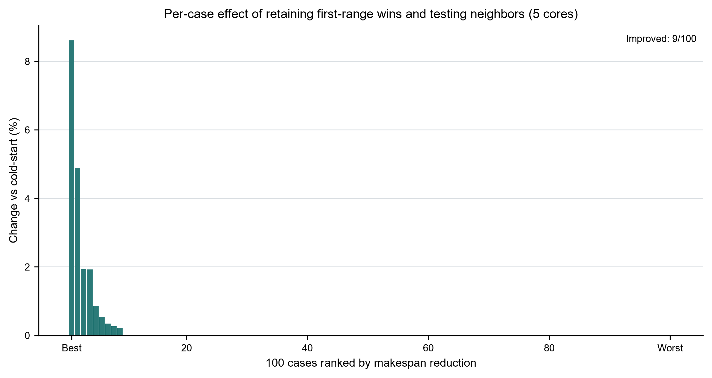
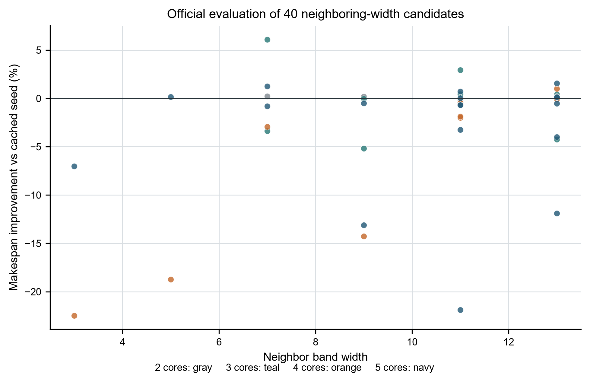

# 问题二：基于已完成搜索的增量细化

**实验日期：** 2026-09-25　　**服务器：** dashan　　**场景：** 题目问题二 Scene B

## 摘要

本轮直接复用 `q2_cold` 的全量冷启动结果及 `q2_optimization` 的常规深度分带搜索结果。只针对第一搜索范围中已经优于冷启动 incumbent 的 20 个 case/core 组合，保持活动核数不变，把胜出分带宽度 (w^*) 的左右相邻整数宽度 (w^*-1,w^*+1) 交给原版官方评测器。40 个相邻候选全部完成，新增评测 40 次；以原 Makespan 和 COPY 指标逐项比较后，12 个 case/core 组合最终采用邻域候选，另外 8 个沿用第一范围胜出方案，380 个组合沿用冷启动方案。

搜索段从运行清单与结果日志文件时间戳估计约 101 秒完成。任务启动后没有实时盯进度，在 10 分钟后检查时已完成。官方评测器是 CPU 仿真程序，所以使用 3 个 CPU worker 并行，不使用 GPU；GPU 不参与 Makespan 仿真。

| 核数 | 冷启动平均加速比 | 本轮最终平均加速比 | 平均加速比相对变化 | 优于冷启动的用例数 | 平均 Makespan 降幅 |
|---:|---:|---:|---:|---:|---:|
| 2 | 2.075760 | 2.076005 | +0.0118% | 2/100 | 0.0123% |
| 3 | 2.913669 | 2.922249 | +0.2946% | 4/100 | 0.3259% |
| 4 | 3.673713 | 3.679001 | +0.1447% | 5/100 | 0.1469% |
| 5 | 4.246278 | 4.253854 | +0.1784% | 9/100 | 0.1960% |

加速比按每个核数下 100 个用例的算术平均计算。本轮是 warm-start 的局部细化；它衡量已缓存搜索结果上的额外收益，不代表重新独立初始化得到的全新结果，也不证明全局最优或未见图泛化。

## 1. 规则和目标函数

图、算子与张量依赖、容量、通信规则、原版验证逻辑和 CPU 仿真评测器均保持不变。场景 B 中同一核心的子图由原评测器合并为一个 Task。固定配置从官方 `config.txt` 读取：L1 为 524,288 bytes，UB 为 131,072 bytes，DDR 带宽为 60 bytes/cycle，跨核 COPY 同步延迟为 500 cycles。本文不把第一问的通信口径套用到第二问。

对 DAG 中的算子 (v)，定义其拓扑深度为：

\[
d(v)=\begin{cases}0,&v\text{ 无前驱},\\1+\max_{u\to v}d(u),&\text{其他情况。}\end{cases}
\]

深度分带宽度 (w\) 决定算子的带编号：

\[
b_w(v)=\left\lfloor\frac{d(v)}{w}\right\rfloor.
\]

既有第一搜索范围枚举 (w\in\{4,8,12\})，并对可用活动核数 (k=2,\dots,n) 构造候选；深度分带只负责产生切分/分配方案，候选是否合法、实际复制与 spill、最终 Makespan 仍由官方评测器决定。第一范围得分以字典序最小化：

\[
J(P)=(T(P),D_{\rm copy}(P)),\qquad
P^*=\arg\min_P^{\rm lex}J(P),
\]

其中 (T(P)) 是官方 Makespan（cycles），(D_{\rm copy}(P)) 是官方返回的额外 COPY 字节数。只有 Makespan 相同时，额外 COPY 更少者优先；没有用未经官方评测的预测分数替代结果。

## 2. 增量搜索方法

### 2.1 读取并筛选已有结果

从 `q2_optimization/band/candidate_summary.csv`（5 核）和 `q2_optimization/transfer/candidate_summary.csv`（2–4 核已有迁移结果）加载第一范围候选，与 `q2_cold/final/per_case_metrics.csv` 比较。每个用例 (i)、核数 (n) 仅保留官方分数优于冷启动 incumbent 的第一范围最优候选，得到 20 个种子组合。未改善的用例不再展开。

### 2.2 邻域宽度细化

固定种子的活动核数 (k^*_{i,n})，只评估：

\[
\mathcal{N}_{i,n}=\{\max(1,w^*_{i,n}-1),\ w^*_{i,n}+1\}.
\]

因此新增候选数为 (20\times2=40)。脚本将 40 个彼此独立的 `(case, 核数, 活动核数, 宽度)` 任务分到 3 个 CPU worker；每项任务调用原版 Scene B 评测器，记录 Makespan、额外 COPY、spill、L1/UB 峰值、方案 JSON 和压缩后的原始结果。CSV 汇总由主进程串行刷新。既有搜索候选不重复生成，也不重新运行整套 400 组冷启动搜索。

最终组合的选择为：

\[
P^{\rm final}_{i,n}=\arg\min_{P\in\{P^{\rm cold}_{i,n},P^*_{i,n}\}\cup\mathcal{N}_{i,n}}^{\rm lex}
\left(T(P),D_{\rm copy}(P)\right).
\]

所有被选方案来自冷启动结果或实际官方评测过的既有/邻域候选。完整 100×4 计划包写入 `final_plans/`，并由 `final_plan_manifest.json` 保存 SHA-256；输出方案字段仍只有官方要求的 `node_to_subgraph` 和 `core_schedules`。

### 2.3 指标

每个用例的加速比和平均值定义为：

\[
S_{i,n}=\frac{T_{i,1}}{T_{i,n}},\qquad
\overline{S}_n=\frac1{100}\sum_{i=1}^{100}S_{i,n}.
\]

相对冷启动的 Makespan 降幅为：

\[
R_{i,n}=\frac{T^{\rm cold}_{i,n}-T^{\rm final}_{i,n}}{T^{\rm cold}_{i,n}}\times100\%.
\]

表中“平均 Makespan 降幅”是 100 个逐例 (R_{i,n}) 的算术平均；图中逐例分布不加置信区间，因为这些是固定基准用例，而非随机抽样或重复实验。

## 3. 结果

- 冷启动优胜种子：20 个 case/core 组合。
- 新增邻域候选：40 个，官方评测成功 40/40；15 个候选的 Makespan 优于对应种子，分布于 12 个不同组合。
- 最终方案选择：12 个组合使用邻域候选、8 个组合使用第一范围种子、380 个组合沿用冷启动 incumbent；相对冷启动没有任何退化。
- 5 核下 9/100 个用例改善；最好单例为 case_006，Makespan 降低 8.6155%，5 核平均加速比由 4.246278 升至 4.253854。5 核逐例改善率中位数为 0%，表示大多数用例保持原方案。
- 冷启动结果包含 400 个选择的独立官方复核；增量候选记录了 40 份官方评测器结果。汇总过程逐项核对所选候选的 CSV 得分与压缩原始评测结果，并验证最终 400 个方案的输出 schema。
- 问题二官方附件没有被修改；既有冷启动复核记录报告其 114 个官方文件哈希保持不变。

### 图 1：各核数的平均加速比

灰色表示冷启动 incumbent，蓝色表示本轮最终选择。增益较小但方向一致；5 核从 4.246278 升至 4.253854。



### 图 2：5 核逐例变化

显示 100 个用例相对冷启动 Makespan 的百分比变化，按改善幅度排序；9 个用例有正向改善，其余保持不变。



### 图 3：40 个相邻宽度候选

纵轴为候选相对其缓存种子的 Makespan 改善率；正值表示候选更快。多个点来自同一个 case/core 的左右邻居，最终仍按官方得分选一份方案。



所有图提供 PNG、矢量 PDF 与 SVG；绘图脚本、数据摘要和碰撞审计 JSON 随结果目录保存。三张图均为单面板，因此多面板对齐审计不适用。最终 PDF 的碰撞检查均为 PASS，PDF 文本最小字号均不低于 5 pt；并已逐张查看 PNG 渲染。

## 4. 企业公开方法调研与采用边界

- **OpenXLA/XLA 编译器调度：** 官方说明先在合法拓扑序中尝试降低峰值内存的调度，再运行 Latency Hiding Scheduler 争取计算/通信重叠；若峰值内存超限，再用 rematerialization 换取较短生命周期。其 LHS 成本模型结合性能查表和解析模型。与本题相通的是 DAG 调度、通信代价与内存生命周期联合考虑；本轮只借鉴“测量/缓存结果后做有界局部探索”的工程原则，不修改题目算子，也不改变原仿真语义。[OpenXLA：HLO 到 Thunks 的调度流程](https://openxla.org/xla/hlo_to_thunks)；[OpenXLA：LHS 成本模型](https://openxla.org/xla/lhs_cost_model)
- **NVIDIA TensorRT：** 官方文档描述 Builder 会测试层实现 tactics 并择优，还提供 timing cache 复用重复层配置的测量结果，以减少后续 build 时间；性能指南也强调先建立稳定测量基线，再优化。这里与我们的缓存候选/官方实测选优直接相关，但 TensorRT 的 GPU kernel timing 与本题 CPU 图仿真不是同一性能模型。[TensorRT：能力与 Builder 优化](https://docs.nvidia.com/deeplearning/tensorrt/latest/inference-library/capabilities.html)；[TensorRT：性能优化与 Timing Cache](https://docs.nvidia.com/deeplearning/tensorrt/latest/performance/optimization.html)
- **AWS Batch：** 公开的资源感知调度以 vCPU、GPU、内存及可消耗外部资源作为调度约束。可对应到本任务把独立评测任务分给有限 CPU worker，避免把 GPU 资源错误地当成 CPU 仿真的加速器。[AWS Batch：Resource-aware scheduling](https://docs.aws.amazon.com/batch/latest/userguide/resource-aware-scheduling.html)

这些公开资料用于理解生产系统中的常见工程做法，并不能证明各公司内部未公开实现，也不是本题规则的替代来源。题目附件与官方评测器始终是数值和可行性的权威依据。

## 5. 复现与文件

在仓库根目录运行增量候选：

```bash
python3 project/solution/q2_incremental_refine.py \
  --project project \
  --out project/q2_incremental_20260925 \
  --workers 3
```

该脚本依赖已存在的第一范围结果和冷启动指标；没有这些缓存文件时不能当作从零求解器使用。复核汇总及最终方案包：

```bash
python3 project/solution/finalize_q2_incremental.py
python3 project/solution/portfolio_q2.py
```

主要产物：`aggregate.json`、`final_per_case_metrics.csv`、`candidate_results.csv`、`verification.json`、`final_plan_manifest.json`、40 份候选方案/原始评测结果、完整 400 份 `final_plans/`、3 张图及绘图/审计文件。之前的 `q2_cold/final/verification.json` 保存冷启动 400 份方案复核记录。本稿由 AI 协助整理；参赛队需理解并按赛事要求核验和披露。
