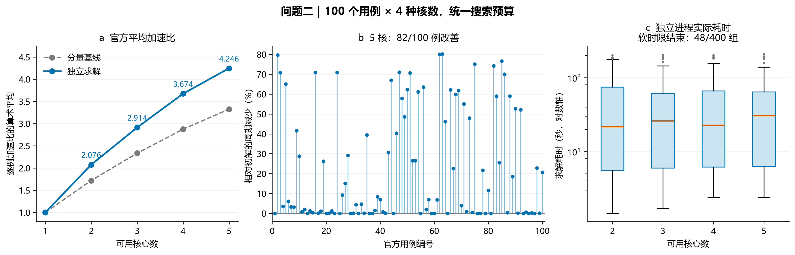
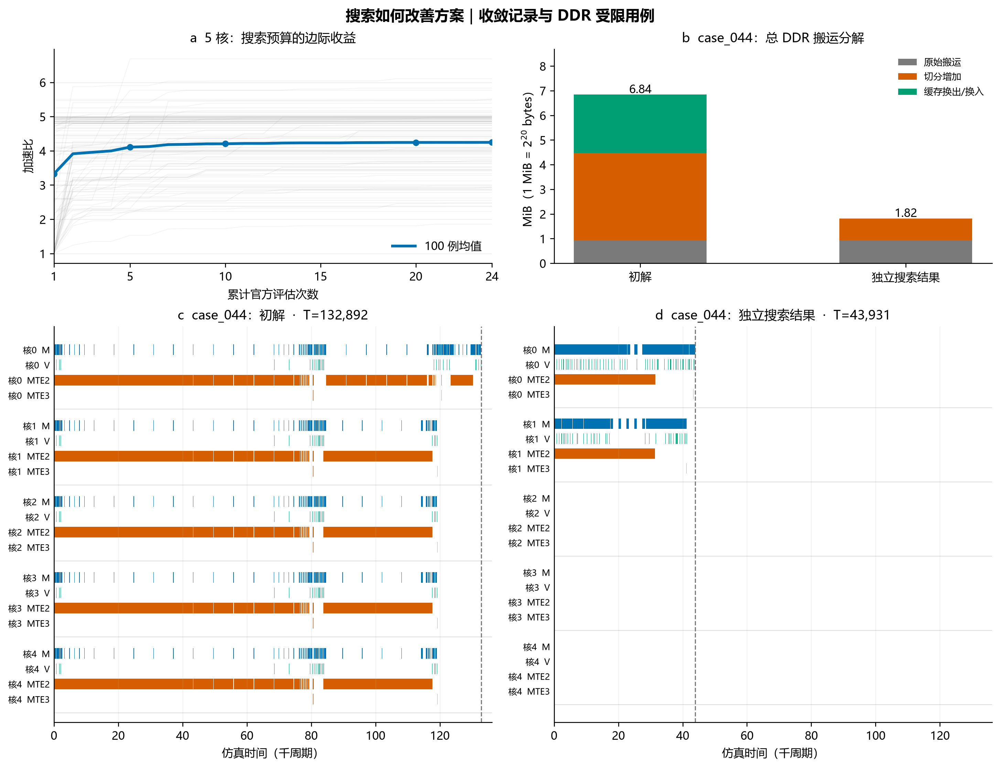

# 问题二：独立初始化的结构与局部调度搜索

本稿对应 `solution/q2_submit.py`（入口）、`q2_cold.py`（求解器）和 `q2_cold_config.json`（统一搜索参数）。场景 B 的题面、原附件代码及固定配置优先于本文和外部参考。本文研究的是在给定图上生成调度方案的算法，不训练神经网络，也不运行真实 NPU；Makespan 来自原版 CPU 仿真评估器。

## 1. 提交与实验口径

单次调用仅使用当前计算图、核心数、原版评估代码、固定硬件配置和统一搜索参数。没有用例名称白名单，没有历史方案查询，没有其他用例的候选或参数状态。程序先从输入构造初解，再在本次调用内改进。因此，内部迭代属于独立初始化求解，不依赖上次运行。结果目录仅写入，不作为下一次求解输入。

输出文件仍仅含 `node_to_subgraph` 和 `core_schedules`。诊断记录保存在旁边目录，不向官方方案增加字段。原图算子、张量、依赖、固定参数、Step1/2/3 和共享 DDR 仿真均不修改。第一问与问题二不能混用通信规则：场景 A 的同核跨子图仍需 DDR；本文场景 B 的同核子图由原评估器合并为一个 Task。

加速比的单核基准在求解结束后的汇总环节读取此前已核验的官方整图单核结果；它只用于统一归一化，不进入求解器、候选排序或停止规则。对新的输入图，提交程序同样无需任何成绩表即可输出方案，评测方可另算该图的单核基准。

之前 `q2_optimization/` 中的结果属于多轮离线候选选优，部分用例获得额外搜索。它们保留为历史研究记录，不参与本次冷启动结果的生成或最终逐例选优。`q1_submit.py` 的历史结果提取方式不在本次问题二改造范围内，不能用它证明问题一已具备同样的独立优化能力。

题目加速比为固定整图单核基准 T1 除以多核官方 Makespan Tn。T1 并不是经过全局优化的单核最短时间，切图还会改变核内调度和缓存换入换出，因此不能简单把核心数 n 当成该比值的必然上限。若观察到大于 n 的结果，应追踪具体时间与搬运变化，不把它直接解释成实际硬件吞吐超过线性扩展。

## 2. 输入、决策与约束

输入为原始二部 DAG、操作类型、Pipe、周期、Tensor 逻辑位置与字节数；核数为 2～5。记切图映射为 p(o)，子图的核心归属为 c(s)，每核子图顺序为 pi_k。

硬约束包括：全部非 COPY 操作恰好覆盖；每个子图恰好出现一次；子图收缩图无环；同核顺序满足依赖；最终展开执行满足 Pipe、缓存和跨核同步约束。统一容量为 L1=524288 bytes、UB=131072 bytes；DDR=60 bytes/cycle；场景 B 跨核拷贝同步延迟=500 cycles。实际值均从原 `config.txt` 读取。

容量不足时，允许原 Step2 按原规则插入换出和换入。生命周期估计超限不能直接证明方案非法；最终合法性由原版验证与仿真决定。代码既检查官方返回的峰值，又保留失败候选的具体异常原因，不用一个任意大惩罚数掩盖失败。

优化准则采用字典序：首先最小化官方 Makespan T，T 相同时最小化官方额外搬运 D_extra。这是本算法明确采用的选优规则，不宣称题面给出了加权评分公式。

## 3. 算法为何减少无目的枚举

### 3.1 从结构构造初始候选

从当前图构造弱连通分量基线、图宽谷值切分和深度分段。分段初始宽度由分支/汇合所在深度的相邻间隔中位数确定，并限制在 2～32；没有此类节点时采用图深度平方根的向上取整。谷值切分的两种初始最小间距为 1 和 6，均是统一开发参数。重复的方案通过规范 JSON 哈希去重。

少量较好的结构方案产生邻近候选：分段宽度减半/加倍，实际使用核数增减 1，或切换低边界数据量的分段方式。核数是可用资源上限，允许部分核心列表为空。结构候选扩展围绕已实评的前三个结构展开，不对宽度和核数做全组合网格。

### 3.2 Tensor 口径的搬运计算

在候选方案中，令 P_x、C_x 分别为 Tensor x 的生产核心集合与消费核心集合。按照附件构造规则，原输入在每个实际消费核心各读一次；原最终输出按要求写回；对每个不同的生产核心—消费核心组合，插入一对 COPY_OUT/COPY_IN。

因此跨核部分为 `sum_x 2*size(x)*|{(a,b):a in P_x,b in C_x,a!=b}|`，另加原输入的逐消费核读取和输出写回。这里按核心集合去重，不能按 Op 依赖边逐条重复收费；也不能把同一源核给多个目标核的写回误当成只写一次，因为原附件为每个源—目标组合插入一对 COPY。

这是换入换出前的搬运量。每次正式评估都会将此计算与官方 `scheduled_copy_bytes - spill_added_copy_bytes` 对照，不一致立即报错。最终成绩始终包含实际 spill。

### 3.3 有依据的剪枝与启发式排序分离

对于固定候选，任一核的单 Pipe 计算周期总量必须完成；依赖计算路径必须顺序完成；所有 DDR 数据必须通过固定总带宽。因此以下 L 是 Makespan 的下界：

`L = max(原图纯计算关键路径周期, max_{核k,计算Pipe p} W[k,p], D_before_spill/60)`。

只有当 L 严格大于当前最好官方 Makespan 时，才据此淘汰候选，并记录淘汰理由与数值。它是对该候选的下界，不是本问题最优解的证明，也不能据此断言目标均值不可达到。

其余候选用计算负载、跨核依赖延迟和数据传输估计排序。含 `500+2*bytes/60` 的依赖路径估计不能完整反映并发争用，明确只是启发式。该估计不会代替官方分数，也不会作为合法性判断。当前版本没有另训预测模型；少量候选不足以证明复杂拟合值得其成本。

### 3.4 局部搜索

优先处理估计负载较高的三个子图：尝试迁移子图，或沿拓扑深度切分其中较重的计算链。一个子图可能容纳多个独立分量，所以还单独选择其中最多两个重分量进行切分，避免无关链条一起被切断。尝试位置为分量深度的 1/4、1/2、3/4 分位，目标优先考虑较轻负载核心。

固定切图还可重构分核：按依赖优先级处理就绪子图，分别维护 M/V 工作量，并比较各核的估计最早完成时刻；同核通信估计为零，跨核计入固定延迟与数据量，原输入计入该核首次读取。此构造是针对场景 B 的启发式，不把每个子图误解释为独立硬件 Task。

顺序候选包括关键路径优先及消费/释放数据倾向。全局子图拓扑序投影到各核得到候选顺序，最后仍由原评估器检查完整执行依赖。核内操作顺序由附件生成，算法没有私自替换它。

结构搜索与局部搜索交替分配评估机会；当前最好方案改善后重新生成局部邻域。始终保留本次运行已验证的最好方案。仍可能陷入局部最优，不能保证每例都比历史不限预算选优更好。

## 4. 统一预算、断点与可复现性

每例每核数最多 24 次官方评估，搜索轮次按 180 秒软时限检查；正在进行的生成或评估完成后才退出，故不是严格 180 秒进程超时。完整进程耗时由外层另测，含程序启动与文件 I/O。全量实验最多两个求解进程并行。若机器负载导致触及时限，候选数量可能不同；固定评估次数且不触及时限时算法为确定性，无随机种子。

`search.jsonl` 在每次评估后刷新：候选来源、序号、代理值、下界、真实指标、是否接受、单次耗时与累计耗时。`events.json` 补充结构失败及下界剪枝事件。`run.json` 保存参数、输入/配置哈希、停止原因与最终方案哈希；`process.json` 保存退出码和完整进程耗时。当前最好合法 JSON 每次改善后立即更新。

这支持按评估次数或已完成评估的时间点观察，不为了凑断点重复仿真。正式复现从零开始；当前版本不提供会暗中继承结果的 resume 模式。运行时间受本机负载影响，模拟 Makespan 单位为 cycles，两者不混用。

先完成最小图、共享输入、实际 spill、收缩成环拒绝、输入不变、用例顺序独立、隔离目录及改名输入等检查；再做六个已知用例的开发试跑；随后冻结代码和参数，统一运行 100×4。六例不是未见测试集，全部官方用例此前也已用于开发，不把本次成绩宣传为未知图泛化成绩。

## 5. 全量结果

| 核数 | 分量基线均值 | 独立求解均值 | 改善用例数 | 求解耗时中位数（秒） |
|---:|---:|---:|---:|---:|
| 1 | 1.000000 | 1.000000 | 单核定义 | — |
| 2 | 1.719204 | 2.075760 | 79/100 | 21.80 |
| 3 | 2.334311 | 2.913669 | 87/100 | 26.01 |
| 4 | 2.873390 | 3.673713 | 80/100 | 22.71 |
| 5 | 3.325144 | 4.246278 | 82/100 | 30.76 |

5 核平均加速比相对分量基线提高 27.70%。尚未达到先前希望的 6；该数字仅作为目标，不作为结果约束。全量搜索共调用原版评估器 8861 次，另有 6383 个候选因明确下界而省去正式评估。搜索中记录 0 个不可行候选；最终 400 份方案全部合法，并逐份独立重新评估一致。原附件 114 个文件哈希均未改变。

48 组因时间预算停止，最长完整进程耗时 209.47 秒。较大用例可能来不及完成 24 次评估，不剔除它们、不额外加时。有限搜索也可能造成个别用例 5 核慢于 4 核；本次没有跨核数读取历史答案修饰该现象。

case_044 的初解为 132892 cycles，独立求解后为 43931 cycles。其图用于解释减少重复 DDR 输入读取的机制，不代表平均效果。

当前统计为一套冻结规则、统一预算、每例独立启动的实测。旧离线选优在预算和候选来源上不同，不能当作公平的同预算对照。没有声称未知图泛化、全局最优或单独某模块的因果贡献；这些需要另外设计实验。





## 6. 图表与提交复现

只生成两张复合图：全量收益与求解成本；收敛轨迹及一个机制示例。每张含清晰单位、来源和样本范围，提供 PNG、矢量 PDF 和绘图代码。机制示例只是解释一个现象，不代表全部用例。所有图由本次真实日志与原版仿真返回值生成，图中不补造缺失值或置信区间。

在包含 `solution/` 与 `official/code/` 的独立包中运行：

```text
python solution/q2_submit.py 输入图.json -n 5 --config config.txt -o 输出方案.json
```

程序默认在输出方案旁创建诊断目录。正式方案文件仅含官方要求的两个字段。固定配置文件随包提供；输入图由使用者提供。该命令无需历史方案、已跑出的 CSV 或原项目其他赛题。开发测试为 `python solution/test_q2_cold.py`；全量运行、复核与绘图入口分别为 `q2_cold_run.py`、`q2_cold_summarize.py`、`q2_cold_figures.py`。

## 7. 参考与边界

- 正式 A 题问题二、附录 B/C/D，以及原附件 `multicore_cut_evaluate_problem_2.py`，是模型和数值口径的第一依据。
- 用户提供《参考文献及求解思路.docx》作为方法建议，不覆盖正式规则。
- [Jeon 等，Baechi，SoCC 2020](https://dprg.cs.uiuc.edu/data/files/2020/socc20-final352.pdf)：借鉴依赖与通信感知放置；不采用改写原算子的图融合，也不移植其近似比结论。
- [Kulagina 等，Memory-aware Adaptive Scheduling，2025](https://arxiv.org/html/2503.22365v1)：借鉴内存感知与依赖优先级；不引入其额外通信缓冲区、异构硬件假设或运行时反馈机制。

算法和技术稿由 AI 辅助实现与整理。参赛队需理解、复核并按赛事要求披露；本稿不等同于已完成的正式竞赛论文。
