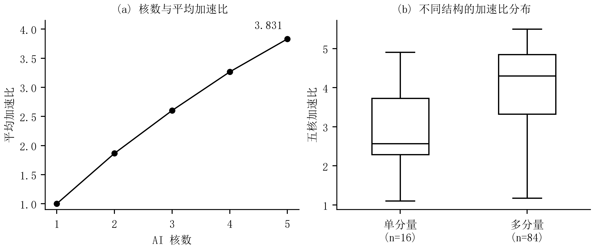
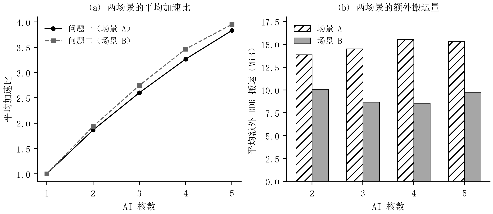

# 第六章　问题一：基于拓扑结构的切图与任务调度

## 6.1　问题分析与计算图预处理
问题一的关键在于确定合适的并行粒度。场景 A 将每个子图独立封装为一个 Task，子图之间的数据均通过 DDR 传递，即使两个子图位于同一核心也不例外。切分能够增加并行机会，却会引入边界搬运和任务等待。因此，算法首先分析当前计算图中的独立分量、分支与汇合位置，再比较不同粒度的切图方案。

设原始计算图为 $G=(T\cup O,E)$，其中 $T$、$O$ 分别为张量节点与操作节点集合。张量 $t$ 的大小记为 $b_t$，操作 $u$ 的计算周期记为 $c_u$，其计算管道记为 $p(u)\in\{M,V\}$。为分析计算依赖，从操作集合中取出非 COPY 操作 $O_c$，将经张量连接的生产者与消费者转化为操作间依赖：

$$
G_c=(O_c,E_c),\qquad
E_c=\{(u,v)\in O_c^2:\exists t\in T,\ (u,t),(t,v)\in E\}\cup E_{OO}.
\tag{6.1}
$$

其中 $E_{OO}$ 表示原图直接给出的操作间依赖。本题 100 个输入图中该集合均为空，但预处理仍保留对此类边的支持。式（6.1） 只建立用于求解的依赖视图，原图中的 COPY 操作、张量大小和存储位置均予以保留。

对 $G_c$ 进行拓扑排序，并在其无向形式上提取弱连通分量 $\mathcal C=\{C_1,\ldots,C_K\}$。沿拓扑序计算操作深度、层宽和两条计算管道的工作量：

$$
\begin{aligned}
d_u&=1+\max_{v\in\operatorname{pred}(u)}d_v,\qquad h=\max_u d_u,\\
m_\ell&=|\{u:d_u=\ell\}|,\qquad
W_j^q=\sum_{u\in C_j,\ p(u)=q}c_u,\quad q\in\{M,V\}.
\end{aligned}
\tag{6.2}
$$

无前驱节点的深度为 1。分量数 $K$ 反映可直接分配的独立计算块数量；层宽 $m_\ell$ 描述不同深度上的并行程度；入度或出度大于 1 的节点分别标识汇合与分支位置。另建立每个张量的生产者、消费者及字节数索引，用于评价候选切分的搬运代价。

表 6-1 给出逐图预处理的结果。84 个图包含多个弱连通分量，另外 16 个图仅有一个分量；计算规模和深度差异较大。由此，完整分量装箱适合作为稳定的初始构造，但对单个大分量或分量负载不均衡的图，还需利用内部拓扑寻找并行切分点。

<table><caption>表 6-1　100 个计算图的结构统计</caption><thead><tr><th>结构量</th><th>最小值</th><th>中位数</th><th>最大值</th></tr></thead><tbody><tr><td>非 COPY 操作数</td><td>552</td><td>3720.5</td><td>35705</td></tr><tr><td>弱连通分量数 $K$</td><td>1</td><td>39.5</td><td>2666</td></tr><tr><td>拓扑深度 $h$</td><td>3</td><td>47.5</td><td>2440</td></tr><tr><td>最大层宽</td><td>8</td><td>217.5</td><td>15921</td></tr></tbody></table>

## 6.2　场景 A 的约束与时间估计
对给定核心数 $N\in\{2,3,4,5\}$，记子图映射为 $\phi:O_c\to\mathcal S$，核心分配为 $a:\mathcal S\to\{0,\ldots,N-1\}$，核心 $k$ 的子图执行序列为 $\pi_k$。子图编号为非负整数；每个非 COPY 操作必须且只能分配到一个子图，每个子图必须且只能在一个核心序列中出现一次。子图依赖图以及加入同核先后关系后的联合图均须无环。输出采用附件规定的 <code>node_to_subgraph</code> 和 <code>core_schedules</code> 两个字段。

以系统完工时间为主要优化目标，同时考虑新增 DDR 搬运量。根据固定配置，同核相邻 Task 的等待时间为 $\delta_{\rm same}=100$ cycle，跨核前驱 Task 的等待时间为 $\delta_{\rm cross}=1000$ cycle；各核心共同使用带宽 $\beta=60$ byte/cycle 的 DDR。L1 和 UB 的容量分别为 524288 byte 和 131072 byte。增加核心数不会增加 DDR 总带宽，同核 Task 切换也不能保留前一 Task 的缓存数据。

为在有限时间内比较候选，采用计算工作量、边界字节数和任务依赖共同构成时间估计。设 $I_s$、$U_s$ 为 Task $s$ 需要从 DDR 读入和写回 DDR 的张量集合，同一 Task 内按张量去重，则

$$
\widehat B_A=\sum_{s\in\mathcal S}\left(\sum_{t\in I_s}b_t+\sum_{t\in U_s}b_t\right),\qquad
\widehat d_s=\max\left\{W_s^M,W_s^V,
\frac{\sum_{t\in I_s}b_t+\sum_{t\in U_s}b_t}{\beta}\right\}.
\tag{6.3}
$$

这里 $W_s^q$ 按式（6.2） 对 Task 内操作重新求和。取最大值用于近似两条计算管道与搬运的重叠执行，$\widehat B_A$ 不含缓存不足引起的换入换出。该式用于方案比较，不能直接替代附件的核内调度结果。

在子图依赖图中加入同核相邻 Task 的顺序边，记得到的前驱集合为 $P^\pi(s)$。沿该图的拓扑序递推：

$$
\begin{aligned}
\widehat f_s&=\widehat d_s+\max_{u\in P^\pi(s)}(\widehat f_u+\delta_{us}),\\
\widehat T_A&=\max\left\{\max_s\widehat f_s,\frac{\widehat B_A}{\beta}\right\},\qquad
\delta_{us}=\begin{cases}
\delta_{\rm cross},&a(u)\ne a(s),\\
\delta_{\rm same},&u\text{ 为 }s\text{ 的同核紧邻前项},\\
0,&\text{其余同核依赖}.
\end{cases}
\end{aligned}
\tag{6.4}
$$

空前驱集合的最大值取 0。式（6.4） 同时反映任务串行关系、跨核等待及全局搬运工作量。由于它不展开逐个 COPY 的带宽竞争，也不执行缓存换出，仍是一种排序代理。最终完工时间和额外搬运量由附件原版程序在方案生成完毕后统一验收。

## 6.3　分量装箱与结构切分
首先将弱连通分量作为完整物品分配。按 $\max(W_j^M,W_j^V)$ 从大到小处理分量，设核心 $k$ 已分配的管道负载为 $(L_k^M,L_k^V)$，则将当前分量放入

$$
k^*=\arg\min_k
\left(\max_{q\in\{M,V\}}(L_k^q+W_j^q),\ L_k^M+L_k^V,\ k\right).
\tag{6.5}
$$

括号内按字典序比较，选定后更新两条管道负载。同核分量合并为一个子图，空核保留空序列。该规则采用最长工作量优先分配思想[1]，并用双管道负载替代单一处理时间。共享 DDR 和缓存使本题不再满足经典独立作业调度模型，因而不直接援引其近似比作为本算法的性能保证。

不同弱连通分量之间没有计算依赖，完整分配不会切断分量内部的生产–消费关系。这一性质有利于避免中间依赖造成的跨核通信，但不意味着额外搬运量必为零：共享输入可能被多个核心分别读取，核内缓存不足也会产生换入换出。另一方面，若一个分量占据大部分工作量，完整保留会限制可利用的核心数。因此，算法同时构造内部切分候选。

内部切分围绕三类结构展开。第一类保留首次汇合前的独立分支，或按照末端消费者对分支归组；第二类利用拓扑层宽的收缩与扩张确定阶段边界；第三类按照深度带与源端、末端可达关系划分。在深度带构造中，候选边界附近按跨层张量字节数选择切分位置，以减少将大张量切到不同 Task 的情况。上述构造均保持原操作和依赖，不拆分操作，也不复制计算。

基础深度带宽由当前图的深度 $h$、总计算量 $W=\sum_{u\in O_c}c_u$ 和核心数确定：

$$
w_0=\max\left\{2,\left\lceil\frac{N\delta_{\rm cross}h}{\max(1,W)}\right\rceil,
\left\lceil\frac{Nh}{256}\right\rceil\right\}.
\tag{6.6}
$$

算法考察 $w_0,2w_0,4w_0$ 三种粒度。前一项避免过细切分，第二项使计算相对等待开销较小时倾向于更粗的 Task；第三项是固定的搜索规模控制规则，256 不是题目的硬件常数。此外，还保留减少活跃核心数的分量分配候选，以应对并行计算收益不足以抵消 DDR 争用的情形。

## 6.4　任务列表调度与有限合并
各结构候选先经过覆盖性、无环性检查和方案去重，再由式（6.4） 排序。仅对排名靠前的至多三个候选进行任务调度与合并调整，以控制额外搜索量。

任务重排采用“就绪任务优先级–最早完成核心”的列表调度思想[2]。先自后向前计算

$$
r_s=\widehat d_s+\max_{v\in\operatorname{succ}(s)}(\delta_{\rm same}+r_v).
\tag{6.7}
$$

每次从全部已分配前驱的就绪 Task 中选取 $r_s$ 最大者，比较其放到各核心后的预计完成时刻。设 $F_k$ 是核心 $k$ 已排任务的末端时间，则

$$
\operatorname{EFT}(s,k)=\widehat d_s+
\max\left\{F_k+\delta_{\rm same}\mathbf1[\pi_k\ne\varnothing],
\max_{u\in\operatorname{pred}(s)}
\big(\widehat f_u+\delta_{\rm cross}\mathbf1[a(u)\ne k]\big)\right\}.
\tag{6.8}
$$

优先选择 EFT 最小的核心，并列时依次选择已排 Task 数较少、编号较小的核心。式（6.7） 中的固定等待项只用于任务优先级；核心选择时则按式（6.8） 区分同核与跨核等待。这里采用尾部追加排布，没有执行 HEFT 的空闲区间插入步骤。

合并调整只考虑同核相邻、且在 Task 拓扑序中也相邻的任务对。按共享张量字节数选取至多八对，逐一尝试收缩；每次收缩都重新校验联合依赖图，并且只接受降低 $\widehat T_A$ 的结果，最多进行两轮。任务重排与合并分别从各自的结构候选出发，避免将多轮局部搜索叠加为无界迭代。最终选择预计时间最小的合法方案；若完整分量方案的预计时间不超过最小值的 1.01 倍，则保留完整分量方案，减少对微小估计差异的依赖。

算法 6-1　 基于输入拓扑的切图与任务调度

<strong>输入：</strong>当前计算图 $G$，核心数 $N$，带宽 $\beta$，等待参数 $\delta_{\rm same},\delta_{\rm cross}$。

<strong>输出：</strong>子图映射 $\phi$ 与每核子图序列 $\pi_0,\ldots,\pi_{N-1}$。

1.读取张量、操作与边；提取非 COPY 操作集 $O_c$，保留原始数据。

2.按生产–消费关系构建 $G_c$；计算拓扑序与节点深度 $d_u$。

3.提取弱连通分量、层宽、分支及汇合位置，统计双管道工作量与张量字节数。

4.按式（6.5） 构造完整分量方案 $P_0$，初始化 $\mathcal P\leftarrow\{P_0\}$。

5.加入首次汇合与末端分支候选，以及较少活跃核心数的分量装箱候选。

6.按式（6.6） 计算 $w_0$。

7.<strong>for</strong> $w\in\{w_0,2w_0,4w_0\}$ <strong>do</strong>

8.按 $w$ 构造数据感知深度带、分支汇合、层宽谷和末端可达归组候选。

9.<strong>end for</strong>；另加入宽度为 $w_0$ 的源端可达归组候选。

10.逐候选检查节点与子图覆盖、联合依赖无环性；剔除失败及重复方案。

11.按式（6.3）–（6.4） 计算 $\widehat B_A$、$\widehat T_A$，选取排名靠前的至多三个方案。

12.<strong>for</strong> 所选方案中的每个 $P$ <strong>do</strong>

13.从 $P$ 分别生成就绪列表重排方案与至多两轮的相邻任务合并方案。

14.重新检查合法性，计算时间估计，将不同的合法方案加入 $\mathcal P$。

15.<strong>end for</strong>

16.取 $\widehat T_A$ 最小的 $P^*$；时间并列时比较边界字节数与固定方案哈希。

17.若 $\widehat T_A(P_0)\le1.01\widehat T_A(P^*)$，令 $P^*\leftarrow P_0$。

18.<strong>return</strong> $P^*$ 的 <code>node_to_subgraph</code> 与 <code>core_schedules</code>。

## 6.5　求解结果与分析
算法对每个图、每种核数分别从原始输入生成方案。所有全局参数在正式运行前固定，生成过程中不读取历史方案和逐图得分，也不调用官方评估器。方案保存后，再使用未修改的附件程序完成 100 个图、2–5 核共 400 组验收，全部通过。

设第 $i$ 个图在 $N$ 核下的官方完工时间为 $T_{i,N}$，按题目规定采用的单核整图时间为 $T_{i,1}$。统计采用逐图加速比的算术平均：

$$
S_{i,N}=\frac{T_{i,1}}{T_{i,N}},\qquad
\overline S_N=\frac1{100}\sum_{i=1}^{100}S_{i,N}.
\tag{6.9}
$$

单核加速比按定义置为 1，不另行进行单核搜索。表 6-2 给出全部用例的汇总；额外搬运采用官方 <code>added_copy_bytes</code> 字段，并按 $1\,\mathrm{MiB}=2^{20}$ byte 换算。

<table><caption>表 6-2　问题一的全量求解结果</caption><thead><tr><th>核心数</th><th>平均加速比</th><th>加速比中位数</th><th>平均额外搬运 / MiB</th></tr></thead><tbody><tr><td>2</td><td>1.8648</td><td>1.9583</td><td>13.848</td></tr><tr><td>3</td><td>2.6016</td><td>2.7753</td><td>14.514</td></tr><tr><td>4</td><td>3.2650</td><td>3.5074</td><td>15.557</td></tr><tr><td>5</td><td>3.8311</td><td>4.0428</td><td>15.285</td></tr></tbody></table>

<figure><figcaption>图 6-1　问题一的加速比结果。左图为每种核数下 100 图的算术平均，单核值按定义为 1；右图为五核下按弱连通分量数分组的分布。箱体表示四分位区间，中线为中位数，须延至 1.5 倍四分位距内的最远观测，点为其外观测。</figcaption></figure>

五核平均加速比为 3.8311。多分量图的五核平均值为 4.0041，单分量图为 2.9228，表明输入结构对可利用的并行性有明显影响。多分量允许在较少新增依赖的条件下分配负载；单分量则通常需要在并行化与边界代价之间作出取舍。该分组仅作结果描述，不作为对任一新图性能的保证。

与仅采用完整分量装箱的同批五核方案相比，结构切分与有限调度调整使 38 个图耗时下降、2 个图上升、60 个图不变。由此可见，保留分量能够解决一部分图，内部结构切分对另一部分图有补充作用，但代理排序仍存在误差。五核平均额外搬运中，缓存换入换出贡献 7.423 MiB，说明通信割边并不是唯一成本来源。后续场景 B 的设计还需显式考虑同核数据驻留对缓存的影响。

# 第七章　问题二：通信与缓存驻留联合约束下的切图调度

## 7.1　场景 B 的运行机制与建模重点
场景 B 将同一核心的全部子图合并为一个 Task，同核生产者与消费者之间可以保留 L1/UB 中的数据。此时，决定边界通信的因素由“是否跨子图”转变为“是否跨核心”。跨核依赖仍需 COPY_OUT 和 COPY_IN，目标搬入须等待源搬出完成，并经过 $\delta_B=500$ cycle 的同步延迟。图 7-1 对比了两种场景的数据路径。

<figure><figcaption>图 7-1　两种场景下的 Task 边界与数据路径。图中为规则示意，未按实测时间绘制；L1、UB 的容量限制及共享 DDR 总带宽均保持题目配置。</figcaption></figure>

合并 Task 可减少同核中间数据搬运，同时也会使部分张量驻留更久。若仅将通信量大的操作集中到同一核心，可能造成计算负载集中或缓存换出增加。因此，问题二在重新分析当前图的基础上，联合考虑双管道负载、跨核生产–消费关系与张量活跃区间，并以少量结构候选控制求解成本。

沿用第六章的 $G_c$、$\phi$、$a$、$\pi_k$ 及硬件符号。每个 case 都重新计算拓扑序、分量、层宽和分支汇合位置，不读取问题一已输出的切图方案。记分支或汇合节点所在的不同拓扑层为 $\ell_1<\cdots<\ell_m$，其相邻间距集合为 $\mathcal D=\{\ell_{j+1}-\ell_j\}$。候选深度带宽取

$$
w_B=\begin{cases}
\max\{2,\min\{32,\operatorname{round}(\operatorname{median}\mathcal D)\}\},&\mathcal D\ne\varnothing,\\
\max\{2,\min\{32,\lceil\sqrt h\rceil\}\},&\mathcal D=\varnothing.
\end{cases}
\tag{7.1}
$$

该规则使切分粒度随本图结构变化，同时将候选尺度限制在固定范围。式中的 2 和 32 是算法参数，均不改变题目规定的核数、缓存容量与等待时间。

## 7.2　跨核通信与完成时间估计
令 $P_t$、$C_t$ 分别表示张量 $t$ 的生产核集合和消费核集合；令 $e_t=1$ 表示原图包含该张量的最终 COPY_OUT。一次跨核生产–消费核对需要源核写出、目标核读入；同一核心内的消费不因子图边界而新增 COPY。按这一规则，定义

$$
\begin{aligned}
n_t^{\rm in}&=\mathbf1[P_t=\varnothing]|C_t|,\\
n_t^{\rm out}&=\mathbf1[P_t\ne\varnothing]\,
\mathbf1[e_t=1\ \text{或}\ C_t=\varnothing]|P_t|,\\
n_t^{\rm cross}&=\sum_{k\in P_t}\sum_{l\in C_t}\mathbf1[k\ne l].
\end{aligned}
\tag{7.2}
$$

由此得到缓存换出之前的通信量估计

$$
\widehat B_B=\sum_{t\in T}b_t
\left(n_t^{\rm in}+n_t^{\rm out}+2n_t^{\rm cross}\right)
+2\sum_{(u,v)\in E_{OO}}d_{uv}\mathbf1[a(\phi(u))\ne a(\phi(v))].
\tag{7.3}
$$

其中 $d_{uv}$ 为直接操作边的 <code>data_size</code>，在本题给定图上第二项为 0。与按依赖边逐条累计相比，式（7.2） 先形成生产核和消费核集合，能够避免把同核多个消费者重复记为不同的消费核。$\widehat B_B$ 用于候选之间的通信比较，实际新增搬运还受到原图已有 COPY 和缓存换入换出的影响。

记核心 $k$ 的管道负载为 $L_k^q=\sum_{u:a(\phi(u))=k,\,p(u)=q}c_u$。设 $b_{uv}$ 为操作依赖 $u\to v$ 关联的张量字节数及直接边字节数之和。沿操作拓扑序递推：

$$
\begin{aligned}
\widehat f_v^B&=c_v+\max_{u\in\operatorname{pred}(v)}
\left[\widehat f_u^B+\mathbf1[a(\phi(u))\ne a(\phi(v))]
\left(\delta_B+\frac{2b_{uv}}{\beta}\right)\right],\\
\widehat T_B&=\max\left\{\max_{k,q}L_k^q,\ \max_v\widehat f_v^B,\ \frac{\widehat B_B}{\beta}\right\}.
\end{aligned}
\tag{7.4}
$$

第一项反映最忙计算管道的工作量，第二项计入依赖路径上的计算与跨核代价，第三项反映共享 DDR 的总工作量。三项均以 cycle 表示。实际执行还存在四 Pipe 的相互配合和带宽动态均分，因此 $\widehat T_B$ 是快速筛选量，而非对官方完工时间的精确表达。

## 7.3　张量驻留区间与缓存风险
为识别同核合并可能带来的缓存压力，先按 $\pi_k$ 连接各子图，并在子图内保留原操作拓扑序，得到核心 $k$ 的分析序列。对张量 $t$，令 $f_{tk}$、$l_{tk}$ 分别为其生产者或消费者在该序列中第一次和最后一次出现的位置。对资源 $r\in\{L1,UB\}$，静态活跃字节峰值为

$$
H_k^r=\max_j\sum_{t:\,\operatorname{pos}_k(t)=r}
b_t\mathbf1[f_{tk}\le j\le l_{tk}],\qquad
R_B=\sum_{r\in\{L1,UB\}}\left(\max_k H_k^r-C_r\right)_+.
\tag{7.5}
$$

其中 $(x)_+=\max(x,0)$，$C_r$ 为对应缓存容量。在静态估计中，原 DDR 输入按 UB 驻留处理。程序通过区间起止位置的差分累计计算 $H_k^r$，无需按实际周期展开整个执行过程。

该区间与附件调度器的真实驻留时间不同。附件按固定核内顺序插入必要的换入换出，并在操作发射前申请输出空间、最后一次使用完成后释放输入空间。因此，$R_B$ 仅用于筛查长期驻留风险，不能用 $R_B=0$ 推出实际无溢出，也不能把 $R_B$ 当作最终新增字节数。运行时 L1/UB 容量仍由附件规定的机制严格约束。

对合法候选采用统一评分

$$
J_B=\widehat T_B+\frac{\widehat B_B+\gamma R_B}{\beta},\qquad \gamma=10.
\tag{7.6}
$$

评分以完成时间估计为主体，附加 DDR 工作量与缓存风险项。$\widehat B_B/\beta$ 在此承担共享带宽压力的启发式修正，不是将式（7.4） 再解释为物理时长的可加分解。系数 $\gamma$ 在开发阶段统一确定：28 个静态风险为正的候选中，实际溢出字节与风险量之比的中位数为 10.54，取整为 10 后冻结；正式求解不再逐图调整该系数。

## 7.4　有限候选构造与算法实现
问题二构造五类方案：完整分量装箱、层宽谷切分、宽度为 $w_B$ 和 $2w_B$ 的两种数据感知深度带，以及宽度为 $w_B$ 的固定深度带。各方案使用同一输入依赖和张量字节数，其中分量或带内独立区域采用第六章的双管道负载分配规则。数据感知切分优先寻找跨层字节数较少的位置，层宽谷切分则利用并行度收缩处形成阶段。五类方案生成后去重，重复结构不再评分。

每个候选首先检查节点覆盖、子图唯一分配及联合依赖图无环性，再计算通信、路径与缓存项。按 $J_B$ 选择方案，并列时依次比较 $\widehat B_B$ 和固定的候选类别顺序。数学模型将通信与缓存机理转化为可计算的排序量，算法据此完成有限候选的选择，输出题目规定的切图和核心序列。

算法 7-1　 基于输入结构与驻留风险的场景 B 调度

<strong>输入：</strong>当前计算图 $G$，核心数 $N$，固定配置 $\beta,\delta_B,C_{L1},C_{UB}$。

<strong>输出：</strong>子图映射 $\phi$ 与每核子图序列 $\pi_0,\ldots,\pi_{N-1}$。

1.读取当前 case，构建 $G_c$、张量生产者/消费者表及大小、存储位置索引。

2.计算拓扑序、深度、弱连通分量、层宽和分支汇合层；按式（7.1） 得到 $w_B$。

3.生成分量装箱、层宽谷、两种数据感知深度带及固定深度带共五类候选。

4.初始化记录集合 $\mathcal R=\varnothing$ 与已处理方案哈希集合。

5.<strong>for</strong> 按固定类别顺序生成的每个候选 $P$ <strong>do</strong>

6.校验节点覆盖、子图覆盖及依赖与核内顺序的无环性；失败则记录原因并跳过。

7.计算完整方案哈希；若重复则跳过。

8.由 $\phi,a$ 建立 $P_t,C_t$，计算 $\widehat B_B$、$L_k^q$ 和 $\widehat T_B$。

9.按每核子图序列构造分析序列，计算 $f_{tk},l_{tk}$，以差分累计得到 $H_k^r$。

10.计算 $R_B$ 和 $J_B$，将候选及各项评价量加入 $\mathcal R$。

11.<strong>end for</strong>

12.若 $\mathcal R$ 为空则报告失败；否则按 $(J_B,\widehat B_B,\text{类别顺序})$ 取最小项。

13.<strong>return</strong> 对应的 <code>node_to_subgraph</code> 与 <code>core_schedules</code>。

## 7.5　求解结果与分析
按照与问题一相同的单核参照和统计口径，对 100 个计算图的 2–5 核方案进行独立验收，共 400 组，全部成功。表 7-1 列出两种场景在相同图和核数下的结果。开发标定与最终验收使用了同一批给定图，因此以下数值表示本题数据上的性能，不据此声称对未知图分布的泛化效果。

<table><caption>表 7-1　问题一与问题二的全量结果比较，额外搬运单位为 MiB</caption><thead><tr><th>核心数</th><th>问题一加速比</th><th>问题二加速比</th><th>问题一额外搬运</th><th>问题二额外搬运</th></tr></thead><tbody><tr><td>2</td><td>1.8648</td><td>1.9358</td><td>13.848</td><td>10.076</td></tr><tr><td>3</td><td>2.6016</td><td>2.7452</td><td>14.514</td><td>8.683</td></tr><tr><td>4</td><td>3.2650</td><td>3.4645</td><td>15.557</td><td>8.569</td></tr><tr><td>5</td><td>3.8311</td><td>3.9522</td><td>15.285</td><td>9.756</td></tr></tbody></table>

<figure><figcaption>图 7-2　两种场景的全量结果比较。左图为逐图加速比的算术平均，单核值按定义为 1；右图为官方统计的平均新增 DDR 字节数，以 MiB 表示。除单核定义值外，每个点或柱均对应 100 个计算图。</figcaption></figure>

问题二在 2–5 核下的平均加速比均高于问题一，五核均值由 3.8311 增至 3.9522。同时，五核平均额外搬运由 15.285 MiB 降至 9.756 MiB。场景 B 允许保留同核数据，为降低边界搬运提供了条件；但两场景使用了各自适配的方案，以上差异同时包含场景规则和方案选择的影响，不能全部归因于单一算法步骤。

逐图比较显示，五核时有 31 个图耗时下降、19 个图上升、50 个图相同。以问题一的逐图耗时为分母，平均耗时缩减率为 1.67\%。平均加速比提高并不意味着每个图都改善，这也是在通信量之外保留缓存风险项的原因。问题二的五核平均缓存换入换出新增字节仍为 5.315 MiB，故本算法并未实现普遍的无溢出调度。

两章算法均遵循“当前图分析–有限方案构造–规则约束检查–独立官方验收”的顺序。推理所需参数和候选规则固定，每个 case 均重新生成其拓扑特征与方案；官方评估器只用于开发检验和最终验收。上述结果支持该方法在题目给定 100 图和固定硬件配置下的可行性与性能，代理模型对动态缓存和带宽竞争的近似仍是主要误差来源。

<h2>参考文献</h2>

[1] Graham R L. Bounds on Multiprocessing Timing Anomalies. SIAM Journal on Applied Mathematics, 1969, 17(2): 416–429. <a href="https://doi.org/10.1137/0117039">DOI: 10.1137/0117039</a>.

[2] Topcuoglu H, Hariri S, Wu M Y. Performance-effective and low-complexity task scheduling for heterogeneous computing. IEEE Transactions on Parallel and Distributed Systems, 2002, 13(3): 260–274. <a href="https://doi.org/10.1109/71.993206">DOI: 10.1109/71.993206</a>.

