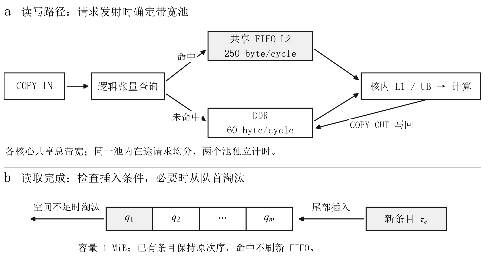
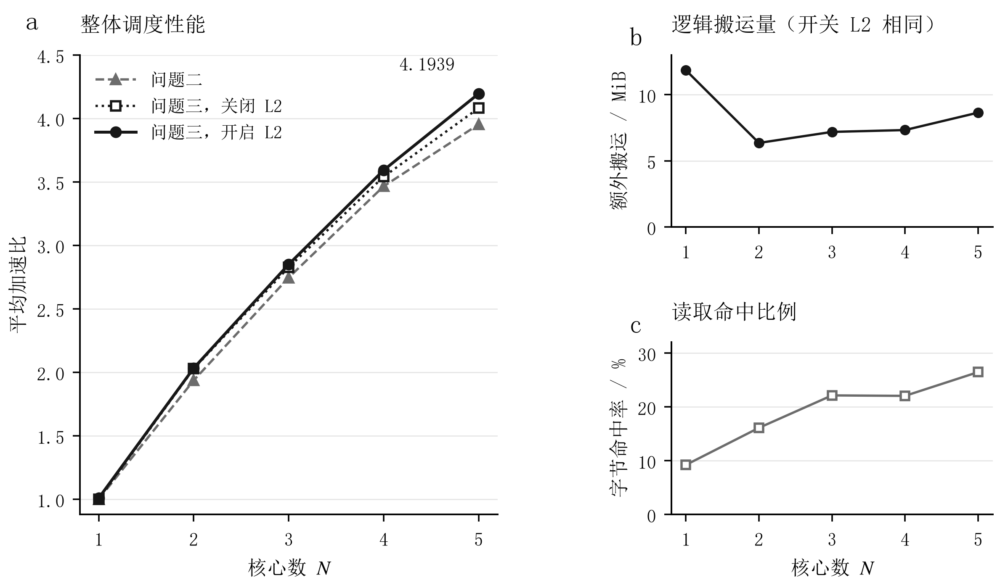
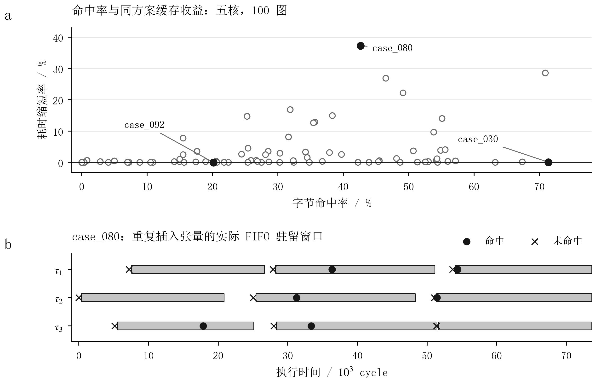

# 第八章　问题三：共享只读 Cache 下的切图与协同调度

## 8.1　缓存数据通路与协同调度条件
问题三在场景 B 的基础上增加所有核心共享的只读 FIFO Cache。同核子图仍合并为一个 Task，跨核传递仍经过 COPY_OUT、COPY_IN 和 $\delta_B=500$ cycle 的同步延迟。新增 Cache 容量为 $C_{\rm L2}=1048576$ byte，读带宽为 $\beta_{\rm L2}=250$ byte/cycle，与带宽为 $\beta=60$ byte/cycle 的 DDR 分别结算。L1、UB 继续承担核内计算数据的驻留，两者容量沿用第六章配置。

读请求的服务路径取决于发射时的 Cache 状态。COPY_IN 按逻辑张量标识查询，命中时占用 L2 读带宽，未命中时占用 DDR 带宽；COPY_OUT 始终进入 DDR。一次读取完成后，附件程序尝试将对应张量插入 FIFO 队列，空间不足时先淘汰最早插入的条目。命中读取不会调整已有条目的队列位置。图 8-1 给出数据通路及插入、淘汰之间的关系。

<figure><figcaption>图 8-1　共享只读 Cache 的数据通路。DDR 与 L2 分别提供 60、250 byte/cycle 的总带宽，同一池内在途请求动态均分带宽。下部按 FIFO 次序表示读取完成后的插入处理，属于规则示意，框宽与箭头长度不代表实际时间或张量大小。</figcaption></figure>

缓存能够减少部分 DDR 读取等待，其收益还取决于请求到达时间和张量能否保留到下一次访问。例如，多个核心同时首次读取同一张量时，早先的读取尚未完成，后续请求仍可能全部未命中；张量即使命中过，之后也会随着新条目插入而被淘汰。调度方案需要同时安排计算负载和读取先后，单独累计共享输入字节无法确定实际收益。

沿用 $G_c$、$\phi$、$a$ 与 $\pi_k$，记完整方案为 $P=(\phi,a,\pi_0,\ldots,\pi_{N-1})$。可提交的决策仍是切图映射与核心序列，Cache 命中、指令发射及淘汰时间随执行产生。本文通过分核和合法重排形成读取机会，不增加预热操作、等待指令或起始时间字段。整体目标保持完工时间优先，并在预计耗时相同时比较搬运工作量。

## 8.2　当前输入图上的有限候选构造
求解从当前图重新计算弱连通分量、拓扑深度、双管道工作量及张量生产–消费关系。完整分量装箱沿用式（6.5），在同一分核映射下保留两种子图表达：每核合并为一个子图，以及每个独立分量保留为一个子图。两种表达最终均按场景 B 合为核内 Task，传入的子图次序会参与核内展开，因此分别纳入候选。

对共享输入较多的分量，还构造带输入亲和性的装箱方案。设分量 $C_j$ 的外部输入集合为 $I_j$，核心 $k$ 已分配分量的外部输入并集为 $I_k^{\rm core}$，分配优先量取为

$$
F_{jk}^{\rm aff}=\max_{q\in\{M,V\}}(L_k^q+W_j^q)
+\frac{\sum_{t\in I_j\setminus I_k^{\rm core}}b_t}{\beta}.
\tag{8.1}
$$

第一项表示分配后最忙计算管道的工作量，第二项折算新增外部输入的读取时间。选择 $F_{jk}^{\rm aff}$ 较小的核心，使已经分配的共享输入具有继续同核使用的机会。并列时依次比较该核原有总工作量与核心编号。这里采用 DDR 带宽估算输入压力，具体读取是否命中则交由事件模型判断。

内部结构切分继承前两问的分支、汇合与深度带构造。以式（7.1） 得到的拓扑尺度 $w_B$ 为起点，再计入本图计算量与同步开销的比例，令

$$
w_C=\min\left\{h,\ \max\left[2,w_B,
\left\lceil\frac{N\delta_Bh}{\max(1,W)}\right\rceil\right]\right\},
\qquad W=\sum_{u\in O_c}c_u.
\tag{8.2}
$$

$w_C$ 以拓扑层数计；分母中的 1 按一个 cycle 理解，用于零工作量输入的数值保护。本题操作周期均为正。当计算量相对同步代价较小时，该式增大切分尺度，避免大量短计算段被固定等待隔开。数据感知深度带考察 $w_C$ 和 $2w_C$ 两种粒度，其余构造保持固定数量。

<table><caption>表 8-1　问题三的候选构造及其作用</caption><thead><tr><th>构造</th><th>数量</th><th>使用当前图的信息与处理方式</th></tr></thead><tbody><tr><td>完整分量装箱</td><td>2</td><td>按双管道工作量分核；分别采用同核合并、独立分量保留两种表达</td></tr><tr><td>输入亲和装箱</td><td>1</td><td>按式（8.1） 兼顾管道负载与新增输入读取</td></tr><tr><td>汇合前分支、共享前缀</td><td>2</td><td>利用首次汇合或末端消费者关系组织独立计算区域</td></tr><tr><td>分叉–汇合阶段、层宽谷</td><td>2</td><td>按分支关系或层宽收缩位置确定阶段边界</td></tr><tr><td>数据感知深度带</td><td>2</td><td>在 $w_C$、$2w_C$ 尺度内优先选择跨层字节较少的边界</td></tr><tr><td>独立分量复用重排</td><td>1</td><td>保持分核结果，调整同核独立分量的执行先后</td></tr></tbody></table>

复用重排只作用于彼此独立的分量。核心 0 首先安排“输入字节数除以 DDR 带宽，再加双管道最大工作量”较小的分量；其余核心的首个分量优先减少与该输入集合的重合，并在同分时优先较大工作量。各核后续分量按与上一个分量共享的输入字节量降序安排，再以工作量和分量编号确定并列次序。这个顺序尝试减少启动阶段的重复未命中，并缩短后续共享读取之间的间隔。真正的完成先后仍受管道和依赖影响，核心 0 没有额外的预热权限。

表 8-1 至多产生十份候选，结构相同的方案在本次调用中去重。各候选共享相同硬件参数与评价规则，构造过程无需按用例编号选择算法，也不读取前两问的已输出方案。

## 8.3　双带宽池与 FIFO 事件模型
为比较不同读取顺序，先将候选展开为轻量事件图。每个非 COPY 操作保留其计算周期 $c_u$；外部输入和跨核传递形成读事件，跨核生产端及最终输出形成写事件。跨核写完成到读释放之间保留 $\delta_B$ 延迟。各核按子图序列连接局部拓扑序，得到操作位置 $j_u$；计算事件取排序键 $3j_u+1$，服务消费者的读事件取 $3\min j_u$，服务生产者的写事件取 $3\max j_u+2$。同一 Pipe 内按该键与事件编号加入先后边，四条 Pipe 各保留一个执行槽。

这些边与原数据依赖共同确定事件的释放条件。若两类顺序合并后出现环，该候选在代理模型中被拒绝，并记录具体原因。局部顺序由当前图直接展开，官方 Step 1–3 的完整空间复用补边未被复制进求解器，核内次序差异因而成为估计误差的一个来源。

设 $\mathcal A_p(t)$ 为时刻 $t$ 在带宽池 $p\in\{\mathrm{DDR},\mathrm{L2}\}$ 中传输的请求集合，$r_e(t)$ 为请求 $e$ 尚未服务的字节数。其发射时依据逻辑张量标识 $\tau_e$ 查询缓存，记查询前状态为 $\mathcal Q_e^{\rm issue}$，则

$$
z_e=\mathbf1[\tau_e\in\mathcal Q_e^{\rm issue}],\qquad
p_e=\begin{cases}\mathrm{L2},&e\text{ 为读请求且 }z_e=1,\\
\mathrm{DDR},&\text{其余搬运请求}.
\end{cases}
\tag{8.3}
$$

同一时间戳内已经处理的完成和插入事件应计入 $\mathcal Q_e^{\rm issue}$。请求发射后，其带宽池保持不变，队列中的条目之后是否被淘汰不会改变这次在途传输的服务路径。

在集合 $\mathcal A_p$ 不变的时间段内，池内请求均分该池带宽：

$$
r_e(t+\Delta t)=r_e(t)-\frac{\beta_p}{|\mathcal A_p(t)|}\Delta t,
\qquad \beta_{\rm DDR}=\beta,\quad \beta_{\rm L2}=250\ \mathrm{byte/cycle}.
\tag{8.4}
$$

对非空带宽池，下一个传输完成事件距当前时刻的间隔为

$$
\Delta_p=\frac{|\mathcal A_p(t)|}{\beta_p}\min_{e\in\mathcal A_p(t)}r_e(t).
\tag{8.5}
$$

模型在就绪释放、计算完成和两池传输完成三类事件中选择最早者，按式（8.4） 同步扣减所有在途请求的剩余字节。请求加入或完成后重新计算 $\Delta_p$。由此，各池在非空时段内的总服务速率恰为自身带宽，DDR 与 L2 的服务量不会混入同一个容量约束。

FIFO 队列记为 $\mathcal Q=(q_1,\ldots,q_m)$，$q_1$ 最早插入。读取完成时，若 $\tau_e$ 尚未驻留且 $0<b_{\tau_e}\le C_{\rm L2}$，先求最小淘汰前缀长度

$$
d^*=\min\left\{d\in\{0,\ldots,m\}:\sum_{r=d+1}^{m}b_{q_r}+b_{\tau_e}\le C_{\rm L2}\right\},
\quad \mathcal Q^+=(q_{d^*+1},\ldots,q_m,\tau_e).
\tag{8.6}
$$

若该标识已经存在，则保持原队列；张量超容量或大小为零时不插入。式（8.6） 每次从最早条目开始释放空间，插入后的总字节数不超过 $C_{\rm L2}$。附件在每次 COPY_IN 完成时都尝试这一处理。因此，一次发射时命中的读取，如果其条目在传输期间被淘汰，也可能在完成时再次插入。张量的有效驻留窗口由实际插入与淘汰事件确定，访问次数本身不会刷新 FIFO 次序。

算法 8-1　 候选方案的双带宽池事件评价

<strong>输入：</strong>候选事件图 $\mathcal H(P)$，$\beta,\beta_{\rm L2},C_{\rm L2}$ 及边上的释放延迟。

<strong>输出：</strong>预计完工时间 $\widehat T_{\rm evt}$、DDR 与 L2 服务字节数。

1.置时刻 $t\leftarrow0$；初始化剩余前驱数、就绪队列和完成事件队列。

2.置 $\mathcal Q\leftarrow\varnothing$，$\mathcal A_{\rm DDR}\leftarrow\varnothing$，$\mathcal A_{\rm L2}\leftarrow\varnothing$。

3.<strong>while</strong> 尚有事件未完成 <strong>do</strong>

4.取出释放时刻不晚于 $t$ 的就绪事件；读写按式（8.3） 入池，计算按 $c_u$ 登记完成时刻。

5.由式（8.5） 求两池最近完成间隔，空池取 $+\infty$。

6.取就绪释放、计算完成和传输完成中的最早时刻 $t'$；若均不存在，报告代理依赖环。

7.按 $\Delta t=t'-t$ 扣减两池剩余字节，置 $t\leftarrow t'$，收集本时刻已完成事件。

8.<strong>for</strong> 按固定事件编号排序的每个完成事件 $e$ <strong>do</strong>

9.若 $e$ 为读事件，按式（8.6） 处理完成插入或保持原队列。

10.更新后继剩余前驱数与最早释放时刻；前驱全部完成的后继加入就绪队列。

11.<strong>end for</strong>

12.<strong>end while</strong>

13.<strong>return</strong> $t$ 与累计服务字节数。

算法 8-1 计算的是既定代理事件图上的完工时间。重复读命中、FIFO 淘汰和带宽动态均分在这个图上逐事件更新；实际核内顺序与换出插入仍由附件决定。本文将这两层的差异保留在模型误差与官方结果中。

## 8.4　核内驻留修正与方案选择
共享 L2 的读取加速不会扩大 L1/UB 的核内容量。对每个候选，另按各核分析序列扫描张量的产生、使用和释放。当前操作关联的输入、输出张量被标为受保护集合，其余驻留张量在空间不足时才可换出。设 $\nu_t(j)$ 为张量 $t$ 在当前位置 $j$ 之后的下一次使用位置，无后续使用时取 $+\infty$；从可逐出集合 $\mathcal E$ 中选择

$$
t^*=\operatorname*{arg\,max}_{t\in\mathcal E}^{\rm lex}
\big(\nu_t(j),b_t,\operatorname{id}(t)\big).
\tag{8.7}
$$

若未来仍需使用且模型中尚无持久副本，计入一次写回；已经访问而不再驻留的张量再次读入时，计入读取字节。最后一次使用后释放空间，逐核累计得到 $\widehat B_{\rm spill}$。原 DDR 张量在这个静态驻留分析中归入 UB，与第七章的估计保持一致。

上述扫描采用顺序区间和下一次使用位置，未展开空间分配造成的全部同步边。若受保护工作集使估计无法继续逐出，记录超容量量，并向已累计流量加入其两倍作为风险修正。所得字节数用于候选排序，不具有实际搬运量上界的含义。正式执行中的容量满足情况仍由原版调度和换入换出机制检验。

令 $\widehat B_{\rm svc}$ 为事件模型中的 DDR 与 L2 服务字节之和，候选的主要评价量为

$$
J_C(P)=\widehat T_{\rm evt}(P)+\gamma_C\frac{\widehat B_{\rm spill}(P)}{\beta},
\qquad \gamma_C=1.
\tag{8.8}
$$

事件图已经包含边界传输及其与计算的重叠，第二项补入图外核内换出带来的时间压力。采用 DDR 带宽作换算，使周期与字节的修正保持同一量纲。开发阶段对一个全局系数比较 $0,0.25,0.5,1,2,4$ 六个取值后，将 $\gamma_C$ 固定为 1；本次求解只更新当前图产生的两项估计。

在通过结构检查且能够完成代理评价的集合 $\mathcal P(G,N)$ 中，按

$$
P^*=\operatorname*{arg\,min}_{P\in\mathcal P(G,N)}^{\rm lex}
\big(J_C(P),\ \widehat B_{\rm svc}(P)+\widehat B_{\rm spill}(P),\ \kappa(P)\big)
\tag{8.9}
$$

选择输出，其中 $\kappa(P)$ 为候选名称的固定字典序。完工时间修正量决定主要次序，搬运量只处理主要评分相同的情况，最后一项保证重复运行时选择一致。该规则在候选集合内作确定性比较，计算量受构造数限制。

算法 8-2　 输入图自适应的只读 Cache 协同调度

<strong>输入：</strong>当前原始图 $G$，核数 $N\in\{1,\ldots,5\}$，题目固定配置及 $\gamma_C$。

<strong>输出：</strong>切图映射 $\phi$ 与序列 $\pi_0,\ldots,\pi_{N-1}$。

1.从 $G$ 建立 $G_c$、张量索引、拓扑序及双管道工作量。

2.若 $N=1$，返回整图单核方案；否则按式（8.2） 计算 $w_C$。

3.按表 8-1 构造待检验集合 $\mathcal B$；置 $\mathcal P\leftarrow\varnothing$、去重集合 $\mathcal U\leftarrow\varnothing$。

4.<strong>for</strong> 固定顺序中的每个构造方案 $P\in\mathcal B$ <strong>do</strong>

5.检查非 COPY 操作覆盖、子图唯一分配及依赖与核内先后的联合无环性。

6.若检查失败或方案摘要已在 $\mathcal U$ 中，记录原因并跳过；否则加入 $\mathcal U$。

7.构造 $\mathcal H(P)$，调用算法 8-1；代理事件图无法推进时记录原因并跳过。

8.按各核分析序列及式（8.7） 估计 $\widehat B_{\rm spill}$。

9.计算 $J_C$ 与服务字节数，将方案及评价量加入 $\mathcal P$。

10.<strong>end for</strong>

11.若 $\mathcal P=\varnothing$，令 $P^*$ 为全部操作落在核心 0 的整图方案，其余核心为空；完成结构检查与代理评价。

12.否则按式（8.9） 选取 $P^*$。

13.<strong>return</strong> $P^*$ 的 <code>node_to_subgraph</code> 与 <code>core_schedules</code>；诊断信息另存。

兜底分支保留了原计算图的依赖关系，适用于普通候选均未通过代理评价的情况。本轮 500 份最终方案未使用这一分支。每个图的候选与事件状态在调用时重新建立，初始 FIFO 队列为空；求解进程无需官方评估器，也无需上一轮方案作为初值。

## 8.5　全量配对结果与缓存收益
正式实验覆盖 100 个计算图。对每图的 2–5 核分别生成方案，单核采用固定整图方案；所有方案先冻结，再分别在无 L2 和只读 L2 配置下执行官方验收。共得到 500 组配对结果、1000 次成功评估。开发诊断也使用过给定图，以下报告反映本题输入集合和固定硬件配置下的表现。

对同一方案，分别记官方完工时间为 $T^0_{i,N}$、$T^{\rm L2}_{i,N}$。沿用第六章的原始单核参照 $T_{i,1}$，定义

$$
\begin{aligned}
S^0_{i,N}&=\frac{T_{i,1}}{T^0_{i,N}},&
S^{\rm L2}_{i,N}&=\frac{T_{i,1}}{T^{\rm L2}_{i,N}},\\
R_{i,N}&=\frac{T^0_{i,N}}{T^{\rm L2}_{i,N}},&
\eta_{i,N}&=1-\frac{T^{\rm L2}_{i,N}}{T^0_{i,N}}.
\end{aligned}
\tag{8.10}
$$

$R_{i,N}$ 为同方案的缓存加速比，$\eta_{i,N}$ 为耗时缩短率，均在逐图计算后取算术平均。字节命中率采用官方命中字节除以命中、未命中字节之和，不与按请求次数计算的命中率混用。单核的 L2 执行时间也可能发生变化，故第三问的单核加速比通过实际配对结果计算。

<table><caption>表 8-2　问题三全量配对结果，每种核数均含 100 图</caption><thead><tr><th>核数</th><th>$\overline S^0_N$</th><th>$\overline S^{\rm L2}_N$</th><th>$\overline R_N$</th><th>字节命中率/%</th><th>额外搬运/MiB</th></tr></thead><tbody><tr><td>1</td><td>1.000000</td><td>1.008622</td><td>1.008622</td><td>9.20</td><td>11.842</td></tr><tr><td>2</td><td>2.027353</td><td>2.032270</td><td>1.002481</td><td>16.09</td><td>6.349</td></tr><tr><td>3</td><td>2.826701</td><td>2.849607</td><td>1.009093</td><td>22.13</td><td>7.182</td></tr><tr><td>4</td><td>3.540343</td><td>3.591397</td><td>1.017550</td><td>22.04</td><td>7.322</td></tr><tr><td>5</td><td>4.080391</td><td>4.193923</td><td>1.036819</td><td>26.45</td><td>8.637</td></tr></tbody></table>

五核平均加速比为 4.193923，高于第二问的 3.952170。逐图与第二问比较，68 图耗时下降、19 图相同、13 图上升。这一比较包含切图和读取路径两方面变化；将第三问同一方案的 L2 关闭后，五核平均加速比为 4.080391。缓存开关配对得到 $\overline R_5=1.036819$，平均耗时缩短率为 2.976%，两种指标分别描述加速倍数与原耗时中节省的比例。

<figure><figcaption>图 8-2　问题三的逐核结果。a 同时列出第二问及第三问同方案开关 L2 的平均加速比；b 为第三问的官方额外搬运量；c 为平均字节命中率。第三问每点包含 100 份实际验收结果，第二问单核点为定义值。图 b 中开关 L2 的 500 组逻辑搬运量逐项相同，因此曲线重合。</figcaption></figure>

额外搬运按官方字段统计，Cache 命中只改变请求的服务路径，不直接删去这次逻辑 COPY。全部配对方案的该字段保持相同，而 DDR 实际服务压力可以降低。图 8-2 同时保留搬运量与命中率，有助于区分需要执行多少逻辑搬运、其中多少读取由 Cache 提供。

## 8.6　驻留时序与误差分析
五核配对中有 66 图耗时下降、33 图相同、1 图略有上升。命中率和收益之间的差异见图 8-3。case_030 的字节命中率为 71.37%，耗时从 560856 cycle 降为 560562 cycle，缩短率为 0.0524%；case_080 的命中率为 42.63%，耗时由 117286 cycle 降为 73651 cycle，缩短率为 37.20%。前者在此次 Cache 开关下的完工时间接近不变，后者具有更大的读取加速收益。

<figure><figcaption>图 8-3　五核缓存效果与 FIFO 驻留窗口。a 展示全部 100 图的字节命中率与同方案耗时缩短率；b 使用缓存配对收益最大的 case_080，展示三条发生重复插入的张量轨迹。横条表示实际插入至淘汰之间的驻留，结束时仍在队列中的区间截于完工时刻；圆点和叉号分别为发射时的命中与未命中。张量按插入次数、命中次数及标识依次降序选取，原始标识和全部事件保存在图表源数据中。</figcaption></figure>

驻留轨迹显示，同一逻辑张量可以经历多次插入与淘汰，命中请求也不会持续保住其在 FIFO 中的位置。读取服务加快后，操作就绪与后续请求进入带宽池的时刻随之变化；最终收益由这些变化共同决定。case_092 的完工时间从 827524 cycle 增至 827834 cycle，增加约 0.0375%，该记录在统计与图中保留。当前轻量模型还省略了官方空间复用补边和完整的换出读取序列，因而对这类细小差异的排序能力有限。

多核方案的候选数中位数为 7，最大为 10。四工作进程并发实验中，400 次多核独立求解的进程内耗时中位数为 0.600 s，最大为 10.916 s，包含输入读取、结构构造与模型评价，不含进程启动和官方验收。有限候选将每图搜索规模限制在固定范围内，事件展开提供了静态通信量之外的时序信息。对于核内换出较多或局部次序敏感的图，驻留近似仍会影响所选方案，已完成验收范围以外的性能需要另行测量。
