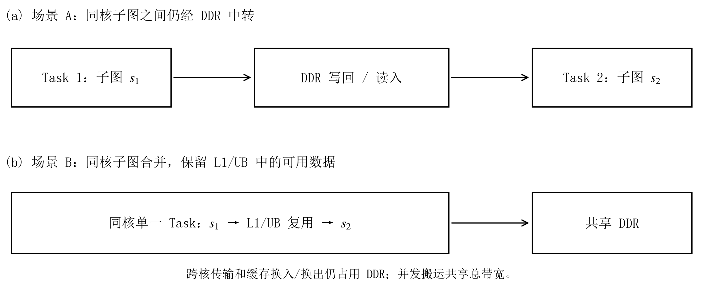

# 第六章　问题一：基于拓扑结构的切图与任务调度

## 6.1　问题分析与计算图预处理
场景 A 将每个子图独立封装为一个 Task。生产者与消费者一旦分属不同子图，中间数据就需要经 DDR 写回并重新读入；位于同一核心也不能省去这一步。细分子图能够释放原图内部的并行性，新增的搬运和等待又会延长执行时间。切分位置因而需要结合原图结构确定：独立计算分量适合直接分配，连接紧密的大分量则需要在分支、汇合和层宽变化处寻找切分位置。

设原始计算图为 $G=(T\cup O,E)$，其中 $T$、$O$ 分别为张量节点与操作节点集合。张量 $t$ 的大小记为 $b_t$，操作 $u$ 的计算周期记为 $c_u$，其计算管道记为 $p(u)\in\{M,V\}$。为分析计算依赖，从操作集合中取出非 COPY 操作 $O_c$，将经张量连接的生产者与消费者转化为操作间依赖：

$$
G_c=(O_c,E_c),\qquad
E_c=\{(u,v)\in O_c^2:\exists t\in T,\ (u,t),(t,v)\in E\}.
\tag{6.1}
$$

该定义对应附件规定的 Tensor–Op 二部图：操作间的先后关系由连接它们的张量确定。求解时在 $G_c$ 上分析拓扑，边界搬运仍通过原图中的张量和 COPY 关系计算。预处理不改变操作周期、张量大小与存储位置。

对 $G_c$ 进行拓扑排序，并在其无向形式上提取弱连通分量 $\mathcal C=\{C_1,\ldots,C_K\}$。沿拓扑序计算操作深度、层宽和两条计算管道的工作量：

$$
\begin{aligned}
d_u&=1+\max_{v\in\operatorname{pred}(u)}d_v,\qquad h=\max_u d_u,\\
m_\ell&=|\{u:d_u=\ell\}|,\qquad
W_j^q=\sum_{u\in C_j,\ p(u)=q}c_u,\quad q\in\{M,V\}.
\end{aligned}
\tag{6.2}
$$

无前驱节点的深度为 1。分量数 $K$ 反映可直接分配的独立计算块数量；层宽 $m_\ell$ 描述不同深度上的并行程度；入度或出度大于 1 的节点分别标识汇合与分支位置。另建立每个张量的生产者、消费者及字节数索引，用于评价候选切分的搬运代价。

逐图统计见表 6-1。84 个图含多个弱连通分量，16 个图仅有一个分量，操作数与深度的跨度也较大。算法保留完整分量装箱，同时构造利用分量内部拓扑的切分方案。两者在每个输入图上重新比较，统计分组仅用于展示数据分布。

<table><caption>表 6-1　100 个计算图的结构统计</caption><thead><tr><th>结构量</th><th>最小值</th><th>中位数</th><th>最大值</th></tr></thead><tbody><tr><td>非 COPY 操作数</td><td>552</td><td>3720.5</td><td>35705</td></tr><tr><td>弱连通分量数 $K$</td><td>1</td><td>39.5</td><td>2666</td></tr><tr><td>拓扑深度 $h$</td><td>3</td><td>47.5</td><td>2440</td></tr><tr><td>最大层宽</td><td>8</td><td>217.5</td><td>15921</td></tr></tbody></table>

## 6.2　场景 A 的约束与时间估计
对给定核心数 $N\in\{2,3,4,5\}$，记子图映射为 $\phi:O_c\to\mathcal S$，核心分配为 $a:\mathcal S\to\{0,\ldots,N-1\}$，核心 $k$ 的子图执行序列为 $\pi_k$。子图编号为非负整数；每个非 COPY 操作必须且只能分配到一个子图，每个子图必须且只能在一个核心序列中出现一次。子图依赖图以及加入同核先后关系后的联合图均须无环。输出采用附件规定的 <code>node_to_subgraph</code> 和 <code>core_schedules</code> 两个字段。

以系统完工时间为主要优化目标，同时考虑新增 DDR 搬运量。根据固定配置，同核相邻 Task 的等待时间为 $\delta_{\rm same}=100$ cycle，跨核前驱 Task 的等待时间为 $\delta_{\rm cross}=1000$ cycle；各核心共同使用带宽 $\beta=60$ byte/cycle 的 DDR。L1 和 UB 的容量分别为 524288 byte 和 131072 byte。增加核心数不会增加 DDR 总带宽，同核 Task 切换也不能保留前一 Task 的缓存数据。

为在有限时间内比较候选，采用计算工作量、边界字节数和任务依赖共同构成时间估计。设 $I_s$、$U_s$ 为 Task $s$ 需要从 DDR 读入和写回 DDR 的张量集合，同一 Task 内按张量去重，则

$$
\widehat B_A=\sum_{s\in\mathcal S}\left(\sum_{t\in I_s}b_t+\sum_{t\in U_s}b_t\right),\qquad
\widehat d_s=\max\left\{W_s^M,W_s^V,
\frac{\sum_{t\in I_s}b_t+\sum_{t\in U_s}b_t}{\beta}\right\}.
\tag{6.3}
$$

这里 $W_s^q$ 按式（6.2） 对 Task 内操作重新求和。两条计算管道和搬运可以重叠执行，故采用三类工作量所需时间的最大值估计 Task 时长。$\widehat B_A$ 记录任务边界的读写量；缓存不足产生的换入换出尚未进入该估计，后续官方验收将保留这一部分实际开销。

在子图依赖图中加入同核相邻 Task 的顺序边，记得到的前驱集合为 $P^\pi(s)$。沿该图的拓扑序递推：

$$
\begin{aligned}
\widehat f_s&=\widehat d_s+\max_{u\in P^\pi(s)}(\widehat f_u+\delta_{us}),\\
\widehat T_A&=\max\left\{\max_s\widehat f_s,\frac{\widehat B_A}{\beta}\right\},\qquad
\delta_{us}=\begin{cases}
\delta_{\rm cross},&a(u)\ne a(s),\\
\delta_{\rm same},&u\text{ 为 }s\text{ 的同核紧邻前项},\\
0,&\text{其余同核依赖}.
\end{cases}
\end{aligned}
\tag{6.4}
$$

空前驱集合的最大值取 0。任务的预计启动时刻取决于前驱完成和同核队列的末端，两类约束在同一递推中合并。全局项 $\widehat B_A/\beta$ 则避免将共享 DDR 当作各核独享资源。该模型省略了逐个 COPY 请求的动态带宽竞争，适合对有限候选作快速排序；结果部分使用方案冻结后获得的官方完工时间与搬运量。

## 6.3　分量装箱与结构切分
首先将弱连通分量作为完整物品分配。按 $\max(W_j^M,W_j^V)$ 从大到小处理分量，设核心 $k$ 已分配的管道负载为 $(L_k^M,L_k^V)$，则将当前分量放入

$$
k^*=\arg\min_k
\left(\max_{q\in\{M,V\}}(L_k^q+W_j^q),\ L_k^M+L_k^V,\ k\right).
\tag{6.5}
$$

括号内按字典序比较，选定后更新两条管道负载。同核分量合并为一个子图，空核保留空序列。该规则采用最长工作量优先分配思想[1]，并用双管道负载替代单一处理时间。共享 DDR 和缓存使本题不再满足经典独立作业调度模型，因而不直接援引其近似比作为本算法的性能保证。

完整分配保留了每个分量内部的生产–消费关系，分量之间也没有计算依赖，因而能够减少中间张量的跨核搬运。共享输入仍可能被多个核心分别读取，核内空间不足仍会触发换入换出。若一个分量集中了大部分计算量，完整分配还会使负载集中在单核上。内部切分候选主要用于处理这一类并行度受限的输入。

内部切分围绕三类结构展开。第一类保留首次汇合前的独立分支，或按照末端消费者对分支归组；第二类利用拓扑层宽的收缩与扩张确定阶段边界；第三类按照深度带与源端、末端可达关系划分。在深度带构造中，候选边界附近按跨层张量字节数选择切分位置，以减少将大张量切到不同 Task 的情况。上述构造均保持原操作和依赖，不拆分操作，也不复制计算。

基础深度带宽由当前图的深度 $h$、总计算量 $W=\sum_{u\in O_c}c_u$ 和核心数确定：

$$
w_0=\max\left\{2,\left\lceil\frac{N\delta_{\rm cross}h}{\max(1,W)}\right\rceil,
\left\lceil\frac{Nh}{256}\right\rceil\right\}.
\tag{6.6}
$$

算法考察 $w_0,2w_0,4w_0$ 三种粒度。前一项避免过细切分，第二项使计算相对等待开销较小时倾向于更粗的 Task；第三项是固定的搜索规模控制规则，256 不是题目的硬件常数。此外，还保留减少活跃核心数的分量分配候选，以应对并行计算收益不足以抵消 DDR 争用的情形。

## 6.4　任务列表调度与有限合并
各结构候选先经过覆盖性、无环性检查和方案去重，再由式（6.4） 排序。仅对排名靠前的至多三个候选进行任务调度与合并调整，以控制额外搜索量。

任务重排采用“就绪任务优先级–最早完成核心”的列表调度思想[2]。先自后向前计算

$$
r_s=\widehat d_s+\max_{v\in\operatorname{succ}(s)}(\delta_{\rm same}+r_v).
\tag{6.7}
$$

每次从全部已分配前驱的就绪 Task 中选取 $r_s$ 最大者，比较其放到各核心后的预计完成时刻。设 $F_k$ 是核心 $k$ 已排任务的末端时间，则

$$
\operatorname{EFT}(s,k)=\widehat d_s+
\max\left\{F_k+\delta_{\rm same}\mathbf1[\pi_k\ne\varnothing],
\max_{u\in\operatorname{pred}(s)}
\big(\widehat f_u+\delta_{\rm cross}\mathbf1[a(u)\ne k]\big)\right\}.
\tag{6.8}
$$

优先选择 EFT 最小的核心，并列时依次选择已排 Task 数较少、编号较小的核心。式（6.7） 中的固定等待项只用于任务优先级；核心选择时则按式（6.8） 区分同核与跨核等待。这里采用尾部追加排布，没有执行 HEFT 的空闲区间插入步骤。

合并调整只考虑同核相邻、且在 Task 拓扑序中也相邻的任务对。每轮按共享张量字节数选取至多八对，分别计算收缩后的方案；联合依赖图有环的方案被剔除，在其余方案中选取能够降低 $\widehat T_A$ 的一项，最多执行两轮。任务重排与合并均从原结构候选独立出发，二者不串接。最终按预计时间、边界字节数和固定方案哈希依次比较；当完整分量方案与最优估计相差不超过 1% 时，保留完整分量方案。该阈值降低了选择结果对微小估计误差的敏感性。

算法 6-1　 基于输入拓扑的切图与任务调度

<strong>输入：</strong>当前计算图 $G$，核心数 $N$，带宽 $\beta$，等待参数 $\delta_{\rm same},\delta_{\rm cross}$。

<strong>输出：</strong>子图映射 $\phi$ 与每核子图序列 $\pi_0,\ldots,\pi_{N-1}$。

1.读取张量、操作与边；提取非 COPY 操作集 $O_c$，保留原始数据。

2.按生产–消费关系构建 $G_c$；计算拓扑序与节点深度 $d_u$。

3.提取弱连通分量、层宽、分支及汇合位置，统计双管道工作量与张量字节数。

4.按式（6.5） 构造完整分量方案 $P_0$，初始化待检验集合 $\mathcal B\leftarrow\{P_0\}$。

5.将首次汇合、末端分支与较少活跃核心数的分量装箱候选加入 $\mathcal B$。

6.按式（6.6） 计算 $w_0$。

7.<strong>for</strong> $w\in\{w_0,2w_0,4w_0\}$ <strong>do</strong>

8.构造数据感知深度带、分支汇合、层宽谷和末端可达归组候选，加入 $\mathcal B$。

9.<strong>end for</strong>；将宽度为 $w_0$ 的源端可达归组候选加入 $\mathcal B$。

10.逐项检验 $\mathcal B$，将覆盖完整、联合图无环且不重复的方案组成 $\mathcal P$；记录拒绝原因。

11.按式（6.3）–（6.4） 评价 $\mathcal P$；按时间、字节数截取至多三个原始候选。

12.<strong>for</strong> 所选方案中的每个 $P$ <strong>do</strong>

13.从 $P$ 分别生成就绪列表重排方案与至多两轮的相邻任务合并方案。

14.重新检查合法性，计算时间估计，将不同的合法方案加入 $\mathcal P$。

15.<strong>end for</strong>

16.取 $\widehat T_A$ 最小的 $P^*$；时间并列时比较边界字节数与固定方案哈希。

17.若 $\widehat T_A(P_0)\le1.01\widehat T_A(P^*)$，令 $P^*\leftarrow P_0$。

18.<strong>return</strong> $P^*$ 的 <code>node_to_subgraph</code> 与 <code>core_schedules</code>。

## 6.5　求解结果与分析
算法对每个图、每种核数分别从原始输入生成方案。所有全局参数在正式运行前固定，生成过程中不读取历史方案和逐图得分，也不调用官方评估器。方案保存后，再使用未修改的附件程序完成 100 个图、2–5 核共 400 组验收，全部通过。

设第 $i$ 个图在 $N$ 核下的官方完工时间为 $T_{i,N}$，按题目规定采用的单核整图时间为 $T_{i,1}$。统计采用逐图加速比的算术平均：

$$
S_{i,N}=\frac{T_{i,1}}{T_{i,N}},\qquad
\overline S_N=\frac1{100}\sum_{i=1}^{100}S_{i,N}.
\tag{6.9}
$$

单核加速比按定义置为 1，不另行进行单核搜索。表 6-2 给出全部用例的汇总；额外搬运采用官方 <code>added_copy_bytes</code> 字段，并按 $1\,\mathrm{MiB}=2^{20}$ byte 换算。

<table><caption>表 6-2　问题一的全量求解结果</caption><thead><tr><th>核心数</th><th>平均加速比</th><th>加速比中位数</th><th>平均额外搬运 / MiB</th></tr></thead><tbody><tr><td>2</td><td>1.8648</td><td>1.9583</td><td>13.848</td></tr><tr><td>3</td><td>2.6016</td><td>2.7753</td><td>14.514</td></tr><tr><td>4</td><td>3.2650</td><td>3.5074</td><td>15.557</td></tr><tr><td>5</td><td>3.8311</td><td>4.0428</td><td>15.285</td></tr></tbody></table>

<figure><figcaption>图 6-1　问题一的加速比结果。左图为每种核数下 100 图的算术平均，单核值按定义为 1；右图为五核下按弱连通分量数分组的分布。箱体表示四分位区间，中线为中位数，须延至 1.5 倍四分位距内的最远观测，点为其外观测。</figcaption></figure>

五核平均加速比为 3.8311。多分量图的五核平均值为 4.0041，单分量图为 2.9228，表明输入结构对可利用的并行性有明显影响。多分量允许在较少新增依赖的条件下分配负载；单分量则通常需要在并行化与边界代价之间作出取舍。该分组仅作结果描述，不作为对任一新图性能的保证。

与仅采用完整分量装箱的同批五核方案相比，增加结构切分与有限调度调整后，38 个图耗时下降、2 个图上升、60 个图不变。改进集中在完整分量分配以外的候选被选中后取得收益的输入上，少数退步反映了代理排序与实际执行的差异。五核平均额外搬运中，缓存换入换出占 7.423 MiB；任务边界之外的核内空间开销已达到不可忽略的规模。场景 B 延长了同核张量的可驻留范围，对这部分开销需要进一步建模。

# 第七章　问题二：通信与缓存驻留联合约束下的切图调度

## 7.1　场景 B 的运行机制与建模重点
场景 B 将同一核心的全部子图合并为一个 Task，同核生产者与消费者之间可以保留 L1/UB 中的数据。此时，决定边界通信的因素由“是否跨子图”转变为“是否跨核心”。跨核依赖仍需 COPY_OUT 和 COPY_IN，目标搬入须等待源搬出完成，并经过 $\delta_B=500$ cycle 的同步延迟。图 7-1 对比了两种场景的数据路径。

<figure><figcaption>图 7-1　两种场景下的 Task 边界与数据路径。图中为规则示意，未按实测时间绘制；L1、UB 的容量限制及共享 DDR 总带宽均保持题目配置。</figcaption></figure>

合并 Task 后，中间张量可以在生产操作结束后保留到同核消费者使用。通信量因而有机会减少，张量占用核内空间的时间也可能延长。将共享大张量的操作安排在同一核心，需要同时考虑该核的计算负载与驻留数据规模。本问据此在分核阶段估计通信，在候选排序阶段补充缓存风险，仍采用有限种结构构造控制计算成本。

沿用第六章的 $G_c$、$\phi$、$a$、$\pi_k$ 及硬件符号。每个 case 都重新计算拓扑序、分量、层宽和分支汇合位置，不读取问题一已输出的切图方案。记分支或汇合节点所在的不同拓扑层为 $\ell_1<\cdots<\ell_m$，其相邻间距集合为 $\mathcal D=\{\ell_{j+1}-\ell_j\}$。候选深度带宽取

$$
w_B=\begin{cases}
\max\{2,\min\{32,\operatorname{round}(\operatorname{median}\mathcal D)\}\},&\mathcal D\ne\varnothing,\\
\max\{2,\min\{32,\lceil\sqrt h\rceil\}\},&\mathcal D=\varnothing.
\end{cases}
\tag{7.1}
$$

分支与汇合层相邻间距刻画了当前图中重复出现的结构尺度，取其中位数可减少少数极长链段对带宽选择的影响。式中的 round 采用最近整数、半整数取偶的规则，与实现一致；2 和 32 为固定的搜索尺度边界。这里的深度带宽以拓扑层数计，硬件配置仍按题目给定值读取。

## 7.2　跨核通信与完成时间估计
令 $P_t$、$C_t$ 分别表示张量 $t$ 的生产核集合和消费核集合；令 $e_t=1$ 表示原图包含该张量的最终 COPY_OUT。为比较分核方案，按生产核–消费核对累计跨核写出与读入；同核消费继续沿用核内数据。相应的计数为

$$
\begin{aligned}
n_t^{\rm in}&=\mathbf1[P_t=\varnothing]|C_t|,\\
n_t^{\rm out}&=\mathbf1[P_t\ne\varnothing]\,
\mathbf1[e_t=1\ \text{或}\ C_t=\varnothing]|P_t|,\\
n_t^{\rm cross}&=\sum_{k\in P_t}\sum_{l\in C_t}\mathbf1[k\ne l].
\end{aligned}
\tag{7.2}
$$

由此得到缓存换出之前的通信量估计

$$
\widehat B_B=\sum_{t\in T}b_t
\left(n_t^{\rm in}+n_t^{\rm out}+2n_t^{\rm cross}\right).
\tag{7.3}
$$

同一核心上多个操作读取同一张量时，在集合 $C_t$ 中只记录一个消费核，避免重复累计该核的边界读取。$\widehat B_B$ 包含输入读入、结果写出和跨核传递的估计工作量。结果表中的额外搬运则按附件扣除原图已有 COPY、加入实际缓存换入换出后统计，两者的计数范围不同。

记核心 $k$ 的管道负载为 $L_k^q=\sum_{u:a(\phi(u))=k,\,p(u)=q}c_u$，$b_{uv}$ 为操作依赖 $u\to v$ 关联的张量字节数之和。沿操作拓扑序递推：

$$
\begin{aligned}
\widehat f_v^B&=c_v+\max_{u\in\operatorname{pred}(v)}
\left[\widehat f_u^B+\mathbf1[a(\phi(u))\ne a(\phi(v))]
\left(\delta_B+\frac{2b_{uv}}{\beta}\right)\right],\\
\widehat T_B&=\max\left\{\max_{k,q}L_k^q,\ \max_v\widehat f_v^B,\ \frac{\widehat B_B}{\beta}\right\}.
\end{aligned}
\tag{7.4}
$$

最忙管道、最长依赖路径和共享 DDR 总工作量分别给出三种时间尺度，取其最大值作为候选的主要耗时估计。各项统一为 cycle，便于与后续缓存风险的时间修正相加。四条 Pipe 的动态配合与请求间带宽均分没有在该式中逐事件展开，实际耗时仍需由冻结方案的官方执行结果检验。

## 7.3　张量驻留区间与缓存风险
为识别同核合并可能带来的缓存压力，先按 $\pi_k$ 连接各子图，并在子图内保留原操作拓扑序，得到核心 $k$ 的分析序列。对张量 $t$，令 $f_{tk}$、$l_{tk}$ 分别为其生产者或消费者在该序列中第一次和最后一次出现的位置。对资源 $r\in\{L1,UB\}$，静态活跃字节峰值为

$$
H_k^r=\max_j\sum_{t:\,\operatorname{pos}_k(t)=r}
b_t\mathbf1[f_{tk}\le j\le l_{tk}],\qquad
R_B=\sum_{r\in\{L1,UB\}}\left(\max_k H_k^r-C_r\right)_+.
\tag{7.5}
$$

其中 $(x)_+=\max(x,0)$，$C_r$ 为对应缓存容量。在静态估计中，原 DDR 输入按 UB 驻留处理。程序通过区间起止位置的差分累计计算 $H_k^r$，无需按实际周期展开整个执行过程。

静态区间记录的是分析序列中的位置。附件执行时，输出空间在操作发射前申请，输入空间在最后一次使用完成后释放，并按固定核内机制插入换入换出。两种时间表示的差异会影响同时驻留的张量集合。$R_B$ 因此作为长期驻留的风险量进入排序；即使其值为零，实际执行中仍可能产生缓存换出。容量可行性在原版执行程序中按 L1/UB 的硬上限检查。

对合法候选采用统一评分

$$
J_B=\widehat T_B+\frac{\widehat B_B+\gamma_B R_B}{\beta},\qquad \gamma_B=10.
\tag{7.6}
$$

在最大瓶颈时间相近时，附加 DDR 工作量使通信较少的方案优先，缓存风险项则降低长期占用核内空间的方案的优先级。这两个修正项与 $\widehat T_B$ 均以 cycle 表示，构成用于排序的评价函数。开发阶段的 28 个正风险候选中，实际换出相关字节与风险量之比的中位数为 10.54，据此将全局系数 $\gamma_B$ 取为 10 并冻结。该系数适用于本轮统一排序，各输入图只重新计算其 $R_B$。

## 7.4　有限候选构造与算法实现
问题二构造五类方案：完整分量装箱、层宽谷切分、宽度为 $w_B$ 和 $2w_B$ 的两种数据感知深度带，以及宽度为 $w_B$ 的固定深度带。各方案使用同一输入依赖和张量字节数，其中分量或带内独立区域采用第六章的双管道负载分配规则。数据感知切分优先寻找跨层字节数较少的位置，层宽谷切分则利用并行度收缩处形成阶段。五类方案生成后去重，重复结构不再评分。

候选生成后，先检查节点覆盖、子图唯一分配及联合依赖图无环性。通过检查的不同方案才计算通信、路径与缓存项，并按 $J_B$ 排序；同分时依次比较 $\widehat B_B$ 和固定的候选类别顺序。算法 7-1 给出这一过程，输出仍为各非 COPY 操作的子图编号与各核子图序列。

算法 7-1　 基于输入结构与驻留风险的场景 B 调度

<strong>输入：</strong>当前计算图 $G$，核心数 $N$，固定配置 $\beta,\delta_B,C_{L1},C_{UB}$。

<strong>输出：</strong>子图映射 $\phi$ 与每核子图序列 $\pi_0,\ldots,\pi_{N-1}$。

1.读取当前 case，构建 $G_c$、张量生产者/消费者表及大小、存储位置索引。

2.计算拓扑序、深度、弱连通分量、层宽和分支汇合层；按式（7.1） 得到 $w_B$。

3.生成分量装箱、层宽谷、两种数据感知深度带及固定深度带共五类候选。

4.初始化记录集合 $\mathcal R=\varnothing$ 与已处理方案哈希集合。

5.<strong>for</strong> 按固定类别顺序生成的每个候选 $P$ <strong>do</strong>

6.校验节点覆盖、子图覆盖及依赖与核内顺序的无环性；失败则记录原因并跳过。

7.计算完整方案哈希；若重复则跳过，否则加入已处理集合。

8.由 $\phi,a$ 建立 $P_t,C_t$，计算 $\widehat B_B$、$L_k^q$ 和 $\widehat T_B$。

9.按每核子图序列构造分析序列，计算 $f_{tk},l_{tk}$，以差分累计得到 $H_k^r$。

10.计算 $R_B$ 和 $J_B$，将候选及各项评价量加入 $\mathcal R$。

11.<strong>end for</strong>

12.若 $\mathcal R$ 为空则报告失败；否则按 $(J_B,\widehat B_B,\text{类别顺序})$ 取最小项。

13.<strong>return</strong> 对应的 <code>node_to_subgraph</code> 与 <code>core_schedules</code>。

## 7.5　求解结果与分析
按照与问题一相同的单核参照和统计口径，对 100 个计算图的 2–5 核方案进行独立验收，共 400 组，全部成功。表 7-1 列出两种场景在相同图和核数下的结果。开发标定与最终验收使用了同一批给定图，因此以下数值表示本题数据上的性能，不据此声称对未知图分布的泛化效果。

<table><caption>表 7-1　问题一与问题二的全量结果比较，额外搬运单位为 MiB</caption><thead><tr><th>核心数</th><th>问题一加速比</th><th>问题二加速比</th><th>问题一额外搬运</th><th>问题二额外搬运</th></tr></thead><tbody><tr><td>2</td><td>1.8648</td><td>1.9358</td><td>13.848</td><td>10.076</td></tr><tr><td>3</td><td>2.6016</td><td>2.7452</td><td>14.514</td><td>8.683</td></tr><tr><td>4</td><td>3.2650</td><td>3.4645</td><td>15.557</td><td>8.569</td></tr><tr><td>5</td><td>3.8311</td><td>3.9522</td><td>15.285</td><td>9.756</td></tr></tbody></table>

<figure><figcaption>图 7-2　两种场景的全量结果比较。左图为逐图加速比的算术平均，单核值按定义为 1；右图为官方统计的平均新增 DDR 字节数，以 MiB 表示。除单核定义值外，每个点或柱均对应 100 个计算图。</figcaption></figure>

问题二在 2–5 核下的平均加速比均高于问题一，五核均值由 3.8311 增至 3.9522。同时，五核平均额外搬运由 15.285 MiB 降至 9.756 MiB。场景 B 允许保留同核数据，为降低边界搬运提供了条件；但两场景使用了各自适配的方案，以上差异同时包含场景规则和方案选择的影响，不能全部归因于单一算法步骤。

逐图比较中，五核时有 31 个图耗时下降、19 个图上升、50 个图相同。以问题一的逐图耗时为分母，平均耗时缩减率为 1.67%。问题二的五核平均缓存换入换出新增字节仍有 5.315 MiB，表明同核复用的收益受到驻留容量制约。静态风险量未记录每次实际申请和释放的时刻，候选排序仍可能低估局部高峰及其搬运代价。

本问以五类构造限制了每次求解的候选规模，输入适应性来自当前图的拓扑层间距、管道负载和张量区间。后续引入共享只读 Cache 后，同一读请求可能占用不同的带宽池，命中还取决于读取完成与淘汰的先后顺序。第八章将这部分时序展开，用于进一步区分静态通信量相近的方案。

# 第八章　问题三：共享只读 Cache 下的切图与协同调度

## 8.1　缓存数据通路与协同调度条件
问题三在场景 B 的基础上增加所有核心共享的只读 FIFO Cache。同核子图仍合并为一个 Task，跨核传递仍经过 COPY_OUT、COPY_IN 和 $\delta_B=500$ cycle 的同步延迟。新增 Cache 容量为 $C_{\rm L2}=1048576$ byte，读带宽为 $\beta_{\rm L2}=250$ byte/cycle，与带宽为 $\beta=60$ byte/cycle 的 DDR 分别结算。L1、UB 继续承担核内计算数据的驻留，两者容量沿用第六章配置。

读请求的服务路径取决于发射时的 Cache 状态。COPY_IN 按逻辑张量标识查询，命中时占用 L2 读带宽，未命中时占用 DDR 带宽；COPY_OUT 始终进入 DDR。一次读取完成后，附件程序尝试将对应张量插入 FIFO 队列，空间不足时先淘汰最早插入的条目。命中读取不会调整已有条目的队列位置。图 8-1 给出数据通路及插入、淘汰之间的关系。

<figure><figcaption>图 8-1　共享只读 Cache 的数据通路。DDR 与 L2 分别提供 60、250 byte/cycle 的总带宽，同一池内在途请求动态均分带宽。下部按 FIFO 次序表示读取完成后的插入处理，属于规则示意，框宽与箭头长度不代表实际时间或张量大小。</figcaption></figure>

缓存能够减少部分 DDR 读取等待，其收益还取决于请求到达时间和张量能否保留到下一次访问。例如，多个核心同时首次读取同一张量时，早先的读取尚未完成，后续请求仍可能全部未命中；张量即使命中过，之后也会随着新条目插入而被淘汰。调度方案需要同时安排计算负载和读取先后，单独累计共享输入字节无法确定实际收益。

沿用 $G_c$、$\phi$、$a$ 与 $\pi_k$，记完整方案为 $P=(\phi,a,\pi_0,\ldots,\pi_{N-1})$。可提交的决策仍是切图映射与核心序列，Cache 命中、指令发射及淘汰时间随执行产生。本文通过分核和合法重排形成读取机会，不增加预热操作、等待指令或起始时间字段。整体目标保持完工时间优先，并在预计耗时相同时比较搬运工作量。

## 8.2　当前输入图上的有限候选构造
求解从当前图重新计算弱连通分量、拓扑深度、双管道工作量及张量生产–消费关系。完整分量装箱沿用式（6.5），在同一分核映射下保留两种子图表达：每核合并为一个子图，以及每个独立分量保留为一个子图。两种表达最终均按场景 B 合为核内 Task，传入的子图次序会参与核内展开，因此分别纳入候选。

对共享输入较多的分量，还构造带输入亲和性的装箱方案。设分量 $C_j$ 的外部输入集合为 $I_j$，核心 $k$ 已分配分量的外部输入并集为 $I_k^{\rm core}$，分配优先量取为

$$
F_{jk}^{\rm aff}=\max_{q\in\{M,V\}}(L_k^q+W_j^q)
+\frac{\sum_{t\in I_j\setminus I_k^{\rm core}}b_t}{\beta}.
\tag{8.1}
$$

第一项表示分配后最忙计算管道的工作量，第二项折算新增外部输入的读取时间。选择 $F_{jk}^{\rm aff}$ 较小的核心，使已经分配的共享输入具有继续同核使用的机会。并列时依次比较该核原有总工作量与核心编号。这里采用 DDR 带宽估算输入压力，具体读取是否命中则交由事件模型判断。

内部结构切分继承前两问的分支、汇合与深度带构造。以式（7.1） 得到的拓扑尺度 $w_B$ 为起点，再计入本图计算量与同步开销的比例，令

$$
w_C=\min\left\{h,\ \max\left[2,w_B,
\left\lceil\frac{N\delta_Bh}{\max(1,W)}\right\rceil\right]\right\},
\qquad W=\sum_{u\in O_c}c_u.
\tag{8.2}
$$

$w_C$ 以拓扑层数计；分母中的 1 按一个 cycle 理解，用于零工作量输入的数值保护。本题操作周期均为正。当计算量相对同步代价较小时，该式增大切分尺度，避免大量短计算段被固定等待隔开。数据感知深度带考察 $w_C$ 和 $2w_C$ 两种粒度，其余构造保持固定数量。

<table><caption>表 8-1　问题三的候选构造及其作用</caption><thead><tr><th>构造</th><th>数量</th><th>使用当前图的信息与处理方式</th></tr></thead><tbody><tr><td>完整分量装箱</td><td>2</td><td>按双管道工作量分核；分别采用同核合并、独立分量保留两种表达</td></tr><tr><td>输入亲和装箱</td><td>1</td><td>按式（8.1） 兼顾管道负载与新增输入读取</td></tr><tr><td>汇合前分支、共享前缀</td><td>2</td><td>利用首次汇合或末端消费者关系组织独立计算区域</td></tr><tr><td>分叉–汇合阶段、层宽谷</td><td>2</td><td>按分支关系或层宽收缩位置确定阶段边界</td></tr><tr><td>数据感知深度带</td><td>2</td><td>在 $w_C$、$2w_C$ 尺度内优先选择跨层字节较少的边界</td></tr><tr><td>独立分量复用重排</td><td>1</td><td>保持分核结果，调整同核独立分量的执行先后</td></tr></tbody></table>

复用重排只作用于彼此独立的分量。核心 0 首先安排“输入字节数除以 DDR 带宽，再加双管道最大工作量”较小的分量；其余核心的首个分量优先减少与该输入集合的重合，并在同分时优先较大工作量。各核后续分量按与上一个分量共享的输入字节量降序安排，再以工作量和分量编号确定并列次序。这个顺序尝试减少启动阶段的重复未命中，并缩短后续共享读取之间的间隔。真正的完成先后仍受管道和依赖影响，核心 0 没有额外的预热权限。

表 8-1 至多产生十份候选，结构相同的方案在本次调用中去重。各候选共享相同硬件参数与评价规则，构造过程无需按用例编号选择算法，也不读取前两问的已输出方案。

## 8.3　双带宽池与 FIFO 事件模型
为比较不同读取顺序，先将候选展开为轻量事件图。每个非 COPY 操作保留其计算周期 $c_u$；外部输入和跨核传递形成读事件，跨核生产端及最终输出形成写事件。跨核写完成到读释放之间保留 $\delta_B$ 延迟。各核按子图序列连接局部拓扑序，得到操作位置 $j_u$；计算事件取排序键 $3j_u+1$，服务消费者的读事件取 $3\min j_u$，服务生产者的写事件取 $3\max j_u+2$。同一 Pipe 内按该键与事件编号加入先后边，四条 Pipe 各保留一个执行槽。

这些边与原数据依赖共同确定事件的释放条件。若两类顺序合并后出现环，该候选在代理模型中被拒绝，并记录具体原因。局部顺序由当前图直接展开，官方 Step 1–3 的完整空间复用补边未被复制进求解器，核内次序差异因而成为估计误差的一个来源。

设 $\mathcal A_p(t)$ 为时刻 $t$ 在带宽池 $p\in\{\mathrm{DDR},\mathrm{L2}\}$ 中传输的请求集合，$r_e(t)$ 为请求 $e$ 尚未服务的字节数。其发射时依据逻辑张量标识 $\tau_e$ 查询缓存，记查询前状态为 $\mathcal Q_e^{\rm issue}$，则

$$
z_e=\mathbf1[\tau_e\in\mathcal Q_e^{\rm issue}],\qquad
p_e=\begin{cases}\mathrm{L2},&e\text{ 为读请求且 }z_e=1,\\
\mathrm{DDR},&\text{其余搬运请求}.
\end{cases}
\tag{8.3}
$$

同一时间戳内已经处理的完成和插入事件应计入 $\mathcal Q_e^{\rm issue}$。请求发射后，其带宽池保持不变，队列中的条目之后是否被淘汰不会改变这次在途传输的服务路径。

在集合 $\mathcal A_p$ 不变的时间段内，池内请求均分该池带宽：

$$
r_e(t+\Delta t)=r_e(t)-\frac{\beta_p}{|\mathcal A_p(t)|}\Delta t,
\qquad \beta_{\rm DDR}=\beta,\quad \beta_{\rm L2}=250\ \mathrm{byte/cycle}.
\tag{8.4}
$$

对非空带宽池，下一个传输完成事件距当前时刻的间隔为

$$
\Delta_p=\frac{|\mathcal A_p(t)|}{\beta_p}\min_{e\in\mathcal A_p(t)}r_e(t).
\tag{8.5}
$$

模型在就绪释放、计算完成和两池传输完成三类事件中选择最早者，按式（8.4） 同步扣减所有在途请求的剩余字节。请求加入或完成后重新计算 $\Delta_p$。由此，各池在非空时段内的总服务速率恰为自身带宽，DDR 与 L2 的服务量不会混入同一个容量约束。

FIFO 队列记为 $\mathcal Q=(q_1,\ldots,q_m)$，$q_1$ 最早插入。读取完成时，若 $\tau_e$ 尚未驻留且 $0<b_{\tau_e}\le C_{\rm L2}$，先求最小淘汰前缀长度

$$
d^*=\min\left\{d\in\{0,\ldots,m\}:\sum_{r=d+1}^{m}b_{q_r}+b_{\tau_e}\le C_{\rm L2}\right\},
\quad \mathcal Q^+=(q_{d^*+1},\ldots,q_m,\tau_e).
\tag{8.6}
$$

若该标识已经存在，则保持原队列；张量超容量或大小为零时不插入。式（8.6） 每次从最早条目开始释放空间，插入后的总字节数不超过 $C_{\rm L2}$。附件在每次 COPY_IN 完成时都尝试这一处理。因此，一次发射时命中的读取，如果其条目在传输期间被淘汰，也可能在完成时再次插入。张量的有效驻留窗口由实际插入与淘汰事件确定，访问次数本身不会刷新 FIFO 次序。

算法 8-1　 候选方案的双带宽池事件评价

<strong>输入：</strong>候选事件图 $\mathcal H(P)$，$\beta,\beta_{\rm L2},C_{\rm L2}$ 及边上的释放延迟。

<strong>输出：</strong>预计完工时间 $\widehat T_{\rm evt}$、DDR 与 L2 服务字节数。

1.置时刻 $t\leftarrow0$；初始化剩余前驱数、就绪队列和完成事件队列。

2.置 $\mathcal Q\leftarrow\varnothing$，$\mathcal A_{\rm DDR}\leftarrow\varnothing$，$\mathcal A_{\rm L2}\leftarrow\varnothing$。

3.<strong>while</strong> 尚有事件未完成 <strong>do</strong>

4.取出释放时刻不晚于 $t$ 的就绪事件；读写按式（8.3） 入池，计算按 $c_u$ 登记完成时刻。

5.由式（8.5） 求两池最近完成间隔，空池取 $+\infty$。

6.取就绪释放、计算完成和传输完成中的最早时刻 $t'$；若均不存在，报告代理依赖环。

7.按 $\Delta t=t'-t$ 扣减两池剩余字节，置 $t\leftarrow t'$，收集本时刻已完成事件。

8.<strong>for</strong> 按固定事件编号排序的每个完成事件 $e$ <strong>do</strong>

9.若 $e$ 为读事件，按式（8.6） 处理完成插入或保持原队列。

10.更新后继剩余前驱数与最早释放时刻；前驱全部完成的后继加入就绪队列。

11.<strong>end for</strong>

12.<strong>end while</strong>

13.<strong>return</strong> $t$ 与累计服务字节数。

算法 8-1 计算的是既定代理事件图上的完工时间。重复读命中、FIFO 淘汰和带宽动态均分在这个图上逐事件更新；实际核内顺序与换出插入仍由附件决定。本文将这两层的差异保留在模型误差与官方结果中。

## 8.4　核内驻留修正与方案选择
共享 L2 的读取加速不会扩大 L1/UB 的核内容量。对每个候选，另按各核分析序列扫描张量的产生、使用和释放。当前操作关联的输入、输出张量被标为受保护集合，其余驻留张量在空间不足时才可换出。设 $\nu_t(j)$ 为张量 $t$ 在当前位置 $j$ 之后的下一次使用位置，无后续使用时取 $+\infty$；从可逐出集合 $\mathcal E$ 中选择

$$
t^*=\operatorname*{arg\,max}_{t\in\mathcal E}^{\rm lex}
\big(\nu_t(j),b_t,\operatorname{id}(t)\big).
\tag{8.7}
$$

若未来仍需使用且模型中尚无持久副本，计入一次写回；已经访问而不再驻留的张量再次读入时，计入读取字节。最后一次使用后释放空间，逐核累计得到 $\widehat B_{\rm spill}$。原 DDR 张量在这个静态驻留分析中归入 UB，与第七章的估计保持一致。

上述扫描采用顺序区间和下一次使用位置，未展开空间分配造成的全部同步边。若受保护工作集使估计无法继续逐出，记录超容量量，并向已累计流量加入其两倍作为风险修正。所得字节数用于候选排序，不具有实际搬运量上界的含义。正式执行中的容量满足情况仍由原版调度和换入换出机制检验。

令 $\widehat B_{\rm svc}$ 为事件模型中的 DDR 与 L2 服务字节之和，候选的主要评价量为

$$
J_C(P)=\widehat T_{\rm evt}(P)+\gamma_C\frac{\widehat B_{\rm spill}(P)}{\beta},
\qquad \gamma_C=1.
\tag{8.8}
$$

事件图已经包含边界传输及其与计算的重叠，第二项补入图外核内换出带来的时间压力。采用 DDR 带宽作换算，使周期与字节的修正保持同一量纲。开发阶段对一个全局系数比较 $0,0.25,0.5,1,2,4$ 六个取值后，将 $\gamma_C$ 固定为 1；本次求解只更新当前图产生的两项估计。

在通过结构检查且能够完成代理评价的集合 $\mathcal P(G,N)$ 中，按

$$
P^*=\operatorname*{arg\,min}_{P\in\mathcal P(G,N)}^{\rm lex}
\big(J_C(P),\ \widehat B_{\rm svc}(P)+\widehat B_{\rm spill}(P),\ \kappa(P)\big)
\tag{8.9}
$$

选择输出，其中 $\kappa(P)$ 为候选名称的固定字典序。完工时间修正量决定主要次序，搬运量只处理主要评分相同的情况，最后一项保证重复运行时选择一致。该规则在候选集合内作确定性比较，计算量受构造数限制。

算法 8-2　 输入图自适应的只读 Cache 协同调度

<strong>输入：</strong>当前原始图 $G$，核数 $N\in\{1,\ldots,5\}$，题目固定配置及 $\gamma_C$。

<strong>输出：</strong>切图映射 $\phi$ 与序列 $\pi_0,\ldots,\pi_{N-1}$。

1.从 $G$ 建立 $G_c$、张量索引、拓扑序及双管道工作量。

2.若 $N=1$，返回整图单核方案；否则按式（8.2） 计算 $w_C$。

3.按表 8-1 构造待检验集合 $\mathcal B$；置 $\mathcal P\leftarrow\varnothing$、去重集合 $\mathcal U\leftarrow\varnothing$。

4.<strong>for</strong> 固定顺序中的每个构造方案 $P\in\mathcal B$ <strong>do</strong>

5.检查非 COPY 操作覆盖、子图唯一分配及依赖与核内先后的联合无环性。

6.若检查失败或方案摘要已在 $\mathcal U$ 中，记录原因并跳过；否则加入 $\mathcal U$。

7.构造 $\mathcal H(P)$，调用算法 8-1；代理事件图无法推进时记录原因并跳过。

8.按各核分析序列及式（8.7） 估计 $\widehat B_{\rm spill}$。

9.计算 $J_C$ 与服务字节数，将方案及评价量加入 $\mathcal P$。

10.<strong>end for</strong>

11.若 $\mathcal P=\varnothing$，令 $P^*$ 为全部操作落在核心 0 的整图方案，其余核心为空；完成结构检查与代理评价。

12.否则按式（8.9） 选取 $P^*$。

13.<strong>return</strong> $P^*$ 的 <code>node_to_subgraph</code> 与 <code>core_schedules</code>；诊断信息另存。

兜底分支保留了原计算图的依赖关系，适用于普通候选均未通过代理评价的情况。本轮 500 份最终方案未使用这一分支。每个图的候选与事件状态在调用时重新建立，初始 FIFO 队列为空；求解进程无需官方评估器，也无需上一轮方案作为初值。

## 8.5　全量配对结果与缓存收益
正式实验覆盖 100 个计算图。对每图的 2–5 核分别生成方案，单核采用固定整图方案；所有方案先冻结，再分别在无 L2 和只读 L2 配置下执行官方验收。共得到 500 组配对结果、1000 次成功评估。开发诊断也使用过给定图，以下报告反映本题输入集合和固定硬件配置下的表现。

对同一方案，分别记官方完工时间为 $T^0_{i,N}$、$T^{\rm L2}_{i,N}$。沿用第六章的原始单核参照 $T_{i,1}$，定义

$$
\begin{aligned}
S^0_{i,N}&=\frac{T_{i,1}}{T^0_{i,N}},&
S^{\rm L2}_{i,N}&=\frac{T_{i,1}}{T^{\rm L2}_{i,N}},\\
R_{i,N}&=\frac{T^0_{i,N}}{T^{\rm L2}_{i,N}},&
\eta_{i,N}&=1-\frac{T^{\rm L2}_{i,N}}{T^0_{i,N}}.
\end{aligned}
\tag{8.10}
$$

$R_{i,N}$ 为同方案的缓存加速比，$\eta_{i,N}$ 为耗时缩短率，均在逐图计算后取算术平均。字节命中率采用官方命中字节除以命中、未命中字节之和，不与按请求次数计算的命中率混用。单核的 L2 执行时间也可能发生变化，故第三问的单核加速比通过实际配对结果计算。

<table><caption>表 8-2　问题三全量配对结果，每种核数均含 100 图</caption><thead><tr><th>核数</th><th>$\overline S^0_N$</th><th>$\overline S^{\rm L2}_N$</th><th>$\overline R_N$</th><th>字节命中率/%</th><th>额外搬运/MiB</th></tr></thead><tbody><tr><td>1</td><td>1.000000</td><td>1.008622</td><td>1.008622</td><td>9.20</td><td>11.842</td></tr><tr><td>2</td><td>2.027353</td><td>2.032270</td><td>1.002481</td><td>16.09</td><td>6.349</td></tr><tr><td>3</td><td>2.826701</td><td>2.849607</td><td>1.009093</td><td>22.13</td><td>7.182</td></tr><tr><td>4</td><td>3.540343</td><td>3.591397</td><td>1.017550</td><td>22.04</td><td>7.322</td></tr><tr><td>5</td><td>4.080391</td><td>4.193923</td><td>1.036819</td><td>26.45</td><td>8.637</td></tr></tbody></table>

五核平均加速比为 4.193923，高于第二问的 3.952170。逐图与第二问比较，68 图耗时下降、19 图相同、13 图上升。这一比较包含切图和读取路径两方面变化；将第三问同一方案的 L2 关闭后，五核平均加速比为 4.080391。缓存开关配对得到 $\overline R_5=1.036819$，平均耗时缩短率为 2.976%，两种指标分别描述加速倍数与原耗时中节省的比例。

<figure><figcaption>图 8-2　问题三的逐核结果。a 同时列出第二问及第三问同方案开关 L2 的平均加速比；b 为第三问的官方额外搬运量；c 为平均字节命中率。第三问每点包含 100 份实际验收结果，第二问单核点为定义值。图 b 中开关 L2 的 500 组逻辑搬运量逐项相同，因此曲线重合。</figcaption></figure>

额外搬运按官方字段统计，Cache 命中只改变请求的服务路径，不直接删去这次逻辑 COPY。全部配对方案的该字段保持相同，而 DDR 实际服务压力可以降低。图 8-2 同时保留搬运量与命中率，有助于区分需要执行多少逻辑搬运、其中多少读取由 Cache 提供。

## 8.6　驻留时序与误差分析
五核配对中有 66 图耗时下降、33 图相同、1 图略有上升。命中率和收益之间的差异见图 8-3。case_030 的字节命中率为 71.37%，耗时从 560856 cycle 降为 560562 cycle，缩短率为 0.0524%；case_080 的命中率为 42.63%，耗时由 117286 cycle 降为 73651 cycle，缩短率为 37.20%。前者在此次 Cache 开关下的完工时间接近不变，后者具有更大的读取加速收益。

<figure><figcaption>图 8-3　五核缓存效果与 FIFO 驻留窗口。a 展示全部 100 图的字节命中率与同方案耗时缩短率；b 使用缓存配对收益最大的 case_080，展示三条发生重复插入的张量轨迹。横条表示实际插入至淘汰之间的驻留，结束时仍在队列中的区间截于完工时刻；圆点和叉号分别为发射时的命中与未命中。张量按插入次数、命中次数及标识依次降序选取，原始标识和全部事件保存在图表源数据中。</figcaption></figure>

驻留轨迹显示，同一逻辑张量可以经历多次插入与淘汰，命中请求也不会持续保住其在 FIFO 中的位置。读取服务加快后，操作就绪与后续请求进入带宽池的时刻随之变化；最终收益由这些变化共同决定。case_092 的完工时间从 827524 cycle 增至 827834 cycle，增加约 0.0375%，该记录在统计与图中保留。当前轻量模型还省略了官方空间复用补边和完整的换出读取序列，因而对这类细小差异的排序能力有限。

多核方案的候选数中位数为 7，最大为 10。四工作进程并发实验中，400 次多核独立求解的进程内耗时中位数为 0.600 s，最大为 10.916 s，包含输入读取、结构构造与模型评价，不含进程启动和官方验收。有限候选将每图搜索规模限制在固定范围内，事件展开提供了静态通信量之外的时序信息。对于核内换出较多或局部次序敏感的图，驻留近似仍会影响所选方案，已完成验收范围以外的性能需要另行测量。

<h2>参考文献</h2>

[1] Graham R L. Bounds on Multiprocessing Timing Anomalies. SIAM Journal on Applied Mathematics, 1969, 17(2): 416–429. <a href="https://doi.org/10.1137/0117039">DOI: 10.1137/0117039</a>.

[2] Topcuoglu H, Hariri S, Wu M Y. Performance-effective and low-complexity task scheduling for heterogeneous computing. IEEE Transactions on Parallel and Distributed Systems, 2002, 13(3): 260–274. <a href="https://doi.org/10.1109/71.993206">DOI: 10.1109/71.993206</a>.

