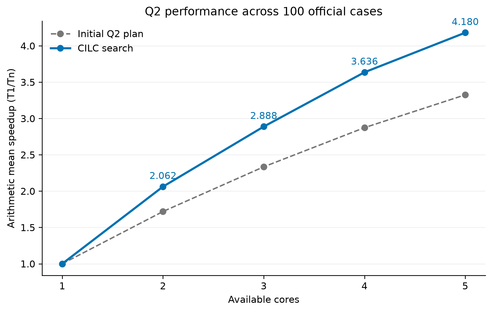
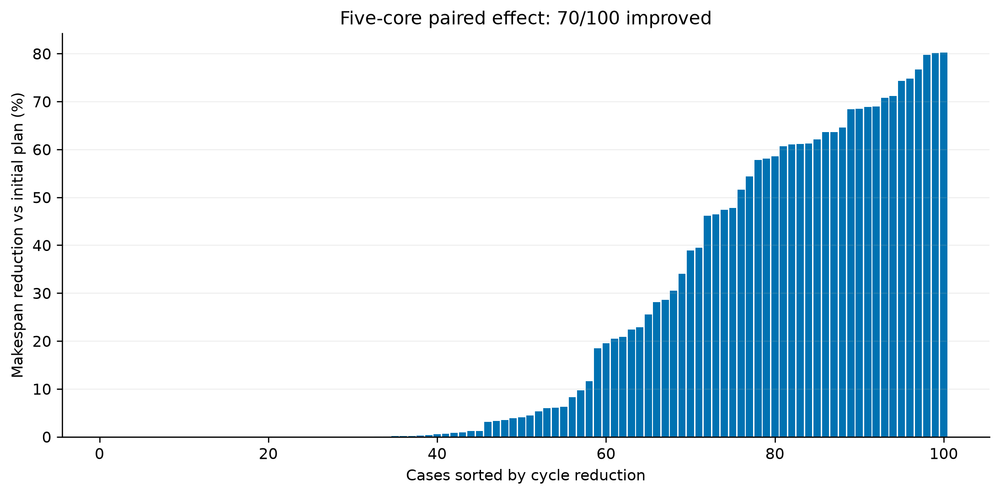
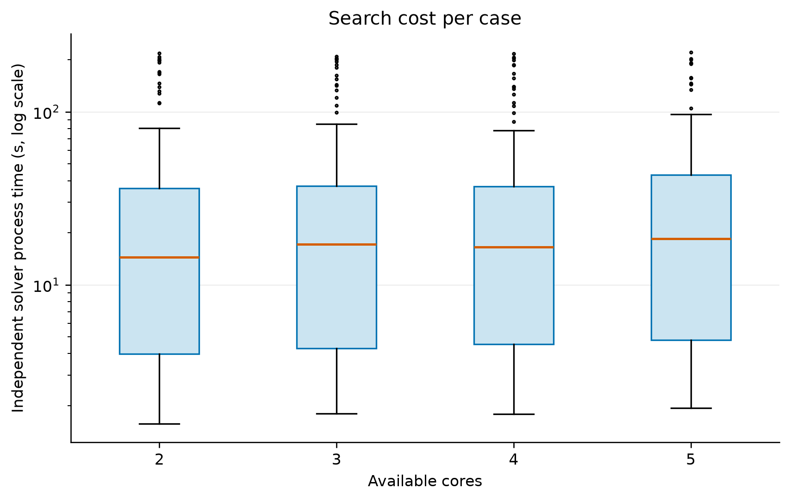
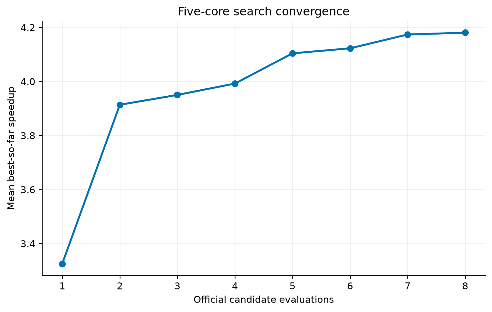
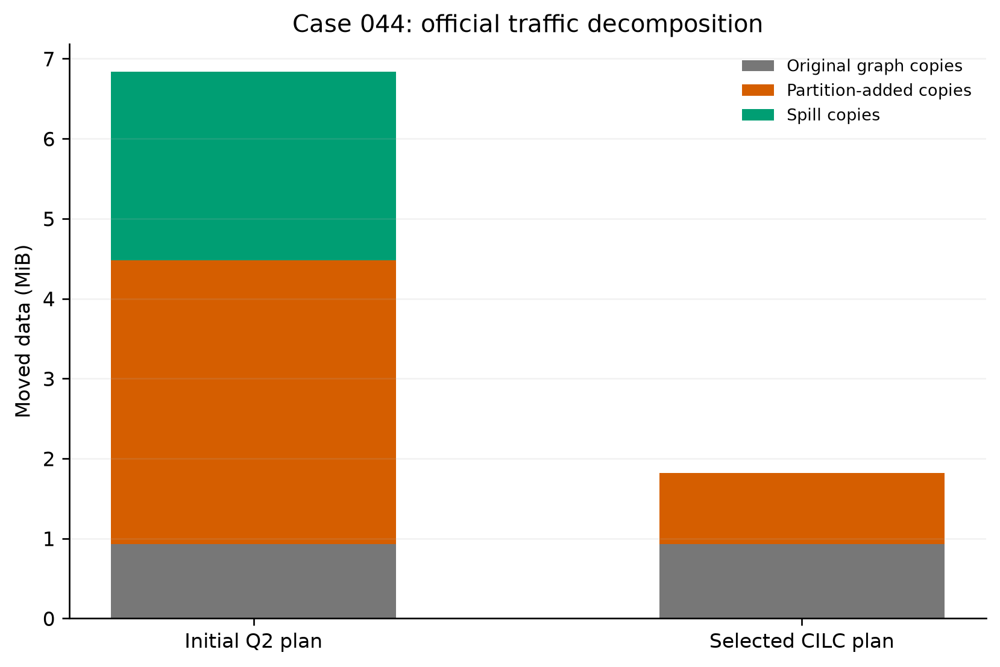
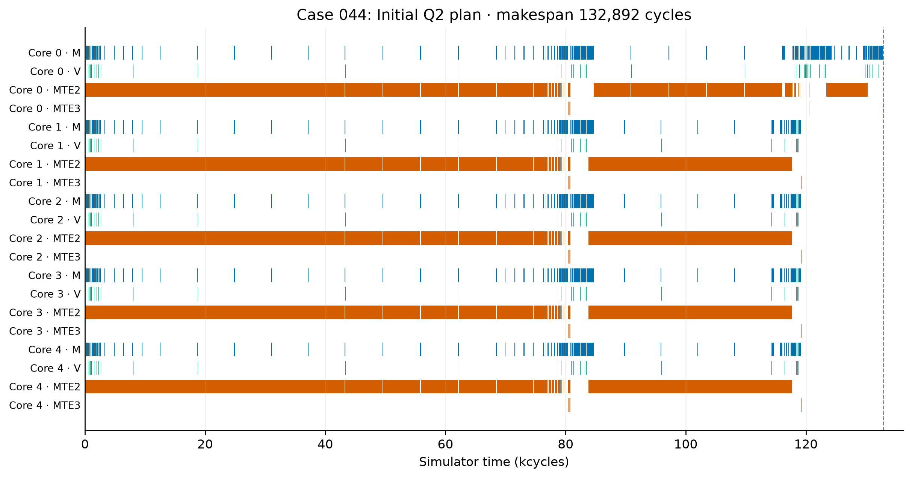
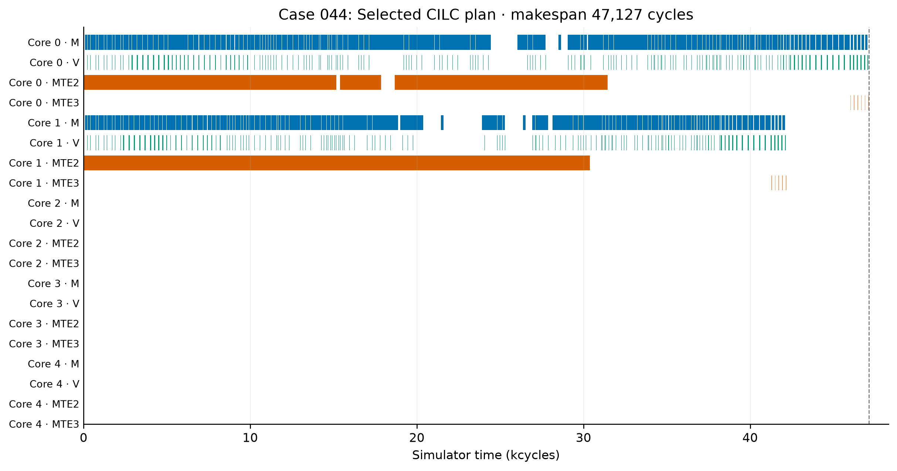

# 问题二：通信内化与 85% 局部性缓存复用（Q2 Final v1）

## 摘要

本版针对场景 B 的 DAG 多核切分和任务顺序，提出通信内化—局部性阈值引导（CILC）搜索。求解器从每个原始图冷启动，候选由未修改的官方模拟器按 Makespan 决胜。Q2 求解器和汇总程序没有读取 Q1 成绩表或方案文件；单核归一化参照来自此前 Q2 场景的官方评测记录。`0.85` 是本算法固定的搜索目标，不是论文证明的最佳阈值。

## 1. 题目与优化目标

给定非 COPY 算子 DAG、每个 Tensor 的字节数和固定资源，决策包括算子到子图的分配、子图到核的分配、每核子图顺序。Scene B 将同核子图合并成 Task，因此生产者与消费者放在同核可以内化跨 Task 通信；不同核的依赖由官方规则加入 COPY、同步等待及 DDR 竞争。L1/UB 超限后，官方 Step 2 按既定规则插入 spill。原始算子/张量/依赖和评测源码未修改。

核数为 2–5；具体 L1、UB、DDR 带宽和跨核等待参数从 `project/official/data/config.txt` 读取。对用例 i 与核数 n，令官方单核/多核周期分别为 Tᵢ,₁ 与 Tᵢ,ₙ：

$$S_{i,n}=T_{i,1}/T_{i,n},\qquad \bar S_n=(1/100)\sum_{i=1}^{100}S_{i,n}.$$

选中候选的官方目标按 `(Makespan, added_copy_bytes)` 字典序比较；spill 已包含在评测器的真实周期和搬运计数中。搜索代理只决定有限预算内先评测哪个候选，不充当最终分数或可行性判断。

## 2. 数学模型

记算子集合 V，Tensor 集合 X。Tensor x 的生产者、消费者集合分别为 Pₓ、Cₓ，字节数为 bₓ；算子 v 所属核心为 c(v)。同核复用带来的通信内化量定义为

$$Q_{loc}=\sum_{x\in X}b_x\sum_{u\in P_x}\sum_{v\in C_x}\mathbf{1}[c(u)=c(v)],\qquad Q_{max}=\sum_{x\in X}b_x|P_x||C_x|,$$
$$\rho=Q_{loc}/Q_{max}.$$

ρ 是可内化生产—消费边字节比例。候选优先级先看局部性缺口 `max(0, 0.85−ρ)`，再按 Q2 Scene-B 代理周期、切分前搬运量排序；完整排序键见 `solution/q2_final_solver.py`。阈值鼓励至少 85% 的可内化边留在本地；图结构做不到时仍允许低于阈值的方案进入官方评测。它不是硬约束。

Scene-B 按源核—目标核对统计的计划搬运量为

$$D_0=\sum_x b_x\left(\mathbf{1}[P_x=\varnothing, C_x\ne\varnothing]|K(C_x)|+\mathbf{1}[P_x\ne\varnothing,(C_x=\varnothing\;\text{或输出})]|K(P_x)|+2\sum_{a\in K(P_x)}\sum_{k\in K(C_x)}\mathbf{1}[a\ne k]\right),$$

其中 K(Pₓ)、K(Cₓ) 为生产者与消费者所在核集合。初筛代理使用

$$T_{proxy}=\max\{L_{compute},\max_{k,p}W_{k,p},D_0/B,T_{dep+copy}\},$$

其中 L_compute 是纯计算 DAG 关键路径下界，Wₖ,ₚ 是核 k 的 Pipe p 工作量，B 是配置文件给出的 DDR 带宽，T_dep+copy 是包含跨核同步和张量字节数的启发式关键路径估计。代理模型只减少无效排序成本；正式候选必须通过原评测器，只有官方 Makespan 和 added_copy_bytes 能替换当前最佳结果。

### 2.1 85% 溢出风险核验

每个候选的官方结果记录 L1/UB 峰值、`spill_added_copy_bytes` 和搬运量。表内“85%峰值线内”表示官方返回的峰值不超过配置容量的 85%；阈值未达到不会导致候选非法或被偷偷丢弃，真实溢出仍由官方 Step 2 处理并计入结果。这样可区分“偏好局部复用的软目标”与“题目强制容量”。

## 3. 算法：CILC 搜索

1. **构造起点。** 从当前 Q2 图独立产生弱连通分量、阶段谷值、深度分段等结构候选；Q2 内部图工具随本目录提供。
2. **通信内化评分。** 对每个 Tensor 生产—消费对统计 bₓ；生产者/消费者落到同核时记为局部内化，否则估算 Scene-B 双向跨核 COPY。候选按 85% 目标缺口优先、再看 Makespan 代理和搬运代理。
3. **缓存风险审查。** 每个官方评测返回峰值 L1/UB 与 spill bytes；日志记录是否在 85% 峰值线内。不会用静态生命周期近似替换官方缓存模拟，也不会把缓存超阈当作规则违规。
4. **邻域改进。** 对最重子图测试迁移、按拓扑深度切分独立链段、按就绪依赖重建固定分区的最早完成放置，并重新排核内 DAG 顺序。结构搜索与局部邻域交替，候选按规范 JSON 哈希去重。
5. **官方选择。** 每图/核数最多 8 次官方评测，单组软时限 180 秒；保留本次运行合法候选中的最佳 `(Makespan, added_copy_bytes)`。所有实际周期、spill、可行性均取自未修改的官方评测器。

每个图都重新构建起点。当前 Q2 求解器不读取 Q1 成绩、Q1 结果 JSON、Q2 以外的方案缓存或其他用例的搜索状态。Q2 单核参照用于结果归一化，不进入候选生成与评分。

## 4. 与已发表方法的关系

CADE 在多核 DAG 上结合节点亲和优先级与竞争感知分配，表明缓存局部性不能脱离可用核心和节点竞争单独优化；CILC 借鉴这一调度视角，但用本题可观测的 Tensor 字节与 Scene-B 官方 COPY 语义定义亲和，不声称重现 CADE。[Yi et al., 2025](https://doi.org/10.1016/j.sysarc.2025.103372)

GPOP 通过分区粒度提高图计算数据局部性，并在通信模式间做权衡；本方案把思想迁移到 DAG 子图/核心分配，不移植 GPOP 的图计算内核。[Lakhotia et al., 2018](https://arxiv.org/abs/1806.08092)

OpenXLA 公开的工程流程先控制张量生命周期的峰值内存，再尝试隐藏计算—通信延迟；若峰值过高，可用重新物化等方法降低内存占用。[From HLO to Thunks](https://openxla.org/xla/hlo_to_thunks) 和 [LHS cost model](https://openxla.org/xla/lhs_cost_model)。本题不支持直接实施 XLA 的 buffer assignment/rematerialization；我们以可测的 spill 字节及官方峰值作风险反馈。

85% 阈值是按用户指定设定的工程搜索超参数；当前实验固定 0.85，没有证明它优于 0.80 或 0.90。后续可在冻结用例之外做阈值敏感性实验。详细文献信息与访问说明见 `results/research_sources.md`。

## 5. 全量结果

搜索使用 2 个 CPU worker 跑 100 个用例 × 4 种核数，每个被接受方案都在搜索过程中通过原评测器实际计算；另核对 400 个冷启动记录、输出计划 SHA-256 与 Makespan。`wall time` 为每个独立求解进程的时间，受服务器负载影响。逐例完整数据见 `results/per_case_metrics.csv`，独立的 Q2 单核归一化参照见 `results/singlecore_reference.csv`，聚合 JSON 见 `results/aggregate.json`。

| 核数 | 初始方案平均加速比 | CILC 平均加速比 | 相对初始改善例数 | 进程耗时中位数（秒） | 平均局部边字节比例 | 85%峰值线内例数 | spill 总字节 |
|---:|---:|---:|---:|---:|---:|---:|---:|
| 2 | 1.719204 | **2.061765** | 75/100 | 14.41 | 0.959 | 55/100 | 492,282,844 |
| 3 | 2.334311 | **2.888001** | 70/100 | 17.15 | 0.954 | 61/100 | 429,650,484 |
| 4 | 2.873390 | **3.635569** | 67/100 | 16.58 | 0.952 | 70/100 | 371,797,102 |
| 5 | 3.325144 | **4.180461** | 70/100 | 18.42 | 0.954 | 64/100 | 318,044,576 |

合计官方评测调用 3129 次。数据如实报告，不按目标值调节样本、分母或选例。5 核均值为 4.180461；用户提出约 3.7 为期望范围，不作为改写结果的约束。

`case_044` 仅用于与已有方法稿一致的机制展示：初始方案周期 132892，CILC 选中周期 47127，加速比 3.276402。单个示例不能代表总体因果效果。

## 6. 七张图

图均由本轮官方结果/搜索日志生成，提供 PNG 和矢量 PDF；源码为 `solution/q2_final_figures.py`。

**图 1｜平均加速比。100 例逐例用 Q2 单核官方参照周期除以多核周期，再对用例算术平均；与本次每图第一个合法初始方案对照。**



**图 2｜5 核逐例相对初始方案的周期降幅；正值代表 Makespan 下降，负值代表退化。用例全体保留。**



**图 3｜每个独立进程的实际墙钟耗时；箱线须线采用 1.5 IQR，纵轴为对数尺度。它受 dashan 负载影响，不是模拟周期。**



**图 4｜5 核搜索逐次官方候选评测的最好合法加速比均值；搜索提前停止后沿用最后合法最好值，并在图注中说明。**



**图 5｜预先选定的诊断用例 case_044，官方数据搬运分解；单位 MiB，来自同一官方评测函数。**



**图 6｜case_044 初始方案的官方操作时间线。颜色代表 Pipe；空白表示该核/Pipe 没有执行操作。**



**图 7｜case_044 搜索选定方案的官方操作时间线，与图 6 使用相同时间单位。单例机制图用于解释，不代表 100 例总体。**



## 7. 复现、范围与限制

从仓库根目录运行：

```bash
python3 project/q2_final_v1/solution/run_q2_final.py
```

运行器默认两进程，遍历官方 100 例 × 2–5 核，每个子任务冷启动，结果/日志保存在 `results/runs/`。生成汇总和七张图：

```bash
python3 project/q2_final_v1/solution/summarize_q2_final.py
python3 project/q2_final_v1/solution/q2_final_figures.py
```

正式运行预算固定为每组至多 8 次候选评测、180 秒软时限。仿真周期与求解器墙钟时间分开报告。8 次有限评测不保证全局最优；代理排序可能错过未进入预算的解。100 个公开图均作为开发目标集使用，本实验不是未见图泛化测试。85% 仅是启发式目标；报告单独给出实测局部边比例、缓存峰值线内例数与 spill 字节，不把目标值误称为实测事实。
