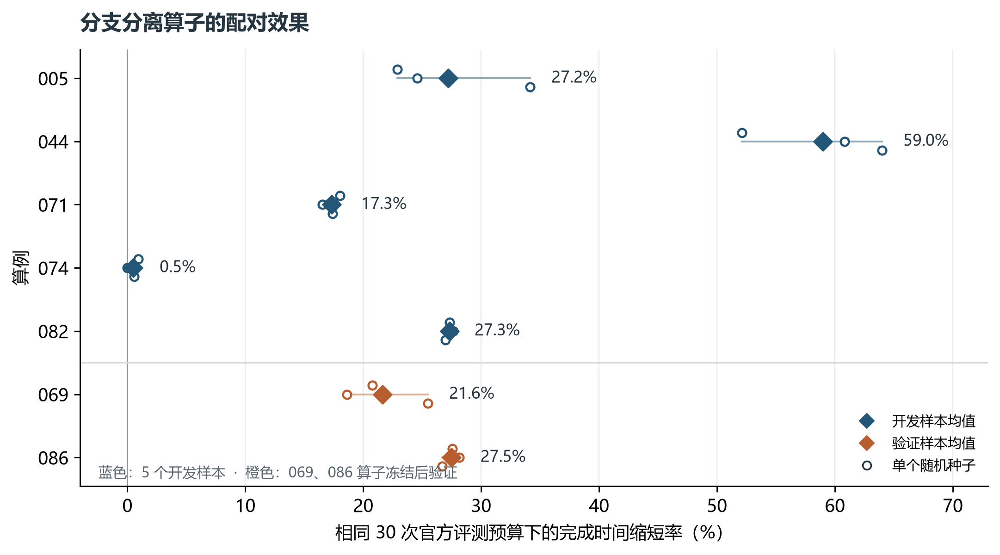
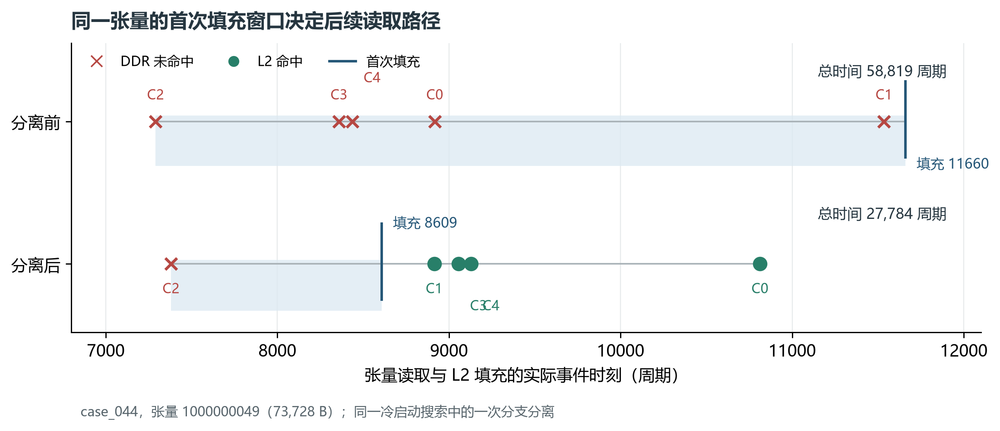

# 共享 FIFO 缓存下的分支分离与事件反馈调度

> 本稿的方法段可用于论文改写；数值段是 **7 个所选案例、5 核、每例 3 个随机种子** 的有限验证，不能写成 100 例或 1～5 核的全量成绩。所有时间均为原评测器返回的 cycles。

## 1　问题机理与决策边界

场景 B 将同核子图合并为一个 Task，允许同核数据在片上使用；跨核依赖仍需源端 COPY_OUT、题给 500 cycles 同步，再由目标端 COPY_IN。第三问额外加入所有核心共享的只读 L2：容量 1,048,576 B，FIFO 淘汰；COPY_IN 查询时，命中走 250 B/cycle 的 L2 池，未命中走 60 B/cycle 的 DDR 池，两个池各自共享。每次方案评测从空 L2 出发。L1 和 UB 容量分别是 524,288 B 与 131,072 B，所有容量、换入换出、依赖与 Pipe 顺序均由原附件程序裁决。

输入是原计算图 $G$ 和核数 $n$。唯一提交决策为操作所属子图 $\phi(v)$、子图所属核心 $\kappa(s)$ 以及各核子图顺序 $\pi_k$，输出字段为 `node_to_subgraph` 和 `core_schedules`。不改原图操作、张量、边或硬件配置；不能人为增加预取、等待节点、缓存锁定或 Core0 特权。临时方案须满足每个非 COPY 操作恰属一个子图、每个子图恰属一核、子图依赖无环及原评测器的全局执行/容量约束。

设 $F_3(P)$ 为原问题三评测器给方案 $P$ 的完成时间，则主目标是

$$
\min_{P\in\mathcal F} T(P),\qquad T(P)=F_3(P).\tag{1}
$$

额外 COPY 字节 $A(P)$ 与 L2 未命中字节 $M(P)$ 用于候选分布和机理诊断，不能取代式 (1)。尤其是 $A(P)$ 是原程序报告的逻辑 COPY 增量，不能直接当作实际 DDR 传输量；L2 命中会改变读取路径，却不从该字段扣除命中字节。

一个只计计算操作的安全下界用于判断算例是否已接近计算吞吐上限：

$$
L_{\rm comp}=
\max\left\{
\max_{p\in\{\mathrm M,\mathrm V\}}
\frac{\sum_{v:p(v)=p}c_v}{n},\quad
\max_{\gamma\in\operatorname{Path}(D)}\sum_{v\in\gamma}c_v
\right\}.\tag{1a}
$$

这里 $D$ 是由原图的直接操作边及操作—张量—操作边构造的**辅助**计算 DAG；经过原 COPY 节点的更长依赖链留给原评测器检查。未计 COPY 和共享池争用，所以下界可能很松，不能据此直接预测某一切分的收益。

## 2　从零割集装箱到“入口—分支”分解

弱连通分量整块装箱能限制跨核通信，但场景 B 下的同核 Task 还决定并行边界。一个大子图可能只有少量共同入口，之后却包含多个内部互不相连的计算分支。将它们全部留在一个核心，会牺牲可并行的 Pipe 工作；只优化割边就看不到这一机会。相反，任意把图均分也会新增 COPY、同步和 DDR 争用。我们只对具有明确图结构证据的子图建立分支候选。

对候选子图 $S$，先在上述辅助 DAG 的诱导子图 $D[S]$ 中求局部入度为零的入口集

$$
R(S)=\{v\in S:\operatorname{pred}_{D[S]}(v)=\varnothing\}.\tag{2}
$$

删除 $R(S)$ 后，忽略方向求弱连通分量 $C_1,\ldots,C_m$。若 $m\ge2$，得到不重叠的划分

$$
S=R(S)\;\dot\cup\;C_1\;\dot\cup\cdots\dot\cup\;C_m.\tag{3}
$$

不同 $C_j$ 之间在辅助 DAG 中没有直接边；共同入口保留在原核，分支按负载分配。这个性质只给出**候选**并行分支，不能排除经原 COPY 节点或外部子图形成的依赖，不能推出缩约后必然无环，也不能保证切分划算。每个候选仍须拓扑修复、内存检查与完整原评测。算法仅把已有计算操作重新分组，不复制或删除操作；原 COPY 节点依附件规则重新展开。

记 $W_{jp}=\sum_{v\in C_j,\,p(v)=p}c_v$，$L_{kp}$ 为核心 $k$ 已分配的 PIPE_M/PIPE_V 工作量。按 $\max_pW_{jp}$ 从大到小处理分支，选择

$$
\kappa(C_j)=\arg\min_{k\in\{0,\ldots,n-1\}}
\max_{p\in\{\mathrm M,\mathrm V\}}\bigl(L_{kp}+W_{jp}\bigr).\tag{4}
$$

式 (4) 仅是确定候选落核的装箱代理，不把共享 DDR、同步或缓存损益伪装成可加成本。候选在原评测器中获得唯一最终时间。为了将评测预算放在有意义的位置，带有更多可移出工作且原核完成较晚的子图被优先提议；实现使用

$$
q(S)=
\begin{cases}
1.5\,\sum_{v\in S\setminus R(S)}c_v,&\kappa(S)=k_{\rm last},\\
\sum_{v\in S\setminus R(S)}c_v,&\text{其他核心}.
\end{cases}\tag{5}
$$

其中 $k_{\rm last}$ 来自本方案**真实**核时间线。式 (5) 的 1.5 是搜索优先级，不是题给硬件参数，也不用于宣称严格关键路径。每次从排序前三的合法结构中抽取一个以保持搜索多样性。最多 256 个子图是这次小样本搜索的工程预算，**并非**题目约束。

## 3　FIFO 事件与真正的缓存收益

按评测器处理的事件顺序编号 $e$，不能把同一时刻的事件合并。$Q_e$ 为该事件前的 FIFO 队列，COPY_IN 请求 $r$ 对张量 $x_r$ 的命中变量为

$$
h_r=\mathbf 1\{x_r\in Q_{e(r)}\},\qquad
B_r^{\rm pool}=\begin{cases}250,&h_r=1,\\60,&h_r=0,\end{cases}\ {\rm B/cycle}.\tag{6}
$$

式 (6) 是请求所属共享池的名义带宽；并发请求在池内按原程序公平分配，不能各自独占该速率。**每个 COPY_IN 完成时**，若张量此刻不驻留且可容纳，就从队首逐项淘汰至容量允许再插入队尾；这也覆盖“发射时命中、在途期间被淘汰”的边界事件。命中本身不刷新 FIFO 队列次序。由真实插入事件 $e_{\rm ins}^{(j)}$ 与下一次淘汰事件 $e_{\rm evict}^{(j)}$ 可定义张量一次或多次驻留的窗口

$$
\mathcal W_x=\bigcup_j[e_{\rm ins}^{(j)}(x),e_{\rm evict}^{(j)}(x)),\qquad
h_r=1\Longleftrightarrow e(r)\in\mathcal W_{x_r}.\tag{7}
$$

式 (7) 是**已执行方案**的事件审计，不是对尚未运行候选的确定预测。多个核心可能在首次填充前同时未命中；只有在原评测器允许的方案变化下，这些读取自然错开后，才可能形成命中。我们没有插入额外等待指令。每个方案先由原评测器给出精确时间线、L2 事件与容量检查，再生成下一候选。

## 4　有限预算搜索

用三个从**当前图**构造的方案初始化种群：弱分量装箱、分量块化、数据感知的拓扑分带。这些是互补起点，不是把其他案例或历史解读作初值。每个案例、核数、随机种子启动独立进程，L2 重新为空；同一案例进程内保留已评估个体，是进化搜索的正常状态。

搜索保留 U-NSGA-III 的锦标赛父代选择及 NSGA-III 参考方向环境选择，原样使用 `pymoo` 的相关组件。向量 $(T,A,M)$ 保留不同通信/缓存结构；**交付方案按 $T$、再按 $A$ 字典序选出**。在交叉变异层，除移动、普通切分、相邻合并与顺序调整之外，加入式 (2)–(4) 的入口—分支算子。该算子按固定 0.60 概率尝试；无可分分支时回到其他邻域。其余操作利用真实末端核心、缓存未命中与负载线索选择候选，但这些代理不决定最后的优劣。

一次评估流程是：分组与落核 → 子图拓扑修复 → 原附件扩展 COPY/换入换出 → 官方场景 B＋L2 事件模拟 → 检查容量、依赖与结果 → 存储真实目标值。非法方案记录原错误信息并排除，不伪造巨大惩罚值。最终方案还要用原评测器独立重算一次；同方案再用原问题二评测器关闭 L2，形成硬件配置对照

$$
R_2(P)=\frac{F_2(P)}{F_3(P)}.\tag{8}
$$

式 (8) 是**固定同一方案**的缓存配置收益，与比较两种优化算法的收益是不同量。输入字节、cycles、B/cycle 和 MiB 均按附件原单位处理。

## 5　有限样本实验与机理

两种消融算法从逐案例、逐种子完全相同的六个初始个体出发，均最多且实际调用 30 次原问题三评测器。对照算法使用同一 U-NSGA-III 选择框架和原有邻域；本算法只增加上述分支分离提案及事件反馈。开发样本为 005、044、071、074、082；069 和 086 是固定分支算子后再运行的内部保留算例，依据输入图的计算下界缺口与规模差异选出。这不是未见过整个比赛数据集的外部盲测。每例取种子 17、29、43；42 个最终方案均用原题三重算，并用原题二做同方案无 L2 对照。114 个官方文件 SHA-256 均与初始清单一致，未改评测器。

| 算例 | 角色 | 对照均值 / cycles | 分支算法均值 / cycles | 均值缩短 |
|---|---|---:|---:|---:|
| 005 | 开发 | 67,833 | 49,368 | 27.2% |
| 044 | 开发 | 69,429 | 28,079 | 59.6% |
| 071 | 开发 | 10,558 | 8,729 | 17.3% |
| 074 | 开发 | 335,682 | 333,989 | 0.5% |
| 082 | 开发 | 510,622 | 371,091 | 27.3% |
| 069 | 算子冻结后验证 | 13,358 | 10,459 | 21.7% |
| 086 | 算子冻结后验证 | 83,298 | 60,415 | 27.5% |

表中均值对每例的 3 个种子等权；“均值缩短”是两组均值之比。逐种子 21 对中，分支算法胜 20、平 1、负 0；逐配对缩短率的算术均值为 25.78%。这些数值只描述所选样本，不等于竞赛 100 例均值。

机制并不只有一种。082 的分支算法均值降低 27.3%，但同方案 L2 开关比约 1.0001，表明此例改善主要来自可用并行结构，不能误称缓存带来的提速。074 的算子总计算工作给出的五核计算下界为 315,884 cycles，而当前均值为 333,989 cycles，已经接近这一**只含计算**的宽松下界，继续切分的空间有限。005、071、069、086 的额外 COPY 往往上升，仍得到更短时间；这与“零割集越小越好”的单一准则相矛盾，但符合并行收益与搬运成本竞争的原题机制。

044 给出了可复核的单操作证据。种子 29 的冷启动搜索中，第 25 次评估仅将一个子图的 3 个共同入口与 3 条各 12 个操作的独立分支分离，没有同时交叉。它使 $T$ 从 58,819 降到 27,784 cycles；新增 COPY 从 3,666,944 升至 3,692,800 B，跨核传输从 20 升至 29，但缓存未命中字节由 3,057,984 降至 1,021,920 B。对**各自同一方案**关闭 L2 后，时间分别是 83,098 与 82,853 cycles，几乎不变。因此这一步的巨大收益与读取时序及 L2 命中相关，而不是少算了工作。

具体到 73,728 B 的张量 1000000049：分离前 C2 在 7,290 发出首次未命中，直到 11,660 才插入 L2；C3、C4、C0、C1 在此之前均已发出未命中。分离后 C2 在 7,380 首次未命中、8,609 完成填充，其他四核的读取发生在 8,914、9,057、9,130、10,812，均命中 L2。该事件链直接解释了“同一输入、相近逻辑搬运量，却有明显不同完成时间”。图 1 为逐种子效果，图 2 为这一张量的事件窗口。

## 6　可用范围与未完成部分

本方法不能保证任意案例改善。子图分离可能增加跨核 COPY、500-cycle 释放约束和 FIFO 容量压力；临界路径、DDR 池争用与 L1/UB 换入换出都须以原评测器为准。本轮仅验证 5 核和 7 个案例，尚缺题目完整要求的 100 例、1～5 核无 L2/有 L2 曲线及所有结果附表；不能据本表宣布最终竞赛得分。下一阶段必须冻结提交入口后按全部案例逐核独立冷启动求解，再由原附件逐项复核。

## 方法来源与适用边界

- [MAGIS, ASPLOS 2024](https://doi.org/10.1145/3620666.3651330) 启发了“图结构与执行顺序联合考虑”的思路；其可改写计算图的规则**没有**直接照搬，本题只更改合法分组与调度。
- [CADE, Journal of Systems Architecture 2025](https://eprints.whiterose.ac.uk/id/eprint/225201/1/JSA24_Cache_aware_DAG.pdf) 说明缓存亲和性与延后执行之间的取舍；本题不允许任意设置发射时刻，因此只借鉴竞争/亲和性诊断，不实现其在线延期机制。
- [Deb 与 Jain 的 NSGA-III 原文](https://www.egr.msu.edu/~kdeb/papers/k2012009.pdf)、[U-NSGA-III 原文](https://www.egr.msu.edu/~kdeb/papers/c2014022.pdf) 提供参考方向选择与锦标赛机制。本项目使用 [pymoo 的参考方向选择和 U-NSGA-III 锦标赛实现](https://pymoo.org/algorithms/moo/unsga3.html)，并自行定义符合题目约束的离散提案，不声称复现原论文的全部默认算子。
