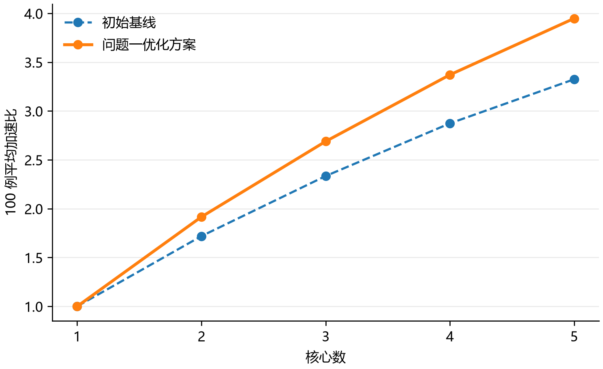

# 2026 华为杯 A 题问题一：场景 A 切图与调度优化思路稿

本稿只讨论**问题一**。正式题意以《通用神经网络处理器下的多核调度问题》、附件 `official/code/` 与固定 `official/data/config.txt` 为准。图中的 HEFT 等建议仅作为算法候选，不改变题目规定的计算图、操作周期、核内顺序或评测方式。问题二、三沿用原基线材料，本稿的数字不代表它们的优化成绩。

## 1. 输入定义、决策变量、约束、目标与输出

给定每个用例的 Op–Tensor 二部图 (G=(V\cup\mathcal T,E))。非 `COPY_IN/COPY_OUT` 操作集合记为 (V_c)，操作 (v) 有执行管道 (p_v\in\{\mathrm{PIPE\_M},\mathrm{PIPE\_V}\}) 和周期 (w_v)（cycles），张量 (t) 大小 (b_t)（bytes）。通过张量中转和题目要求的 COPY 收缩得到计算操作 DAG；已在全部 100 个附件图上与官方依赖提取结果逐边核对一致。

决策只有三项：(g_v) 为每个 (v\in V_c) 指定非负整数子图 id；(k_s) 指定每个子图/Task 的核心；(\pi_c) 指定该核心上的 Task 顺序。**不能决定 Task 内的 Op 顺序**，也不能改写原图。合法方案恰好覆盖全部非 COPY 操作，每个子图在所有核心队列中恰好出现一次；收缩后的 Task 依赖图无环，同核队列顺序不违反依赖。官方 Step1–3 决定核内顺序、L1/UB 驻留和必要的换入换出，我们不自行替代。

场景 A 中每个子图独立成 Task，**同核跨子图也必须经 DDR**。固定配置为 L1 `524288 bytes`、UB `131072 bytes`、共享 DDR `60 bytes/cycle`；跨核前驱等待 `1000 cycles`，同核 Task 切换等待 `100 cycles`。所有候选都交由原版 `evaluate_scene_a` 处理 COPY 插入、容量约束、DDR 公平共享和四 Pipe 执行。用于搜索的 (b/60) 或 (2b/60) 只是周期代理量，不能当作官方 Makespan；真实 COPY 周期、竞争和等待由评测器给出。

主目标是最小化官方 Makespan (M_{i,n})；若并列，选择总额外 COPY 字节数 (B^{\mathrm{add}}_{i,n}) 较小的方案。单核参照 (M_{i,1}) 由原题整图核内调度给出。对 (n=2,3,4,5)，逐例加速比为 (S_{i,n}=M_{i,1}/M_{i,n})，100 例平均为 (\bar S_n=\frac1{100}\sum_{i=1}^{100}S_{i,n})；(\bar S_1=1)。**先求每例比值再作算术平均**，没有使用平均时间之比。

可计算输出为题目格式的 `<case>_multicore_res.json`、官方 Makespan、官方总额外数据搬运量、逐例加速比和 1～5 核平均加速比折线图。最终表的 `source_plan` 记录实际采用方案来源，保留搜索候选及异常字段；方案和统计各有 schema 版本。所有算法确定性运行，无随机初始化，`search_config.json` 明确记录单位、范围和 `random_seed: null`。

## 2. 候选算法与为何这样设计

初版基线将弱连通计算分量按两类计算 Pipe 的周期做 LPT 分配，每核一个 Task。该做法不额外切断分量内部依赖，但对含共享主干的图几乎无法并行。新方案仍使用**同一个原始图和官方评测器**，仅生成不同的合法切图/Task 顺序：

1. **分段切图**：按最长拓扑深度建立阶段。定宽分段与“图宽由窄转宽/由宽转窄”分段并行试验；后者用最常见层宽识别局部窄段，并用 `min_band_depth` 合并过密切点。阶段之间天然按拓扑先后，因此容易保持 Task DAG 无环。
2. **阶段内分组**：按后继终端的可达掩码区分共享主干和终端分支；共享部分再按弱连通块拆开，终端分支按 Pipe 计算负载分核。测试过上游来源掩码及按候选切点张量字节量选界，只有官方评测胜出的方案才入选。这避免把“切边字节少”误认成“实际耗时一定短”。
3. **Task 级 HEFT 启发式**：对已合法切出的 Task 估计权重 (\hat w_s)，并按 (R(s)=\hat w_s+\max_{u\in\mathrm{succ}(s)}(\hat c_{su}+R(u))) 给出上行优先级；随后按预计最早完成时间选择核心、形成 `core_schedules`。通信代理包含题目给出的同核/跨核等待及张量字节量。这个优先级**只作用于 Task 级**，绝不替换官方 Step1–3 的核内顺序。
4. **官方评测选择**：对每个用例和核数，仅在原版评测成功的候选中按 ((M,B^{\mathrm{add}})) 排序，并保留基线作为回退。因而每个最终方案在给定官方数据上的 Makespan 不会劣于初版基线。算法搜索使用了题目给定的 100 个用例，是**对这些用例的评测引导选择**，不是未见数据上的泛化验证或全局最优证明。

小图单测直接采用题目附录 B.7：Makespan `6 cycles`、新增搬运 `0 bytes`。全部候选由原版场景 A 评测，`candidate_summary.csv` 有 **1077 条 `ok`、0 条失败**；所有最终 400 份方案又通过官方结构和 Task 顺序校验，并逐份读取保存的原版评测 JSON 核对场景、核数、Makespan 和额外搬运字节数。题目附件的计算图和固定配置未改动。GPU 不参与官方 CPU 模拟评分。

## 3. 结果与判断

| 核数 | 初版基线平均加速比 | 本版平均加速比 | 比初版提高的用例数 |
|---:|---:|---:|---:|
| 1 | 1.0000 | 1.0000 | — |
| 2 | 1.7192 | **1.9162** | 35 |
| 3 | 2.3343 | **2.6890** | 36 |
| 4 | 2.8734 | **3.3709** | 43 |
| 5 | 3.3249 | **3.9480** | 45 |

5 核较初版提高 `0.6230` 个加速比单位，约 `18.74%`。**预设的 4.2 目标未达到**，仍差 `0.2520`；不能将其写成达标。100 例、2～5 核共 400 个最终方案/结果均齐全，缺失项为 0。具体每例的 Makespan、总额外 COPY 字节、方案来源及加速比见 `q1_optimization/final/per_case_metrics.csv`；官方原始结果位于对应 `baseline_results*/` 或 `q1_optimization/<case>/n<n>/<strategy>/result.json.gz`。

典型变化：`case_054` 的 5 核 Makespan 从 `518133` 降到 `199283 cycles`（加速比约 `4.09`）；`case_056` 从 `265764` 降到 `75870 cycles`。`case_044` 的 5 核加速比仍约 `1.69`，提醒我们共享 DDR 与 Task 边界搬运可抵消多核收益。`case_048` 的非 COPY 操作最长依赖路径约 `75960 cycles`，而固定单核时间为 `222220 cycles`；即使忽略其余成本，单例加速比也不可能超过约 `2.93`。这只是该用例的一个可证上界，**不能据此宣称全体平均达到 4.2 不可能**。



图注：100 个给定用例逐例加速比的算术平均；单核固定为 1，蓝线是初版基线，橙线是当前逐例经官方评测选出的合法方案。源数据为 `q1_optimization/final/per_case_metrics.csv`，矢量版为 `q1_optimization/final/mean_speedup.pdf`；运行 `solution/q1_finalize.py` 可重绘。图只描述给定用例的结果，没有误差线或随机重复实验。

## 4. 复现与边界

在本项目目录，以已安装依赖的 Python 运行：

```powershell
python solution/test_q1_optimized.py official
python solution/q1_search.py --official official --output q1_optimization --cases 1 2 3 --cores 5 --strategies valley_mode_heft valley_merge_32_heft
python solution/q1_expand_cores.py --project .
python solution/q1_finalize.py --project .
python solution/q1_submit.py official/data/case_054.json -n 5 -o case_054_multicore_res.json
```

`q1_submit.py` 对字节级匹配题目给定计算图的输入输出已经评测并校验的选优方案；对其他输入输出合法的连通分量基线，不承诺未知图的相同成绩。正式提交前，队员应核对所有输出、确认竞赛对 AI 辅助与材料引用的披露要求。本思路稿和代码由 OpenAI Codex 辅助完成；外部方法来源、采用边界和未复用代码说明见 `q1_optimization/research_notes.md`。原题、附件程序和本地实际结果始终优先于网页资料或截图建议。
