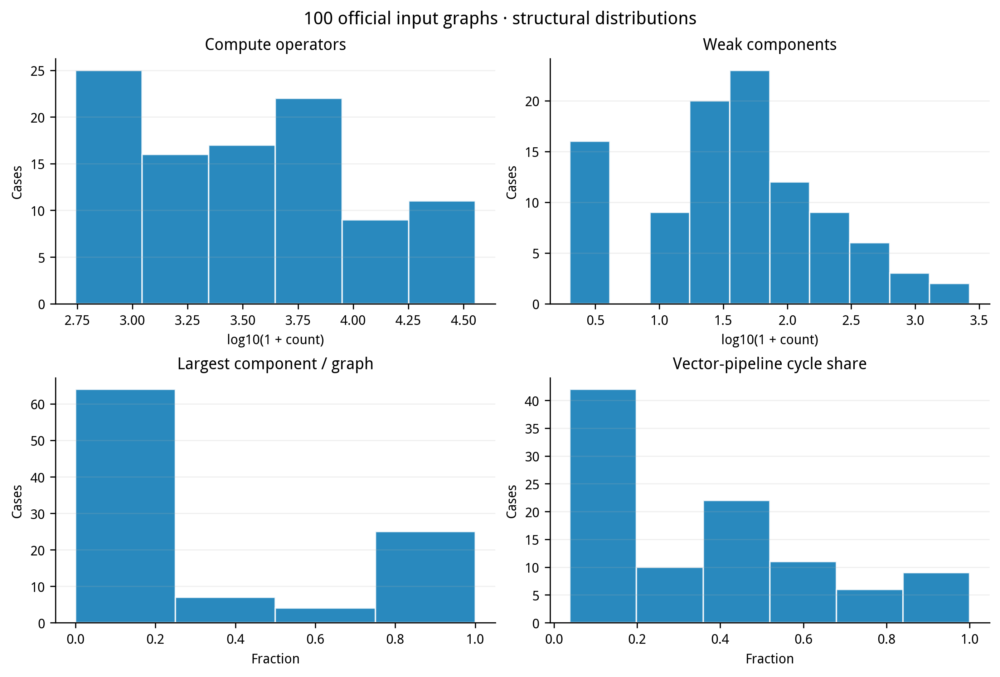
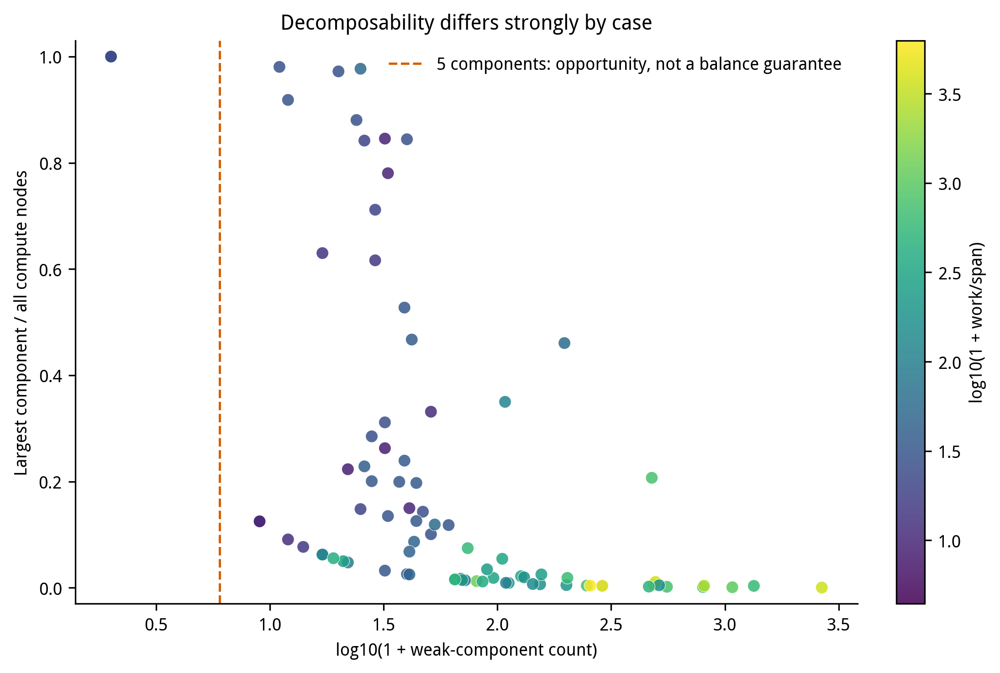
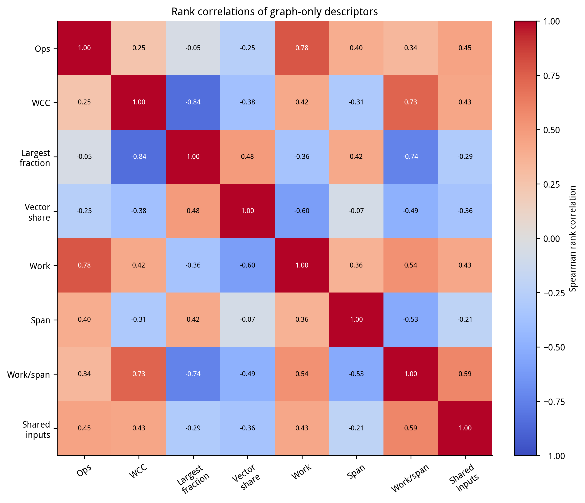
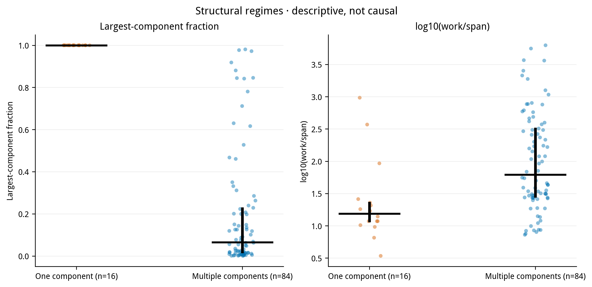

# 面向三种硬件场景的神经网络多核切图与协同调度研究

## 摘要

针对神经网络计算图在多核处理器上的切图与协同调度问题，本文围绕三个具有不同 Task 与数据传输规则的执行场景，归纳问题约束、任务结构和优化目标。对操作周期、矩阵/向量 Pipe、依赖关键路径、张量规模、弱连通分量及共享输入等特征进行统一预处理，并基于官方 100 个输入图开展描述性统计。统计结果显示，样例在计算规模、分量结构和 Pipe 负载方面存在明显差异，多项规模指标呈右偏分布。因此，调度模型需要同时考虑关键路径、异构计算资源、跨核通信、片上容量和共享带宽。本文参考《通用神经网络处理器下的多核切图与协同调度优化模型与算法》中的装箱、通信内化、生命周期和 FIFO 缓存建模思路，并将近似分析与官方离散事件执行语义区分。全文前五章依次给出问题重述、问题分析、模型假设、符号说明和描述性统计。

**关键词：**计算图；多核调度；通信内化；缓存局部性；描述性统计

## 目录

一、问题重述
二、问题分析
三、模型假设
四、符号说明
五、描述性统计

# 一、问题重述

## 1.1 问题背景

神经网络计算图由相互依赖的计算操作和中间张量构成。将计算图部署到多核处理器时，操作如何切分、分配到哪些核心以及各核心按什么顺序执行，会共同影响执行时间和数据搬运量。矩阵与向量操作的工作特征不同，核心间传输还会消耗同步和带宽资源；有限的片上存储则可能引发换入换出。因此，调度方案需要根据计算图结构和硬件执行规则联合确定。

本题设置了三个执行场景：问题一将子图作为独立任务，问题二允许同核子图合并执行，问题三在问题二基础上启用共享 FIFO 缓存。三个场景具有不同的任务边界、通信开销和数据复用方式，需要分别建立目标与约束。

## 1.2 问题重述

**问题一：独立子图任务下的切图与调度。**给定计算图、核心数及硬件配置，将操作划分为子图，为子图分配核心并确定各核心上的执行顺序。每个子图对应一个独立 Task。Task 间等待依赖前驱所在核心：题面规定核内等待为 100 cycles、跨核等待为 1000 cycles；同一核心上相邻 Task 的边界数据也按题目规则处理。要求在满足依赖、Task 顺序和存储规则的前提下缩短全图完成时间。

**问题二：同核 Task 合并下的通信协同调度。**在问题一的计算图及核心分配框架上，将同一核心上的子图合并为一个 Task。跨核依赖需要经过 COPY_OUT、同步和 COPY_IN，跨核同步延迟为 500 cycles。同核数据可在片上复用。模型需在核间并行收益、跨核通信、Pipe 负载均衡和片上存储压力之间进行权衡。

**问题三：启用共享 FIFO L2 缓存的调度。**沿用问题二的同核 Task 合并与跨核通信规则，增加共享只读 FIFO L2 缓存。L2 容量为 1 MiB、带宽为 250 B/cycle；DDR 为共享 60 B/cycle，Cache 初始为空。模型需考虑请求发射次序、未命中读取完成后的插入和 FIFO 淘汰对命中结果的影响，并比较 Cache 对 DDR 流量与总完成时间的作用。

三个场景共用的片上容量为 L1=524,288 B、UB=131,072 B。容量约束和带宽约束分别描述数据驻留和搬运速率，应独立处理。

# 二、问题分析

## 2.1 问题一的分析

问题一中，一个子图就是一个 Task。切分粒度会影响 Task 数量、Task 等待和边界张量处理，也决定操作能否分散到多个核心并行执行。弱连通分量内部没有跨分量依赖，可作为初始装箱单元；但若一个连通分量占据大部分操作或计算周期，单纯按分量分配会限制并行度，需要进一步考察合法的拓扑切分。

对当前问题一冻结求解器，结构方法包括双 Pipe 分量装箱、依据图深度/汇合/共享关系切分、按就绪 Task 贪心分配核心及有界合并。求解过程使用固定策略，不在单个输入上调用官方评估器挑选候选。调度分析至少需要考虑每核矩阵和向量工作量、依赖关键路径、Task 激活、DDR 搬运与片上容量。总计算量均分不能反映不同 Pipe 的负载差异；各依赖等待也可能重叠，不能简单累加为实际完成时间。

## 2.2 问题二的分析

问题二将同核子图合并为一个 Task，核内数据复用更直接，但跨核依赖需承担 COPY 与同步代价。若为减少通信而把相关操作集中到一核，可能出现矩阵或向量 Pipe 过载；若将计算分散到更多核心，又可能增加跨核搬运并占用共享 DDR 带宽。

当前问题二模型以双 Pipe 负载、跨核关键路径、DDR 流量和静态张量存活压力构造候选排序代理，并从有限的分量装箱、深度带和数据感知切分方案中选择。静态内存压力不等同官方 Step 2 的准确 spill 量；正式 makespan、实际搬运及容量行为仍以冻结方案后的官方执行为准。开发阶段对风险系数进行全局标定，不能把在给定 100 图上取得的结果解释为分布外保证。

## 2.3 问题三的分析

问题三在问题二基础上引入 FIFO 缓存。张量是否命中，取决于读请求发生时张量是否已完成读取并插入缓存，以及此前插入的数据是否已将其淘汰。命中不刷新 FIFO 顺序，超过容量的张量不能驻留。因此，单独统计复用次数无法判断实际命中。

当前问题三冻结版本依据输入图构造有限种结构方案，并用自身的事件与驻留模型排序；每次推理不调用官方评估器或读取历史解。开发诊断使用过给定图集的官方反馈，故需将“单次推理不调用评估器”与“全局开发未使用评分标签”区分。缓存命中能减少 DDR 读取，但命中流量仍占用 L2 带宽。缓存收益应在同一冻结方案下配对比较，以避免把切图差异误认为缓存收益。

## 2.4 统一的多目标设计

令方案为 $\pi$，问题编号为 $q\in\{1,2,3\}$。在结构合法且满足片上存储约束的方案集合内，分别考虑：

$$
\min \mathbf f_1(\pi)=
\bigl(T_1(\pi),\ Q_1(\pi),\ E_{\mathrm{mem},1}(\pi),\ I_{\mathrm{imb},1}(\pi)\bigr),
$$

$$
\min \mathbf f_2(\pi)=
\bigl(T_2(\pi),\ Q_{\mathrm{cross},2}(\pi),\ E_{\mathrm{mem},2}(\pi),\ I_{\mathrm{imb},2}(\pi)\bigr),
$$

$$
\min \mathbf f_3(\pi)=
\bigl(T_3(\pi),\ Q_{\mathrm{DDR},3}(\pi),\ -Q_{\mathrm{hit},3}(\pi),\
E_{\mathrm{mem},3}(\pi),\ I_{\mathrm{imb},3}(\pi)\bigr).
$$

其中，$T_q$ 为全图完成时间，$Q_q$ 表示场景相应的新增通信或 DDR 字节，$Q_{\mathrm{hit},3}$ 为 FIFO 命中字节，$E_{\mathrm{mem},q}$ 为片上容量超额，$I_{\mathrm{imb},q}$ 为核心/Pipe 工作量不均衡度。真实时间、换入换出量和缓存命中以官方执行程序为准；搜索阶段若使用估计量，须明确标为代理值。

令 $x_{vk}\in\{0,1\}$ 表示操作 $v$ 是否分配到核心 $k$，$r_v$ 表示其合法拓扑执行序位。基本结构约束为：

$$
\sum_{k=0}^{n-1}x_{vk}=1\quad(\forall v\in V),\qquad
r_u<r_v\quad(\forall (u,v)\in E).
$$

此外还需保证每个子图唯一分核、每核子图序列合法，且原始依赖与同核顺序联合后无环。

对每个核心 $k$，理想内存可行性约束为：

$$
H_{k,\mathrm{L1}}(\pi)\le 524288,\qquad
H_{k,\mathrm{UB}}(\pi)\le 131072.
$$

DDR/L2 带宽可导出完成时间下界：

$$
T_q(\pi)\ge
\max\left\{
\max_{k,p}W_{kp}(\pi),\
L_{\mathrm{dep},q}(\pi),\
\frac{Q_{D,q}^{\min}(\pi)}{60},\
\mathbf 1_{q=3}\frac{Q_{L,q}^{\min}(\pi)}{250}
\right\}.
$$

该式给出资源和依赖下界，不是精确 makespan 的可加公式。多个资源可能并行工作，最终时间应由官方离散事件模拟决定。方案 $\pi_a$ 支配 $\pi_b$，是指所有待最小化指标均不劣且至少一项严格更优。透明的决策流程是先筛除结构和内存不可行方案，再保留 Pareto 非支配解，最后使用预先固定且仅依赖输入图与硬件参数的规则输出单一方案。

## 2.5 参考方法与实现边界

第二篇论文《通用神经网络处理器下的多核切图与协同调度优化模型与算法》第 2 章及第 4—6 章、附录 A—C，讨论了执行场景、分问题调度和实现细节。本文借鉴 LPT 类装箱、通信内化、张量生命周期分析和 FIFO 状态建模。经典 LPT 界基于较受限的独立任务与同构机器条件，不能直接保证包含 DAG、异构 Pipe 和共享带宽的本题完成时间；局部性比例也不能替代官方容量检查。

## 2.6 方案生成与评估的边界

当前 Q1、Q2、Q3 推理包均在生成单个输入方案时不调用官方评估器。开发和标定阶段则使用过给定 100 图的反馈，尤其 Q2 风险参数为全局标定，Q3 开发阶段使用官方反馈诊断。因此，本版本可以表述为“逐输入推理时不使用评估器搜索或择优”，但不能表述为“整个方案方法从未受评估结果影响”，也不能据此声称对未见分布具有同等性能。

# 三、模型假设

1. **计算图假设。**输入操作与张量依赖构成有向无环图；操作周期、执行 Pipe、张量大小和存储位置按官方数据读取。
2. **分配唯一性假设。**每个操作被且仅被分配到一个子图；每个子图被且仅被分配到一个核心。
3. **执行顺序假设。**方案满足原始依赖，以及题目规定的 Task 依赖和核心内子图顺序。只施加题目实际要求的有向无环约束。
4. **资源容量假设。**L1 和 UB 是分别受限的片上资源，不能将两者容量合并后判断可行。
5. **共享带宽假设。**DDR 与问题三中的 L2 按题设作为共享带宽池；带宽下界不等同实际执行时长。
6. **FIFO 假设。**问题三缓存按题目 FIFO 查询、插入与淘汰规则工作；不假设题目未规定的预取或预热行为。
7. **描述统计假设。**第五章仅汇总官方 100 个原始输入图的结构和规模特征，不将评估器输出混入输入统计。
8. **近似量边界。**逻辑生命周期峰值、预测命中和资源时间下界用于分析或候选排序，不宣称它们等于官方执行器测得的峰值、命中或 makespan。
9. **评估器边界。**当前单次推理不调用官方评估器；开发标定可能使用评分反馈，二者在方法叙述和结果解释中分别说明。

# 四、符号说明

| 符号 | 含义 | 单位/范围 |
|---|---|---|
| $G=(V\cup\mathcal T,E)$ | 操作、张量和依赖边组成的计算图 | — |
| $V,\mathcal T,E$ | 操作、张量、依赖边集合 | — |
| $d_v$ | 操作 $v$ 的计算周期 | cycles |
| $p(v)$ | 操作 $v$ 使用的 Pipe 类型 | 矩阵/向量等 |
| $b_t$ | 张量 $t$ 的大小 | B |
| $\operatorname{pos}(t)$ | 张量 $t$ 的存储层级 | L1/UB |
| $n,k$ | 核心数和核心索引 | $k=0,\ldots,n-1$ |
| $\phi(v)$ | 操作到子图的映射 | — |
| $\kappa(s)$ | 子图 $s$ 到核心的映射 | — |
| $\pi_k$ | 核心 $k$ 上子图的执行序列 | — |
| $\tau_q(v)$ | 场景 $q$ 中操作对应的 Task | — |
| $W_{kp}$ | 核心 $k$ 上 Pipe $p$ 的总工作量 | cycles |
| $Q_q$ | 场景 $q$ 的相关搬运字节量 | B |
| $H_{k,m}$ | 核心 $k$ 在存储层级 $m$ 的峰值占用 | B |
| $C_m$ | 存储层级 $m$ 的容量 | B |
| $B_D,B_L$ | DDR、L2 带宽 | B/cycle |
| $C_L$ | L2 容量 | B |
| $T_q(\pi)$ | 官方执行器下方案 $\pi$ 的完成时间 | cycles |
| $L_{\mathrm{dep},q}$ | 依赖与场景同步形成的关键路径下界 | cycles |
| $I_{\mathrm{imb},q}$ | 核心/Pipe 工作量不均衡度 | 无量纲 |
| $Q_{\mathrm{hit},3}$ | 问题三中的 L2 命中字节数 | B |

# 五、描述性统计

## 5.1 数据来源与预处理

统计对象为官方输入目录中的 100 个计算图。处理过程保留原始操作周期、张量字节数、图边和案例编号，并从原图计算操作数、DAG 边数、弱连通分量数、最大分量占比、矩阵/向量周期、关键路径、张量总字节及共享外部输入等特征。输入文件 SHA256 和 7 项基础 profile 均与项目清单逐图核对，100/100 匹配。

规模特征的原始值保留在 CSV 与统计 JSON 中；为了显示不同数量级，绘图时对长尾计数使用对数坐标，不对数据做截尾或 winsorize。比例变量保留在 $[0,1]$。本章仅分析输入特征，不读取完成时间、加速比、spill 或 Cache 评估输出。

## 5.2 数据规模与计算特征

表 5-1 中每项依次给出最小值、第一四分位数、中位数、均值、第三四分位数和最大值。

**表 5-1  100 个输入图的规模和计算特征**

| 特征 | min | Q1 | 中位数 | 均值 | Q3 | max |
|---|---:|---:|---:|---:|---:|---:|
| 计算操作数 | 552 | 1,110.75 | 3,720.5 | 6,345.06 | 7,096 | 35,705 |
| DAG 边数 | 400 | 1,266.25 | 4,017 | 7,406.41 | 8,269.75 | 38,493 |
| 总计算周期 | 23,052 | 162,732.75 | 509,952 | 3,179,741.84 | 1,848,864 | 61,275,840 |
| 关键路径周期 | 400 | 2,500.5 | 6,140 | 39,921.77 | 24,796.5 | 863,040 |
| 矩阵 Pipe 周期 | 0 | 63,177 | 256,920 | 2,728,477.23 | 1,345,339 | 58,915,232 |
| 向量 Pipe 周期 | 9,988 | 58,334 | 144,314.5 | 451,264.61 | 347,998.5 | 7,714,975 |
| $W/S$ 并行度代理 | 3.42 | 20.20 | 43.13 | 416.22 | 305.17 | 6,258.78 |

总计算周期的均值约为 318 万 cycles，中位数约为 51 万 cycles，说明少数大图显著拉高均值。$W/S$ 定义为总操作工作量与计算关键路径之比，仅表示图结构提供的并行空间，不是可实现的加速比。

**图 5-1  输入图规模与结构分布**

**图 5-2  总工作量、关键路径与并行度代理**

## 5.3 连通结构、张量与局部性特征

**表 5-2  输入图的依赖结构和张量特征**

| 特征 | min | Q1 | 中位数 | 均值 | Q3 | max |
|---|---:|---:|---:|---:|---:|---:|
| 弱连通分量数 | 1 | 17.5 | 39.5 | 146.97 | 107.25 | 2,666 |
| 最大分量节点占比 | 0.0004 | 0.0156 | 0.1220 | 0.3293 | 0.7288 | 1.0000 |
| 张量总数 | 816 | 1,593.25 | 4,590.5 | 7,477.86 | 8,004 | 40,287 |
| 张量总字节 | 325,708 | 3,921,341 | 9,366,784 | 29,375,957.16 | 24,141,591 | 360,593,104 |
| 外部输入张量数 | 12 | 130 | 254 | 486.68 | 556.5 | 4,362 |
| 外部输入字节 | 35,622 | 435,535 | 1,063,082 | 2,083,082.98 | 2,428,224 | 13,400,064 |
| 输出张量数 | 1 | 19.5 | 62 | 159.44 | 126.5 | 2,666 |
| 输出张量字节 | 2 | 271.5 | 16,689 | 324,217.56 | 160,768 | 4,094,976 |

100 个案例中有 16 个仅含一个弱连通分量，84 个含多个分量，且这 84 个案例均不少于 5 个分量。最大分量占比的中位数为 12.2%，上四分位数约为 72.9%，表明案例间既有分散的小分量，也有单一大分量占主导的图结构，单一分配策略难以覆盖全部情况。

97 个案例至少有一个共享外部输入张量。共享输入可能形成跨核复用机会，也可能因消费者被分配到多个核心而扩大通信。张量总字节均值明显高于中位数，反映不同案例的数据规模差异较大；后续通信和内存分析需同时考察字节数与消费者分布。

**图 5-3  弱连通分量结构及最大分量占比**

**图 5-4  Pipe 工作构成与共享输入特征**

## 5.4 变量相关性和结构分组

**图 5-5  描述性特征的 Spearman 相关**

**图 5-6  不同图结构组的规模特征比较**

相关性图用于观察输入特征间的单调关联，不作因果解释。结构分组图以中位数和四分位范围描述组内差异。分量较多不必然意味着更高的并行收益；仍需结合各分量的矩阵/向量工作量、依赖深度和张量边界判断。

## 5.5 图结构代理候选及解释范围

**图 5-7  仅基于图特征构造的候选代理 Pareto 图**

图 5-7 展示少量结构基线在资源下界、估计通信、逻辑存储超额和 FIFO 代理指标上的权衡。该图不使用官方评估器，不代表真实 makespan 排名、存储可行性证书或 100 个案例的算法性能结果。

**图 5-8  三种硬件场景及其统一建模流程**

## 参考文献

[1] 《通用神经网络处理器下的多核切图与协同调度优化模型与算法》，2026 年 A 题第二篇论文，29 页，第 2 章、第 4—6 章及附录 A—C。
[2] 2026 年 A 题题目说明及官方输入图、硬件执行配置。具体 Task、COPY、同步、容量和带宽语义以相应版本题面与官方执行程序为准。
